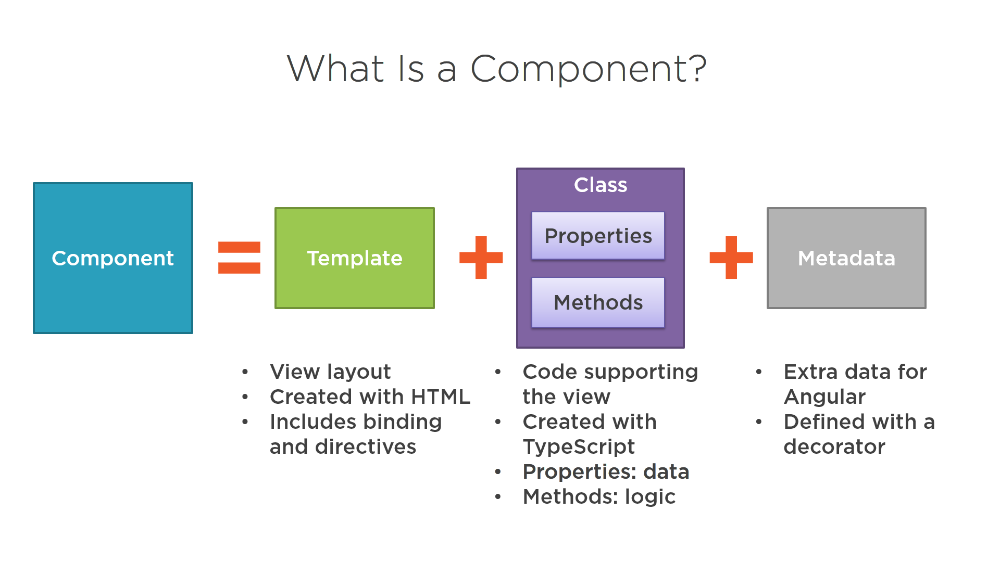

# Components are the main building block for Angular applications. Each component consists of:

* An HTML template that declares what renders on the page
* A Typescript class that defines behavior
* A CSS selector that defines how the component is used in a template
* Optionally, CSS styles applied to the template

The @Component decorator identifies the class immediately below it as a component class, and specifies its metadata.

The metadata for a component tells Angular where to get the major building blocks that it needs to create and present the component and its view. In particular, it associates a template with the component, either directly with inline code, or by reference. Together, the component and its template describe a view.

In addition to containing or pointing to the template, the @Component metadata configures, for example, how the component can be referenced in HTML and what services it requires.



## Creating a component using the Angular CLI
To create a component using the Angular CLI:

From a terminal window, navigate to the directory containing your application.
Run the ng generate component <component-name> command, where <component-name> is the name of your new component.
By default, this command creates the following:

* A folder named after the component
* A component file, <component-name>.component.ts
* A template file, <component-name>.component.html
* A CSS file, <component-name>.component.css
* A testing specification file, <component-name>.component.spec.ts

Where <component-name> is the name of your component.

Example component
```
import { Component } from '@angular/core';

@Component({
  selector: 'app-root',
  templateUrl: './app.component.html',
  styleUrls: ['./app.component.less']
})
export class AppComponent {
  title = 'konnect-test';
}

```


* Decorators mark their type and provide metadata that tells Angular how to use them


