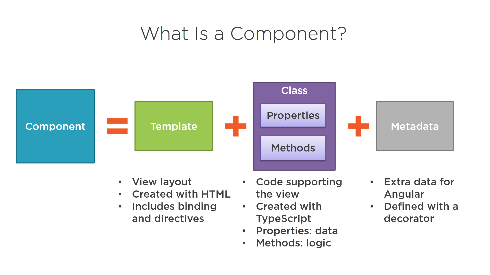

# Angular

For writing a angular application we will need below frameworks installed on our machine.
* NPM (Node Package Manager) https://www.npmjs.com/
* Angular CLI (Auto generate boiler plate codes for us and also building, testing and deploying application) https://cli.angular.io/

Angular is a platform and framework for building single-page client applications using HTML and TypeScript. Angular is written in TypeScript. It implements core and optional functionality as a set of TypeScript libraries that you import into your apps.

The architecture of an Angular application relies on certain fundamental concepts. The basic building blocks of the Angular framework are Angular components that are organized into NgModules. NgModules collect related code into functional sets; an Angular app is defined by a set of NgModules. An app always has at least a root module that enables bootstrapping, and typically has many more feature modules.

* Components define views, which are sets of screen elements that Angular can choose among and modify according to your program logic and data.

* Components use services, which provide specific functionality not directly related to views. Service providers can be injected into components as dependencies, making your code modular, reusable, and efficient.

## Modules

There are two types of modules
* ES 2015 Modules
* Angular Modules

Modules, components and services are classes that use decorators. These decorators mark their type and provide metadata that tells Angular how to use them.

The metadata for a component class associates it with a template that defines a view. A template combines ordinary HTML with Angular directives and binding markup that allow Angular to modify the HTML before rendering it for display.

* The metadata for a service class provides the information Angular needs to make it available to components through dependency injection (DI).

* An app's components typically define many views, arranged hierarchically. Angular provides the Router service to help you define navigation paths among views. The router provides sophisticated in-browser navigational capabilities.

### ES 2015 Modules
Anything we export is a module 

Export - product.ts
```
export class Product {
}
```

Import - product-list.ts
```
import {Product } from './product'
``` 

### Angular Module
angular by default has atleast one module called app module. each module has one or many component and one component is create and belongs to only one module.

### Difference between ES and Angular Modules


## Components
Component contains html template and data binding and it's class which contains properties and methods. Component also contains metatdata defined with decorators

```
import { Component } from '@angular/core';

@Component({
  selector: 'pm-root',
  templateUrl: './app.component.html',
  styleUrls: ['./app.component.css']
})
export class AppComponent {
  title = 'Angular: Getting Started';
}

```



### Decorator
A function that adds metadata to a class, it's member or it's methods arguments. It's prefixed with @
Angular provides build in decorators. We can create our own component.

A decorator is a function and does not ends with semi colon and we can pass multiple parms to function that's why the syntax is 
```
@Component ({})
```
```
@Component ({selector:'root', template:'<div>Hello</div>'})
```
