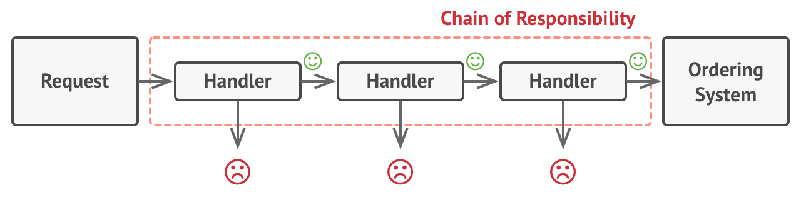

# Chain of Responsibility Pattern

Chain of Responsibility is a behavioral design pattern that lets you pass requests along a chain of handlers. Upon receiving a request, each handler decides either to process the request or to pass it to the next handler in the chain.


In this pattern, normally each receiver contains reference to another receiver. If one object cannot handle the request then it passes the same to the next receiver and so on.



## Example

```java
public abstract class AbstractLogger {
   public static int INFO = 1;
   public static int DEBUG = 2;
   public static int ERROR = 3;

   protected int level;

   //next element in chain or responsibility
   protected AbstractLogger nextLogger;

   public void setNextLogger(AbstractLogger nextLogger){
      this.nextLogger = nextLogger;
   }

   public void logMessage(int level, String message){
      if(this.level <= level){
         write(message);
      }
      if(nextLogger !=null){
         nextLogger.logMessage(level, message);
      }
   }

   abstract protected void write(String message);
	
}
```

```java
public class ConsoleLogger extends AbstractLogger {

   public ConsoleLogger(int level){
      this.level = level;
   }

   @Override
   protected void write(String message) {		
      System.out.println("Standard Console::Logger: " + message);
   }
}
```

```java
public class ErrorLogger extends AbstractLogger {

   public ErrorLogger(int level){
      this.level = level;
   }

   @Override
   protected void write(String message) {		
      System.out.println("Error Console::Logger: " + message);
   }
}
```

```java
public class FileLogger extends AbstractLogger {

   public FileLogger(int level){
      this.level = level;
   }

   @Override
   protected void write(String message) {		
      System.out.println("File::Logger: " + message);
   }
}
```

```java
public class ChainPatternDemo {
	
   private static AbstractLogger getChainOfLoggers(){

      AbstractLogger errorLogger = new ErrorLogger(AbstractLogger.ERROR);
      AbstractLogger fileLogger = new FileLogger(AbstractLogger.DEBUG);
      AbstractLogger consoleLogger = new ConsoleLogger(AbstractLogger.INFO);

      errorLogger.setNextLogger(fileLogger);
      fileLogger.setNextLogger(consoleLogger);

      return errorLogger;	
   }

   public static void main(String[] args) {
      AbstractLogger loggerChain = getChainOfLoggers();

      loggerChain.logMessage(AbstractLogger.INFO, "This is an information.");

      loggerChain.logMessage(AbstractLogger.DEBUG, "This is an debug level information.");

      loggerChain.logMessage(AbstractLogger.ERROR, "This is an error information.");
   }
}
```