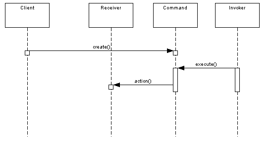

# Command Design Pattern

The command pattern is a behavioral design pattern and is part of the GoF‘s formal list of design patterns. Simply put, the pattern intends to encapsulate in an object all the data required for performing a given action (command), including what method to call, the method’s arguments, and the object to which the method belongs.

The Command pattern is known as a behavioural pattern,as it's used to manage algorithms, relationships and responsibilities between objects. Thedefinition of Command provided in the original Gang of Four book on DesignPatterns states: 

The following sequence diagram shows the relationship in a clearer way:



## Command in the Real World 

One example of the command pattern being executed in the real world is the idea of a table order at a restaurant: the waiter takes the order, which is a command from the customer.This order is then queued for the kitchen staff.  The waiter tells the chef that the a new order has come in, and the chef has enough information to cook the meal.

## When Would I Use This Pattern?

* A history of requests is needed
* You need callback functionality
* Requests need to be handled at variant times or in variant orders
* The invoker should be decoupled from the object handling the invocation.

## Example

A command is an object whose role is to store all the information required for executing an action, including the method to call, the method arguments, and the object (known as the receiver) that implements the method.

To get a more accurate idea of how command objects work, let’s start developing a simple command layer which includes just one single interface and two implementations:

```java
//Command
public interface Command{
  public void execute();
}
```

```java
//Concrete Command
public class LightOnCommand implements Command{
  //reference to the light
  Light light;
  public LightOnCommand(Light light){
    this.light = light;
  }
  public void execute(){
    light.switchOn();
  }
}
```

```java
//Concrete Command
public class LightOffCommand implements Command{
  //reference to the light
  Light light;
  public LightOffCommand(Light light){
    this.light = light;
  }
  public void execute(){
    light.switchOff();
  }
}
```

```java
//Receiver
public class Light{
  private boolean on;
  public void switchOn(){
    on = true;
  }
  public void switchOff(){
    on = false;
  }
}
```

```java
//Invoker
public class RemoteControl{
  private Command command;
  public void setCommand(Command command){
    this.command = command;
  }
  public void pressButton(){
    command.execute();
  }
}
```

Finally we'll set up a client to use the invoker


```java
//Client
public class Client{
  public static void main(String[] args)    {
    RemoteControl control = new RemoteControl();
    Light light = new Light();
    Command lightsOn = new LightsOnCommand(light);
    Command lightsOff = new LightsOffCommand(light);
    //switch on
    control.setCommand(lightsOn);
    control.pressButton();
    //switch off
    control.setCommand(lightsOff);
    control.pressButton();
  }
}
```