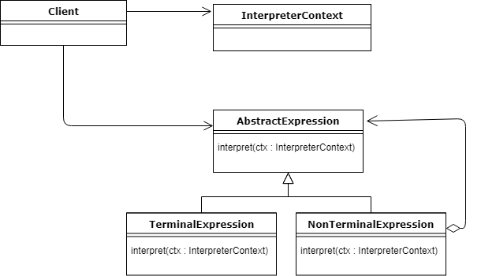

# Interpreter Design Pattern

Interpreter pattern provides a way to evaluate language grammar or expression. This type of pattern comes under behavioral pattern. This pattern involves implementing an expression interface which tells to interpret a particular context. This pattern is used in SQL parsing, symbol processing engine etc.



Above diagram shows two main entities: the Context and the Expression.

Now, any language needs to be expressed in some way, and the words (expressions) are going to have some meaning based on the given context.

AbstractExpression defines one abstract method which takes the context as a parameter. Thanks to that, each expression will affect the context, change its state and either continue the interpretation or return the result itself.

Therefore, the context is going to be the holder of the global state of processing, and it’s going to be reused during the whole interpretation process.

So what’s the difference between the TerminalExpression and NonTerminalExpression?

A NonTerminalExpression may have one or more other AbstractExpressions associated in it, therefore it can be recursively interpreted. In the end, the process of interpretation has to finish with a TerminalExpression that will return the result.

## Example

```java
public interface Expression {
   public boolean interpret(String context);
}
```

```java
public class TerminalExpression implements Expression {
	
   private String data;

   public TerminalExpression(String data){
      this.data = data; 
   }

   @Override
   public boolean interpret(String context) {
   
      if(context.contains(data)){
         return true;
      }
      return false;
   }
}
```

```java
public class OrExpression implements Expression {
	 
   private Expression expr1 = null;
   private Expression expr2 = null;

   public OrExpression(Expression expr1, Expression expr2) { 
      this.expr1 = expr1;
      this.expr2 = expr2;
   }

   @Override
   public boolean interpret(String context) {		
      return expr1.interpret(context) || expr2.interpret(context);
   }
}
```

```java
public class AndExpression implements Expression {
	 
   private Expression expr1 = null;
   private Expression expr2 = null;

   public AndExpression(Expression expr1, Expression expr2) { 
      this.expr1 = expr1;
      this.expr2 = expr2;
   }

   @Override
   public boolean interpret(String context) {
      return expr1.interpret(context) && expr2.interpret(context);
   }
}
```

```java
public class InterpreterPatternDemo {

   //Rule: Robert and John are male
   public static Expression getMaleExpression(){
      Expression robert = new TerminalExpression("Robert");
      Expression john = new TerminalExpression("John");
      return new OrExpression(robert, john);		
   }

   //Rule: Julie is a married women
   public static Expression getMarriedWomanExpression(){
      Expression julie = new TerminalExpression("Julie");
      Expression married = new TerminalExpression("Married");
      return new AndExpression(julie, married);		
   }

   public static void main(String[] args) {
      Expression isMale = getMaleExpression();
      Expression isMarriedWoman = getMarriedWomanExpression();

      System.out.println("John is male? " + isMale.interpret("John"));
      System.out.println("Julie is a married women? " + isMarriedWoman.interpret("Married Julie"));
   }
}
```