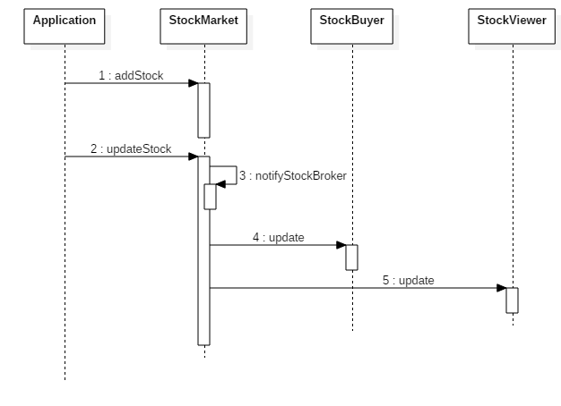

# Observer Design Pattern

The Observer pattern, also known as the Publish-Subscriber pattern, is one of the behavioral design patterns that defines a one-to-many relationship between objects. For example, when the state of one object, Subject, changes, all its dependents, Observers, are notified and updated automatically by calling their methods.

Mainly, this pattern is used to implement distributed event handling systems. It is also a key part in the Model-View-Controller (MVC) architectural pattern.

## Example

Here, StockMarket is the subject and StockBroker is the Observer. StockBroker has two concrete implementations:StockBuyer andStockViewer. So, whenever the stockMarket object is changed, these two concrete observers get an update via their function update().



Whenever a stock value is updated for a symbol, then subscribers StockBuyer  and StockViewer of the StockMarket will get updated information.

Let's start by creating the interface StockBroker  as an interface for the observer.

```java
import java.util.Map;
/**
 * Observer interface
 */
interface StockBroker {
    void update(Map<String, Double> stockList);
}
```

These are the concrete implementations of the abstract observer.

```java
import java.util.Iterator;
import java.util.Map;
/**
 * Here, StockBuyer and StockViewer are concrete Observers
 */
public class StockBuyer implements StockBroker {
    public void update(Map<String, Double> stocks) {
        System.out.println("StockBuyer: stockList is changed:");
        stocks.forEach((symbol, value) -> System.out.println(symbol + " - $" + value));
    }
}
public class StockViewer implements StockBroker {
    public void update(Map<String, Double> stocks) {
        System.out.println("StockViewer: stockList is changed:");
        stocks.forEach((symbol, value) -> System.out.println(symbol + " - $" + value));
    }
}
```

Now, we've created a Subject class that notifies all the Observers upon the change in state.


```java
/**
 * Subject
 */
public abstract class AbstractStockMarket {
    private List<StockBroker> stockBrokers = new ArrayList<StockBroker>();
    public void addStockBroker(StockBroker stockBroker) {
        stockBrokers.add(stockBroker);
    }
    public void notifyStockBroker(Map<String, Double> stockList) {
        for (StockBroker broker : stockBrokers) {
            broker.update(stockList);
        }
    }
    public abstract void addStock(String stockSymbol, Double price);
    public abstract void update(String stockSymbol, Double price);
}
```

We could have combined the two above Subject classes. However, the separation of them provides an extra layer and the extensibility on future classes.

The following code represents the concrete Subject.

```java
/**
 * It is concrete Subject
 */
public class StockMarket extends AbstractStockMarket {
    private Map<String, Double> stockList = new HashMap<>();
    public void addStock(String stockSymbol, Double price) {
        stockList.put(stockSymbol, price);
    }
    public void update(String stockSymbol, Double price) {
        stockList.put(stockSymbol, price);
        notifyStockBroker(stockList);
    }
}
```

So finally, here is the application class used to implement the above classes.

```java

/**
 * Client
 */
public class Application {
    public static void main(String[] args) {
        AbstractStockMarket market = new StockMarket();
        StockBroker buyer = new StockBuyer();
        StockBroker viewer = new StockViewer();
        market.addStockBroker(buyer);
        market.addStockBroker(viewer);
        market.addStock("ORC", 12.23);
        market.addStock("MSC", 45.78);
        System.out.println("===== Updating ORC =====");
        market.update("ORC", 12.34);
        System.out.println("===== Updating MSC =====");
        market.update("MSC", 44.68);
    }
}
```

```java

===== Updating ORC =====
StockBuyer: stockList is changed:
ORC - $12.34
MSC - $45.78
StockViewer: stockList is changed:
ORC - $12.34
MSC - $45.78
===== Updating MSC =====
StockBuyer: stockList is changed:
ORC - $12.34
MSC - $44.68
StockViewer: stockList is changed:
ORC - $12.34
MSC - $44.68
```