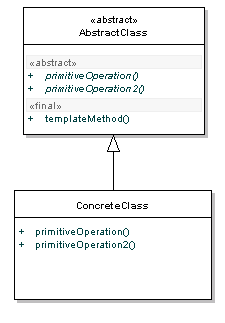

# Template Method Pattern

It makes it easier to implement complex algorithms by encapsulating logic in a single method.

The Template Method pattern is known as a behavioural pattern,as it's used to manage algorithms, relationships and responsibilities between objects.



The AbstractClass contains the templateMethod(), which should be made final so that it cannot be overridden. This template method makes use of other operations available in order to run the algorithm, but is decoupled for the actual implementation of these methods. All operations used by this template method are made abstract, so their implementation is deferred to subclasses.

The ConcreteClass implements all the operations required by the templateMethod that were defined as abstract in the parent class. There can be many different ConcreteClasses. 

The Template Method pattern makes use of the Hollywood Principle: Don't call us, we'll call you. The template method in the parent class controls the overall process, "calling" subclass methods when necessary. The Hollywood principle avoids low level components depending on high level components, and instead give these low level classes (ConcreteClass) a way of hooking into the parent class (AbstractClass). 

## Example

For our Java example, we'll use a cross compiler as an example. First, we'll create a generic cross compiler base class, with it's crossCompile() method being the glue for the whole algorithm to run.

```java
public abstract class CrossCompiler {
  public final void crossCompile() {
    collectSource();
    compileToTarget();
  }
  //Template methods
  protected abstract void collectSource();
  protected abstract void compileToTarget();
}
```

```java

public class IPhoneCompiler extends CrossCompiler {
  protected void collectSource() {
    //anything specific to this class
  }
  protected void compileToTarget() {
    //iphone specific compilation
  }
}
```

```java
public class AndroidCompiler extends CrossCompiler {
  protected void collectSource() {
    //anything specific to this class
  }
  protected void compileToTarget() {
    //android specific compilation
  }
}
```

```java
public class Client {
  public static void main(String[] args) {
    CrossCompiler iphone = new IPhoneCompiler();
    iphone.crossCompile();
    CrossCompiler android = new AndroidCompiler();
    android.crossCompile();
  }
}
```

