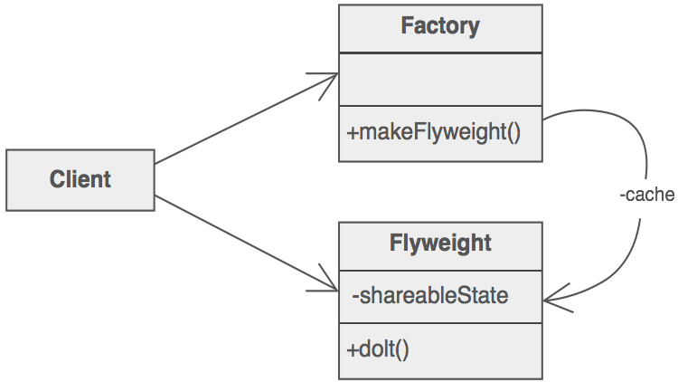

# Flyweight Design Pattern

Simply put, the flyweight pattern is based on a factory which recycles created objects by storing them after creation. Each time an object is requested, the factory looks up the object in order to check if it’s already been created. If it has, the existing object is returned – otherwise, a new one is created, stored and then returned.

The flyweight object’s state is made up of an invariant component shared with other similar objects (intrinsic) and a variant component which can be manipulated by the client code (extrinsic).

It’s very important that the flyweight objects are immutable: any operation on the state must be performed by the factory.

The goal of the flyweight pattern is to reduce memory usage by sharing as much data as possible, hence, it’s a good basis for lossless compression algorithms. In this case, each flyweight object acts as a pointer with its extrinsic state being the context-dependent information.



## Example

```java
public interface Bird {
   void draw();
}
```

```java
public class AngryBird implements Bird {
    private String color;


    public AngryBird(String color){
        this.color = color;       
    }

    @Override
    public void draw() {
        System.out.println("Angry Bird: Draw() [Color : " + color);
    }
}
```

```java
public class BirdFactory {
 
    private static final HashMap angrybirdMap = new HashMap();

    public static Bird getAngryBird(String color) {
        AngryBird angrybird = (AngryBird)angrybirdMap.get(color);

        if(angrybird == null) {   //Here we are checking if object is already present if not create new one.
            angrybird = new AngryBird(color);
            angrybirdMap.put(color, angrybird);
            System.out.println("Creating Angry Bird of color : " + color);
        }
        return angrybird;
    }
}
```

```java
 private static final String colors[] = { "Red", "Orange", "Blue", "Yellow", "Pink" };
public static void main(String[] args) {

    for(int i=0; i < 20; ++i) {
        AngryBird angrybird = (AngryBird)BirdFactory.getAngryBird(getRandomColor());
        
        angrybird.draw();
    }
}
private static String getRandomColor() {
    return colors[(int)(Math.random()*colors.length)];
}
```