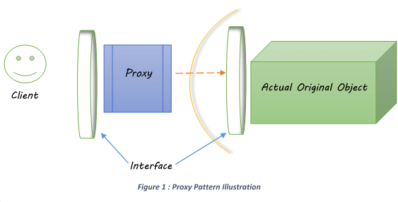

# Proxy design pattern

Proxy is a structural design pattern that provides an object that acts as a substitute for a real service object used by a client. Proxy receives client requests, does some work (access control, caching, etc.) and then passes request to a service object.

1. Create a "wrapper" for a remote, or expensive, or sensitive target
2. Encapsulate the complexity/overhead of the target in the wrapper
3. The client deals with the wrapper
4. The wrapper delegates to the target
5. To support plug-compatibility of wrapper and target, create an interface

Some examples of proxies in standard Java libraries:

* java.lang.reflect.Proxy
* java.rmi.*
* javax.ejb.EJB (see comments)
* javax.inject.Inject (see comments)
* javax.persistence.PersistenceContext



## Example

1. Identify the actual original object, which needs to wrap through a proxy.
2. Identify what steps needs to perform to control the access to the original object.
3. Create a suitable interface that can be implemented by both the original object and the proxy.
4. Create the proxy with access controlling mechanism and any other additional functionalities that support the intention of the proxy.
5. Create the client object and access the original object via the proxy

Let’s assume a very rare species of animal called ‘Sea Bear’ in a nature park. Not every park visitors will be allowed to visit the sea bear. Only authorized people like biologists, vets, and animal researchers will be able to visit them. To control the access of this rare species park has appointed a ‘Sea Bear Guard’. He will assess the details of the visitors and controls the sea bear visits as appropriate.

Let’s implement this situation in the proxy pattern and identify the related components.

SeaBearGuardProxy : This is the proxy class to the SeaBearOriginal class.

BearProtectInterface : This is the interface which is shared by both SearBearOriginal and SeaBearGuardProxy classes and contains the access controlling mechanism.

SeaBearOriginal : This is the actual original class which represents the rare animal species in the nature park

```java
public interface BearProtectInterface { 
 public void allowVisit(int visitorCode)throws TypeMismatch;
}
```

```java
public class SeaBearGuardProxy implements BearProtectInterface {
 
    private int visitorCode;
    private String visitorProfession;
    
    private SeaBearOriginal seaBear = new SeaBearOriginal();
 
    @Override
    public void allowVisit(int visitorCode) throws TypeMismatch{
        if (visitorCode == 1 ) {
            System.out.println("Visitor allowed to see the Sea Bear");
            seaBear.showSeaBear();
        } else {
            System.out.println("Visitor NOT allowed to see the Sea Bear");
        }
    }
    
    public void assignVisitorCode(String profession){
        if (visitorProfession == "Biologist"||visitorProfession == "Vet"||visitorProfession == "Animal Researcher") {
            visitorCode = 1;
        } else {
            visitorCode = 0;
        }
    }
}
```

```java
public class SeaBearOriginal implements BearProtectInterface {
 
    @Override
    public void allowVisit(int visitorCode) throws TypeMismatch {
        if (visitorCode == 1 ) {
            System.out.println("Visitor allowed to see the Sea Bear");
            this.showSeaBear();
        } else {
            System.out.println("Visitor NOT allowed to see the Sea Bear");
        } 
    }
    
    public void showSeaBear(){
        System.out.println("You are welcome to the Sea Bear premisses");
    }
}
```

```java
 public static void main(String[] args) {
 
    BearProtectInterface seaBearProxy = new SeaBearGuardProxy();
    try {
        seaBearProxy.allowVisit(1);
    } catch (TypeMismatch e) {
        e.printStackTrace();
    }
 }
```