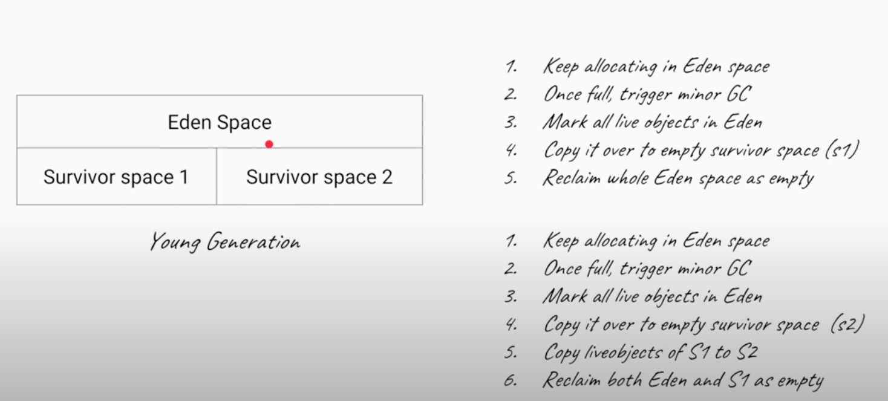
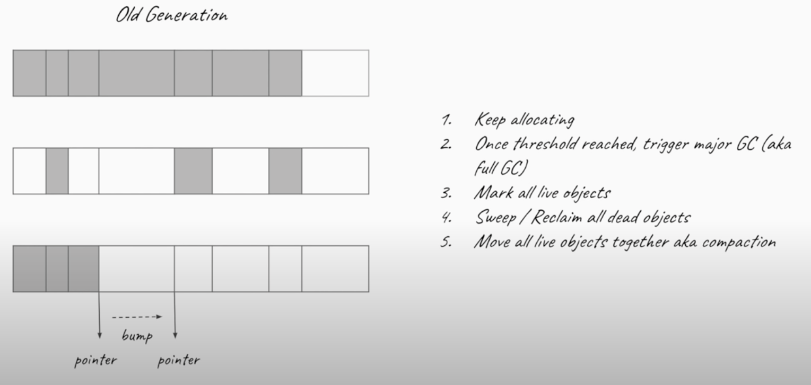
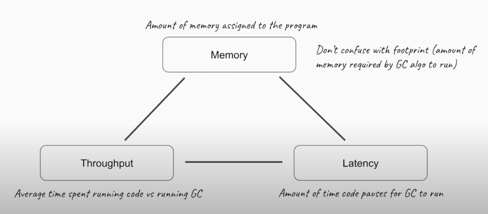

# Interview Questions

## How many ways we can create singleton object?

### Early Initialization

The easiest way to achieve thread safety is to inline the object creation or to use an equivalent static block. This takes advantage of the fact that static fields and blocks are initialized one after another

```java
public class EarlyInitSingleton {
    private static final EarlyInitSingleton INSTANCE = new EarlyInitSingleton();
    public static EarlyInitSingleton getInstance() {
        return INSTANCE;
    }
    
     // private constructor and other methods...
}
```

### Initialization on Demand

Additionally, since we know from the Java Language Specification reference in the previous paragraph that a class initialization occurs the first time we use one of its methods or fields, we can use a nested static class to implement lazy initialization:

```java
public class InitOnDemandSingleton {
    private static class InstanceHolder {
        private static final InitOnDemandSingleton INSTANCE = new InitOnDemandSingleton();
    }
    public static InitOnDemandSingleton getInstance() {
        return InstanceHolder.INSTANCE;
    }

     // private constructor and other methods...
}
```

In this case, the InstanceHolder class will assign the field the first time we access it by invoking getInstance.

### Enum Singleton

The last solution comes from the Effective Java book (Item 3) by Joshua Block and uses an enum instead of a class. At the time of writing, this is considered to be the most concise and safe way to write a singleton:

```java
public enum EnumSingleton {
    INSTANCE;

    // other methods...
}
```

### Double-Checked Locking

```java
public class DclSingleton {
    private static volatile DclSingleton instance; // Should be volatile to avoid cache incoherence issues (fully initialize objected being used)
    public static DclSingleton getInstance() {
        if (instance == null) {
            synchronized (DclSingleton.class) {
                if (instance == null) {
                    instance = new DclSingleton();
                }
            }
        }
        return instance;
    }

    // private constructor and other methods...
}
```

Ref: https://www.youtube.com/watch?v=Z5TRputhzHs

## Using volatile vs AtomicInteger in Java concurrency

Ref : https://www.youtube.com/watch?v=WH5UvQJizH0

### Volatile keyword in Java

It provides a visibility guarantee. Write to volatile variable happens before every subsequent read of the same variable.
It also prevents Compiler from doing smart things, which can create problems in a multi-threading environment, like caching variables, re-ordering of code, etc.

a read of a volatile variable always returns the most recent write by any thread.

http://tutorials.jenkov.com/java-concurrency/volatile.html

### Atomic Variables in Java

The most commonly used atomic variable classes in Java are AtomicInteger, AtomicLong, AtomicBoolean, and AtomicReference. These classes represent an int, long, boolean, and object reference respectively which can be atomically updated. The main methods exposed by these classes are:

* get() – gets the value from the memory, so that changes made by other threads are visible; equivalent to reading a volatile variable
* set() – writes the value to memory, so that the change is visible to other threads; equivalent to writing a volatile variable
* lazySet() – eventually writes the value to memory, maybe reordered with subsequent relevant memory operations. One use case is nullifying references, for the sake of garbage collection, which is never going to be accessed again. In this case, better performance is achieved by delaying the null volatile write
* compareAndSet() – same as described in section 3, returns true when it succeeds, else false
* weakCompareAndSet() – same as described in section 3, but weaker in the sense, that it does not create happens-before orderings. This means that it may not necessarily see updates made to other variables. As of Java 9, this method has been deprecated in all atomic implementations in favor of weakCompareAndSetPlain(). The memory effects of weakCompareAndSet() were plain but its names implied volatile memory effects. To avoid this confusion, they deprecated this method and added four methods with different memory effects such as weakCompareAndSetPlain() or weakCompareAndSetVolatile()

## Differences between Externalizable vs Serializable

|Serializable|Externalizable|
|:--- | :--- |
|Serializable is a marker interface i.e. does not contain any method. | Externalizable interface contains two methods writeExternal() and readExternal() which implementing classes MUST override.|
|Serializable interface pass the responsibility of serialization to JVM and it’s default algorithm.	|Externalizable provides control of serialization logic to programmer – to write custom logic.|
|Mostly, default serialization is easy to implement, but has higher performance cost.	|Serialization done using Externalizable, add more responsibility to programmer but often result in better performance.|
|It’s hard to analyze and modify class structure because any change may break the serialization.|It’s more easy to analyze and modify class structure because of complete control over serialization logic.|

## Why Java is not a purely Object-Oriented Language?

Pure Object Oriented Language or Complete Object Oriented Language are Fully Object Oriented Language which supports or have features which treats everything inside program as objects. It doesn’t support primitive datatype(like int, char, float, bool, etc.). There are seven qualities to be satisfied for a programming language to be pure Object Oriented. They are:

* Encapsulation/Data Hiding
* Inheritance
* Polymorphism
* Abstraction
* All predefined types are objects
* All user defined types are objects
* All operations performed on objects must be only through methods exposed at the objects.

## When we have wrappers classes, why primitives are supported?

Wrappers, being objects, get placed in the heap. Primitives are just "values" and go in the stack. This is more efficient, because for wrapped primitives in the heap you need (at least) both the value (which is in the stack) and the reference to the wrapper object.

Whether this performance gain matters at all depends on what you're doing. For heavy numerical work, definitely, but for 99 % of stuff out there, this is rather an annoyance. For one thing, you can't store primitives in a Collection anyway; they get autoboxed. So the only way to store lots of them is to use plain arrays, which in turn can lead to other kinds of inefficiencies (if you need to resize them, for instance).

## What Are Stack and Heap? What Is Stored in Each of These Memory Structures, and How Are They Interrelated?

The stack is a part of memory that contains information about nested method calls down to the current position in the program. It also contains all local variables and references to objects on the heap defined in currently executing methods.

This structure allows the runtime to return from the method knowing the address whence it was called, and also clear all local variables after exiting the method. Every thread has its own stack.

The heap is a large bulk of memory intended for allocation of objects. When you create an object with the new keyword, it gets allocated on the heap. However, the reference to this object lives on the stack.

## What Is Generational Garbage Collection and What Makes It a Popular Garbage Collection Approach?

Generational garbage collection can be loosely defined as the strategy used by the garbage collector where the heap is divided into a number of sections called generations, each of which will hold objects according to their “age” on the heap.

Whenever the garbage collector is running, the first step in the process is called marking. This is where the garbage collector identifies which pieces of memory are in use and which are not. This can be a very time-consuming process if all objects in a system must be scanned.

As more and more objects are allocated, the list of objects grows and grows leading to longer and longer garbage collection time. However, empirical analysis of applications has shown that most objects are short-lived.

With generational garbage collection, objects are grouped according to their “age” in terms of how many garbage collection cycles they have survived. This way, the bulk of the work spread across various minor and major collection cycles.

Today, almost all garbage collectors are generational. This strategy is so popular because, over time, it has proven to be the optimal solution.

## Describe in Detail How Generational Garbage Collection Works

To properly understand how generational garbage collection works, it is important to first remember how Java heap is structured to facilitate generational garbage collection.

The heap is divided up into smaller spaces or generations. These spaces are Young Generation, Old or Tenured Generation, and Permanent Generation.

The young generation hosts most of the newly created objects. An empirical study of most applications shows that majority of objects are quickly short lived and therefore, soon become eligible for collection. Therefore, new objects start their journey here and are only “promoted” to the old generation space after they have attained a certain “age”.

The term “age” in generational garbage collection refers to the number of collection cycles the object has survived.

The young generation space is further divided into three spaces: an Eden space and two survivor spaces such as Survivor 1 (s1) and Survivor 2 (s2).

The old generation hosts objects that have lived in memory longer than a certain “age”. The objects that survived garbage collection from the young generation are promoted to this space. It is generally larger than the young generation. As it is bigger in size, the garbage collection is more expensive and occurs less frequently than in the young generation.

The permanent generation or more commonly called, PermGen, contains metadata required by the JVM to describe the classes and methods used in the application. It also contains the string pool for storing interned strings. It is populated by the JVM at runtime based on classes in use by the application. In addition, platform library classes and methods may be stored here.

First, any new objects are allocated to the Eden space. Both survivor spaces start out empty. When the Eden space fills up, a minor garbage collection is triggered. Referenced objects are moved to the first survivor space. Unreferenced objects are deleted.

During the next minor GC, the same thing happens to the Eden space. Unreferenced objects are deleted and referenced objects are moved to a survivor space. However, in this case, they are moved to the second survivor space (S2).



In addition, objects from the last minor GC in the first survivor space (S1) have their age incremented and are moved to S2. Once all surviving objects have been moved to S2, both S1 and Eden space are cleared. At this point, S2 contains objects with different ages.

At the next minor GC, the same process is repeated. However this time the survivor spaces switch. Referenced objects are moved to S1 from both Eden and S2. Surviving objects are aged. Eden and S2 are cleared.

After every minor garbage collection cycle, the age of each object is checked. Those that have reached a certain arbitrary age, for example, 8, are promoted from the young generation to the old or tenured generation. For all subsequent minor GC cycles, objects will continue to be promoted to the old generation space.



This pretty much exhausts the process of garbage collection in the young generation. Eventually, a major garbage collection will be performed on the old generation which cleans up and compacts that space. For each major GC, there are several minor GCs.

## What are the different garbage collections supported by java?

* The Serial GC
* Parallel GC
* The Concurrent Mark Sweep (CMS) Collector
* G1 Garbage Collector
* Z Garbage Collector

https://www.baeldung.com/jvm-garbage-collectors

|Garbage Collector|Optimized For|
|:--- | :--- |
|The Serial GC |Memory Footprint ((data structor used to store the gc information))|
|Parallel GC |Throughput|
|CMS |Latency|
|G1 |Throughput & Latency Balance|
|Z1 | |




> Memory: Amount of memory assigned to the program called as heap.

> Throughput: It is houmuch amout of time your code is run vs houmuch amout of time the garbage collection is run. so for example if the throughput is 99% then your program ran for 99% of time and 1% was garbage collector. so we need higher throughput

> Latency: It is houmch amout of time the program stops for garbage collection to run. it is generally in milliseconds.

> We need latency as low as possible or as predictable as possible

### The Serial GC

This is the simplest GC implementation, as it basically works with a single thread. As a result, this GC implementation freezes all application threads when it runs. Hence, it is not a good idea to use it in multi-threaded applications like server environments.

The Serial GC is the garbage collector of choice for most applications that do not have small pause time requirements and run on client-style machines. To enable Serial Garbage Collector, we can use the following argument:

> java -XX:+UseSerialGC -jar Application.java

* Smallest footprint(data structor used to store the gc information) of any collectors
* Use single thread for both minor and major collection
* Objects in old gen are allocated with simple bump the pointer technique.
* Best of program with small memory, or running on shared CPU.

#### Usage Cases

The Serial GC is the garbage collector of choice for most applications that do not have low pause time requirements and run on client-style machines. It takes advantage of only a single virtual processor for garbage collection work (therefore, its name). Still, on today's hardware, the Serial GC can efficiently manage a lot of non-trivial applications with a few hundred MBs of Java heap, with relatively short worst-case pauses (around a couple of seconds for full garbage collections).

Another popular use for the Serial GC is in environments where a high number of JVMs are run on the same machine (in some cases, more JVMs than available processors!). In such environments when a JVM does a garbage collection it is better to use only one processor to minimize the interference on the remaining JVMs, even if the garbage collection might last longer. And the Serial GC fits this trade-off nicely.

Finally, with the proliferation of embedded hardware with minimal memory and few cores, the Serial GC could make a comeback.

Command Line Switches
To enable the Serial Collector use:
-XX:+UseSerialGC

Here is a sample command line for starting the Java2Demo:
java -Xmx12m -Xms3m -Xmn1m -XX:PermSize=20m -XX:MaxPermSize=20m -XX:+UseSerialGC -jar c:\javademos\demo\jfc\Java2D\Java2demo.jar

### Parallel Garbage Collector

It's the default GC of the JVM and sometimes called Throughput Collectors. Unlike Serial Garbage Collector, this uses multiple threads for managing heap space. But it also freezes other application threads while performing GC.

> java -XX:+UseParallelGC -jar Application.java

* Parallel Collector - Multiple threads for minor GC, single thread for major GC.
* Parallel old collector - Multiple threads for both minor and major GC. Default since java 7u4.
* Dosen't run with the application. i.e while GC is running applications are stopped.
* Greates throughput in multi-processor system.
* Great for batch application.
  
#### Usage Cases
The Parallel collector is also called a throughput collector. Since it can use multilple CPUs to speed up application throughput. This collector should be used when a lot of work need to be done and long pauses are acceptable. For example, batch processing like printing reports or bills or performing a large number of database queries.

-XX:+UseParallelGC
With this command line option you get a multi-thread young generation collector with a single-threaded old generation collector. The option also does single-threaded compaction of old generation.

Here is a sample command line for starting the Java2Demo:
java -Xmx12m -Xms3m -Xmn1m -XX:PermSize=20m -XX:MaxPermSize=20m -XX:+UseParallelGC -jar c:\javademos\demo\jfc\Java2D\Java2demo.jar

-XX:+UseParallelOldGC
With the -XX:+UseParallelOldGC option, the GC is both a multithreaded young generation collector and multithreaded old generation collector. It is also a multithreaded compacting collector. HotSpot does compaction only in the old generation. Young generation in HotSpot is considered a copy collector; therefore, there is no need for compaction.

Compacting describes the act of moving objects in a way that there are no holes between objects. After a garbage collection sweep, there may be holes left between live objects. Compacting moves objects so that there are no remaining holes. It is possible that a garbage collector be a non-compacting collector. Therefore, the difference between a parallel collector and a parallel compacting collector could be the latter compacts the space after a garbage collection sweep. The former would not.

### The Concurrent Mark Sweep (CMS) Collector

* Concurrent mark and sweep collector for old generation means it runs with application for garbage collection.
* Runs concurrently with application (But still has stop the world pauses).
* Lesss throughput than parallel collector.
* More footprint (data structor used to store the gc information) than parallel collector.
* Smaller pause times thean parallel collector.
* Great for general application.
* Deprecated in Java-9
  
### G1 Garbage Collector

G1 (Garbage First) Garbage Collector is designed for applications running on multi-processor machines with large memory space. It's available since JDK7 Update 4 and in later releases.

* G1 is the new default garbage collector in JDK 9
* The goal is throughput and low latency
* The default pause target for G1 is 200 miliseconds
* G1 divides the heap into multiple regions usually around 2000 regions.
* G1 finds all the live object concurrently (The java aplication is not stopped).
* G1 keeps track of pointers between regions. so that it can transfer the objects between regions.
* G1 can decide to collect a few regions at a time.
  - fewer objects to collect -> shorter pauses
  - More information -> more control over pauses
* As g1 begins the collection it needs at least one empty region to move live objects.
* Live objects are moved to the empty regions freeing the memory in old regions.
* Thus the new regions are more compact.

Unlike other collectors, the G1 collector partitions the heap into a set of equal-sized heap regions, each a contiguous range of virtual memory. When performing garbage collections, G1 shows a concurrent global marking phase (i.e. phase 1 known as Marking) to determine the liveness of objects throughout the heap.

After the mark phase is completed, G1 knows which regions are mostly empty. It collects in these areas first, which usually yields a significant amount of free space (i.e. phase 2 known as Sweeping). It is why this method of garbage collection is called Garbage-First.

To enable the G1 Garbage Collector, we can use the following argument

>java -XX:+UseG1GC -jar Application.java

Ref: https://blogs.oracle.com/javamagazine/understanding-the-jdks-new-superfast-garbage-collectors

### Shenandoah (sheh.nuhn.dow.uh) Garbage Collector

Shenandoah is a new GC that was released as part of JDK 12.

Shenandoah’s key advance over G1 is to do more of its garbage collection cycle work concurrently with the application threads. G1 can evacuate its heap regions, that is, move objects, only when the application is paused, while Shenandoah can relocate objects concurrently with the application. To achieve the concurrent relocation, it uses what’s known as a Brooks pointer. This pointer is an additional field that each object in the Shenandoah heap has and which points back to the object itself.

Shenandoah does this because when it moves an object, it also needs to fix up all the objects in the heap that have references to that object. When Shenandoah moves an object to a new location, it leaves the old Brooks pointer in place, forwarding references to the new location of the object. When an object is referenced, the application follows the forwarding pointer to the new location. Eventually the old object with the forwarding pointer needs to be cleaned up, but by decoupling the cleanup operation from the step of moving the object itself, Shenandoah can more easily accomplish the concurrent relocation of objects.

To use Shenandoah in your application from Java 12 onwards, enable it with the following options:

> -XX:+UnlockExperimentalVMOptions -XX:+UseShenandoahGC

Ref: https://blogs.oracle.com/javamagazine/understanding-the-jdks-new-superfast-garbage-collectors

### Z Garbage Collector

ZGC (Z Garbage Collector) is a scalable low-latency garbage collector which debuted in Java 11 as an experimental option for Linux. JDK 14 introduced  ZGC under the Windows and macOS operating systems. ZGC has obtained the production status from Java 15 onwards.

ZGC performs all expensive work concurrently, without stopping the execution of application threads for more than 10 ms, which makes it suitable for applications that require low latency. It uses load barriers with colored pointers to perform concurrent operations when the threads are running and they are used to keep track of heap usage.

Reference coloring (colored pointers) is the core concept of ZGC. It means that ZGC uses some bits (metadata bits) of reference to mark the state of the object. It also handles heaps ranging from 8MB to 16TB in size. Furthermore, pause times do not increase with the heap, live-set, or root-set size.

Similar to G1, Z Garbage Collector partitions the heap, except that heap regions can have different sizes.

This makes ZGC a good fit for applications that require large amounts of memory, such as with big data. However, ZGC is also a good candidate for smaller heaps that require predictable and extremely low pause times

To enable the Z Garbage Collector, we can use the following argument in JDK versions lower than 15:

> java -XX:+UnlockExperimentalVMOptions -XX:+UseZGC Application.java

From version 15 we don't need experimental mode on:

> java -XX:+UseZGC Application.java

We should note that ZGC is not the default Garbage Collector.

Ref: https://blogs.oracle.com/javamagazine/understanding-the-jdks-new-superfast-garbage-collectors

## How Do You Trigger Garbage Collection from Java Code?

You, as Java programmer, can not force garbage collection in Java; it will only trigger if JVM thinks it needs a garbage collection based on Java heap size.

Additionally, there are methods like System.gc() and Runtime.gc() which is used to send request of Garbage collection to JVM but it’s not guaranteed that garbage collection will happen.

## What Happens When There Is Not Enough Heap Space to Accommodate Storage of New Objects?

If there is no memory space for creating a new object in Heap, Java Virtual Machine throws OutOfMemoryError or more specifically java.lang.OutOfMemoryError heap space.

## Describe Strong, Weak, Soft and Phantom References and Their Role in Garbage Collection?

Much as memory is managed in Java, an engineer may need to perform as much optimization as possible to minimize latency and maximize throughput, in critical applications. Much as it is impossible to explicitly control when garbage collection is triggered in the JVM, it is possible to influence how it occurs as regards the objects we have created.

Java provides us with reference objects to control the relationship between the objects we create and the garbage collector.

> StringBuilder sb = new StringBuilder();

In the above snippet, the new keyword creates a new StringBuilder object and stores it on the heap. The variable sb then stores a strong reference to this object. What this means for the garbage collector is that the particular StringBuilder object is not eligible for collection at all due to a strong reference held to it by sb. The story only changes when we nullify sb like this:

> sb = null;

After calling the above line, the object will then be eligible for collection.

We can change this relationship between the object and the garbage collector by explicitly wrapping it inside another reference object which is located inside java.lang.ref package.

A **soft reference** can be created to the above object like this:

```
StringBuilder sb = new StringBuilder();
SoftReference<StringBuilder> sbRef = new SoftReference<>(sb);
sb = null;
```

In the above snippet, we have created two references to the StringBuilder object. The first line creates a strong reference sb and the second line creates a soft reference sbRef. The third line should make the object eligible for collection but the garbage collector will postpone collecting it because of sbRef.

The story will only change when memory becomes tight and the JVM is on the brink of throwing an OutOfMemory error. In other words, objects with only soft references are collected as a last resort to recover memory.

A **weak reference** can be created in a similar manner using WeakReference class. When sb is set to null and the StringBuilder object only has a weak reference, the JVM's garbage collector will have absolutely no compromise and immediately collect the object at the very next cycle.

A **phantom reference** is similar to a weak reference and an object with only phantom references will be collected without waiting. However, phantom references are enqueued as soon as their objects are collected. We can poll the reference queue to know exactly when the object was collected.

## What Is a Stringbuilder and What Are Its Use Cases? What Is the Difference Between Appending a String to a Stringbuilder and Concatenating Two Strings with a + Operator? How Does Stringbuilder Differ from Stringbuffer?

https://javapapers.com/java/java-string-vs-stringbuilder-vs-stringbuffer-concatenation-performance-micro-benchmark/


### StringBuilder

First up is the humble StringBuilder. This class provides an array of String-building utilities that makes easy work of String manipulation.

```
StringBuilder stringBuilder = new StringBuilder(100);

stringBuilder.append("Baeldung");
stringBuilder.append(" is");
stringBuilder.append(" awesome");

assertEquals("Baeldung is awesome", stringBuilder.toString());
```

Internally, StringBuilder maintains a mutable array of characters. In our code sample, we've declared this to have an initial size of 100 through (default 16) the StringBuilder constructor. Because of this size declaration, the StringBuilder can be a very efficient way to concatenate Strings.

StringBuilder's default constructor will create an array which can hold 16 char elements. #append(String) copies the characters of the string to the StringBuidler's array using String#getChars(int, int, char[], int). The array is re-sized using Arrays.copyOf(char[], int) only when there is no space to add more characters. Each time this happens the capacity of the array is doubled + 2. The end is marked by counting how many characters are in the array.

It's also worth noting that the StringBuffer class is the synchronized version of StringBuilder. 

Although synchronization is often synonymous with thread safety, it's not recommended for use in multithreaded applications due to StringBuffer's builder pattern. While individual calls to a synchronized method are thread safe, multiple calls are not.

### String + operator

Next up is the addition operator (+). This is the same operator that results in the addition of numbers and is overloaded to concatenate when applied to Strings.

```
String myString = "The " + "quick " + "brown " + "fox...";
assertEquals("The quick brown fox...", myString);
```
At first glance, this may seem much more concise than the StringBuilder option. However, when the source code compiles, the + symbol translates to chains of StringBuilder.append() calls. Due to this, mixing the StringBuilder and + method of concatenation is considered bad practice.

Additionally, String concatenation using the + operator within a loop should be avoided. Since the String object is immutable, each call for concatenation will result in a new String object being created.

### String.join (Java 8+)

If our application is running on Java 8 or above, we can take advantage of the String.join method. With this, we can join an array of Strings with a common delimiter, ensuring no spaces are missed.

```
String[] strings = {"I'm", "running", "out", "of", "pangrams!"};

String myString = String.join(" ", strings);

assertEquals("I'm running out of pangrams!", myString);
```

A huge advantage of this method is not having to worry about the delimiter between our strings.

### StringJoiner (Java 8+)

StringJoiner abstracts all of the String.join functionality into a simple to use class. The constructor takes a delimiter, with an optional prefix and suffix. We can append Strings using the well-named add method.

```
StringJoiner fruitJoiner = new StringJoiner(", ");

fruitJoiner.add("Apples");
fruitJoiner.add("Oranges");
fruitJoiner.add("Bananas");

assertEquals("Apples, Oranges, Bananas", fruitJoiner.toString());
```

By using this class, instead of the String.join method, we can append Strings as the program runs; There's no need to create the array first!

### String.intern()

Basically doing String.intern() on a series of strings will ensure that all strings having same contents share same memory. So if you have list of names where 'john' appears 1000 times, by interning you ensure only one 'john' is actually allocated memory.

This can be useful to reduce memory requirements of your program. But be aware that the cache is maintained by JVM in permanent memory pool which is usually limited in size compared to heap so you should not use intern if you don't have too many duplicate values.

In JDK 7, interned strings are no longer allocated in the permanent generation of the Java heap, but are instead allocated in the main part of the Java heap (known as the young and old generations), along with the other objects created by the application. This change will result in more data residing in the main Java heap, and less data in the permanent generation, and thus may require heap sizes to be adjusted. Most applications will see only relatively small differences in heap usage due to this change, but larger applications that load many classes or make heavy use of the String.intern() method will see more significant differences.

### What is JIT compiler?

The Just-In-Time (JIT) compiler is a an essential part of the JRE i.e. Java Runtime Environment, that is responsible for performance optimization of java based applications at run time. Compiler is one of the key aspects in deciding performance of an application for both parties i.e. the end user and the application developer.

In order to improve performance, JIT compilers interact with the Java Virtual Machine (JVM) at run time and compile suitable bytecode sequences into native machine code. While using a JIT compiler, the hardware is able to execute the native code, as compared to having the JVM interpret the same sequence of bytecode repeatedly and incurring an overhead for the translation process. This subsequently leads to performance gains in the execution speed, unless the compiled methods are executed less frequently.

The JIT compiler doesn't compile every method that gets called because thousands of methods can be called at startup. Instead, OpenJ9 records the number of times a method is called. When the count reaches a pre-defined invocation threshold, JIT compilation is triggered. Once a method has been compiled by the JIT, the VM can call the compiled method rather than interpreting it.

## What Is Ahead of Time Compilation? (From Java 9)

AOT compilation is one way of improving the performance of Java programs and in particular the startup time of the JVM. The JVM executes Java bytecode and compiles frequently executed code to native code. This is called Just-in-Time (JIT) Compilation. The JVM decides which code to JIT compile based on profiling information collected during execution.

While this technique enables the JVM to produce highly optimized code and improves peak performance, the startup time is likely not optimal, as the executed code is not yet JIT compiled. AOT aims to improve this so-called warming-up period. The compiler used for AOT is Graal.

JAOT Compilation

> jaotc --output jaotCompilation.so JaotCompilation.class

Running the JAOT program

> java -XX:AOTLibrary=./jaotCompilation.so JaotCompilation

The argument -XX:AOTLibrary accepts a relative or full path to the library. Alternatively, we can copy the library to the lib folder in the Java home directory and only pass the name of the library.

https://www.youtube.com/watch?v=sJVenujWGjs

https://www.baeldung.com/ahead-of-time-compilation
## What Is a JIT Compiler?

When we compile our Java program (e.g., using the javac command), we'll end up with our source code compiled into the binary representation of our code – a JVM bytecode. This bytecode is simpler and more compact than our source code, but conventional processors in our computers cannot execute it.

To be able to run a Java program, the JVM interprets the bytecode. Since interpreters are usually a lot slower than native code executing on a real processor, the JVM can run another compiler which will now compile our bytecode into the machine code that can be run by the processor. This so-called just-in-time compiler is much more sophisticated than the javac compiler, and it runs complex optimizations to generate high-quality machine code.

Oracle’s Java HotSpot VM is equipped with a highly advanced just-in-time (JIT) compiler. This means that the class files (which are compiled from Java source code) are further compiled at runtime, and they can be turned into very highly optimized machine code. This optimized code runs extremely fast—usually as fast as (and, in certain cases, faster than) compiled C/C++ code.

Fortunately, a new open source tool called JITWatch is being developed to give developers much better insight into how the JIT compiler treats their code. For most effective use, the JITWatch tool relies on developers already understanding the basic mechanisms and terminology of JIT compilation.

Java HotSpot VM automatically monitors which methods are being executed. Once a method has become eligible (by meeting some criteria, such as being called often), it is scheduled for compilation into machine code, and it is then known as a hot method. The compilation into machine code happens on a separate JVM thread and will not interrupt the execution of the program. In fact, even while the compiler thread is compiling a hot method, the Java Virtual Machine (JVM) will keep on using the original, interpreted version of the method until the compiled version is ready.

**Some JIT Compilation Techniques**

One of the most common JIT compilation techniques used by Java HotSpot VM is inlining, which is the practice of substituting the body of a method into the places where that method is called. Inlining saves the cost of calling the method; no new stack frames need to be created. By default, Java HotSpot VM will try to inline methods that contain less than 35 bytes of JVM bytecode.

Another common optimization that Java HotSpot VM makes is monomorphic dispatch, which relies on the observed fact that, usually, there aren’t paths through a method that cause an object reference to be of one type most of the time but of another type at other times.
## AOT vs JIT compilation in Java

we use byte code so that it's portable across architectures the code is initially interpreted line by line and then after some threshold of 10000 times of execution it is converted into machine code based on some runtime analysis or core profiling the code is further optimized by the C2 compiler and if we choose we can use a AOT 
compilation for some of our code or some of our libraries to avoid doing this interpretation and C1 compiler job and start our application even faster and all of this compile code is stored in code cache which as of Java 8 is off to 40 MB.

## What is C1 & C2 compilers in JIT

The JDK implementation by Oracle is based on the open-source OpenJDK project. This includes the HotSpot virtual machine, available since Java version 1.3. It contains two conventional JIT-compilers: the client compiler, also called C1 and the server compiler, called opto or C2.

C1 is designed to run faster and produce less optimized code, while C2, on the other hand, takes a little more time to run but produces a better-optimized code. The client compiler is a better fit for desktop applications since we don't want to have long pauses for the JIT-compilation. The server compiler is better for long-running server applications that can spend more time on the compilation.

Today, Java installation uses both JIT compilers during the normal program execution.

### Tiered Compilation

As we mentioned in the previous section, our Java program, compiled by javac, starts its execution in an interpreted mode. The JVM tracks each frequently called method and compiles them. In order to do that, it uses C1 for the compilation. But, the HotSpot still keeps an eye on the future calls of those methods. If the number of calls increases, the JVM will recompile these methods once more, but this time using C2.

This is the default strategy used by the HotSpot, called tiered compilation.

### The Server Compiler

Let's now focus for a bit on C2, since it is the most complex of the two. C2 has been extremely optimized and produces code that can compete with C++ or be even faster. The server compiler itself is written in a specific dialect of C++.

However, it comes with some issues. Due to possible segmentation faults in C++, it can cause the VM to crash. Also, no major improvements have been implemented in the compiler over the last several years. The code in C2 has become difficult to maintain, so we couldn't expect new major enhancements with the current design. With that in mind, the new JIT compiler is being created in the project named GraalVM.


## Project GraalVM

Project GraalVM is a research project created by Oracle. We can look at Graal as several connected projects: a new JIT compiler that builds on HotSpot and a new polyglot virtual machine. It offers a comprehensive ecosystem supporting a large set of languages (Java and other JVM-based languages; JavaScript, Ruby, Python, R,  C/C++, and other LLVM-based languages).

https://www.baeldung.com/graal-java-jit-compiler

https://blog.idrsolutions.com/2018/04/java-10-project-graal-explained-5-minutes/


## How to create Noninstantiable (You cannot create instance of this class, Can be used as Utility classes) class.

```
public class UtilityClass {

// Suppress default constructor for noninstantiability
    private UtilityClass() {
        throw new AssertionError();
    }    
}
```

Because the explicit constructor is private, it is inaccessible outside the class. The AssertionError isn’t strictly required, but it provides insurance in case the constructor is accidentally invoked from within the class. It guarantees the class will never be instantiated under any circumstances. This idiom is mildly counterintuitive because the constructor is provided expressly so that it cannot be invoked. It is therefore wise to include a comment, as shown earlier.

As a side effect, this idiom also prevents the class from being subclassed. All constructors must invoke a superclass constructor, explicitly or implicitly, and a subclass would have no accessible superclass constructor to invoke.

Example: Objects class in Java

```java
public final class Objects {
    private Objects() {
        throw new AssertionError("No java.util.Objects instances for you!");
    }
}
```