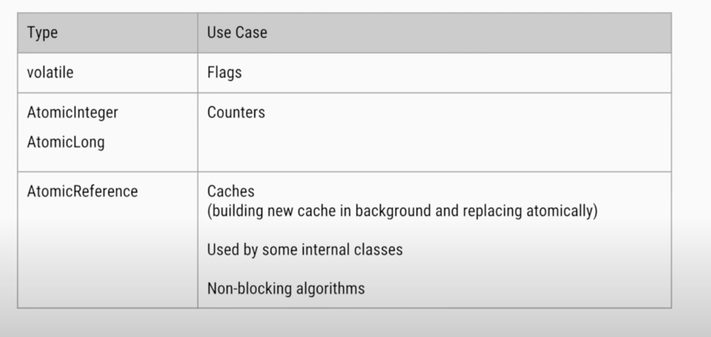

# Java Basics

## Volatile keyword in Java

Volatile specifier is used to indicate that a variable’s value can be modified by multiple threads simultaneously.
The value of this variable will never be cached thread-locally: all reads and writes will go straight to “main memory” ( that is not right at all practically :), but this is what mostly written everywhere.)

Volatile comes with two major concepts : Visibility and Ordering.

Visibility: If one thread changes a value of a variable, the change will be visible immediately to other threads reading the variable. This is guaranteed by not allowing the compiler or the JVM to allocate those variables in the CPU registers. Any write to a volatile variable is flushed immediately to main memory and any read of it is fetched from main memory. That means there is a little bit of performance penalty, but that's far better from a concurrency point of view.

Ordering: Sometimes for performance optimization, the JVM reorders instructions. This is not allowed when accessing volatile variables. Access to volatile variables is not reordered with access to other volatile variables, nor with access to other normal fields around them. This makes writes to non-volatile fields around them visible immediately to other threads.

In a multithreaded application where the threads operate on non-volatile variables, each thread may copy variables from main memory into a CPU cache while working on them, for performance reasons. If your computer contains more than one CPU, each thread may run on a different CPU. That means, that each thread may copy the variables into the CPU cache of different CPUs. This is illustrated here:


With non-volatile variables there are no guarantees about when the Java Virtual Machine (JVM) reads data from main memory into CPU caches, or writes data from CPU caches to main memory.

Imagine too, that only Thread 1 increments the counter variable, but both Thread 1 and Thread 2 may read the counter variable from time to time.

If the counter variable is not declared volatile there is no guarantee about when the value of the counter variable is written from the CPU cache back to main memory. This means, that the counter variable value in the CPU cache may not be the same as in main memory. This situation is illustrated here:


The problem with threads not seeing the latest value of a variable because it has not yet been written back to main memory by another thread, is called a "visibility" problem. The updates of one thread are not visible to other threads.

### The Java volatile Visibility Guarantee

The Java volatile keyword is intended to address variable visibility problems. By declaring the counter variable volatile all writes to the counter variable will be written back to main memory immediately. Also, all reads of the counter variable will be read directly from main memory.

### Full volatile Visibility Guarantee

Actually, the visibility guarantee of Java volatile goes beyond the volatile variable itself. The visibility guarantee is as follows:

* If Thread A writes to a volatile variable and Thread B subsequently reads the same volatile variable, then all variables visible to Thread A before writing the volatile variable, will also be visible to Thread B after it has read the volatile variable.
* If Thread A reads a volatile variable, then all all variables visible to Thread A when reading the volatile variable will also be re-read from main memory.

Ref: http://tutorials.jenkov.com/java-concurrency/volatile.html

Ref: https://www.youtube.com/watch?v=WH5UvQJizH0

### Volatile is Not Always Enough

Even if the volatile keyword guarantees that all reads of a volatile variable are read directly from main memory, and all writes to a volatile variable are written directly to main memory, there are still situations where it is not enough to declare a variable volatile.

Imagine if Thread 1 reads a shared counter variable with the value 0 into its CPU cache, increment it to 1 and not write the changed value back into main memory. Thread 2 could then read the same counter variable from main memory where the value of the variable is still 0, into its own CPU cache. Thread 2 could then also increment the counter to 1, and also not write it back to main memory. This situation is illustrated in the diagram below:


Thread 1 and Thread 2 are now practically out of sync. The real value of the shared counter variable should have been 2, but each of the threads has the value 1 for the variable in their CPU caches, and in main memory the value is still 0. It is a mess! Even if the threads eventually write their value for the shared counter variable back to main memory, the value will be wrong.

### Main Differences

**LOCKING:** The synchronized keyword is used to implement a lock-based threading model, whereas volatile and atomic variables give are non-lock based, which means threads do not require a lock to access these variables.

**PERFORMANCE:** Atomic variables perform better than a synchronized keyword because atomic variables use concurrency support provided by hardware for various atomic operations, like Compare-And-Swap or read-modify-write. Note that synchronization uses a locking mechanism.

**DEPENDENCY:** Volatile variable is generally used when the value of the variable does not depend on its previous value. Hence volatile variables are suitable for boolean variables. Whereas atomic variables can be used for variables where the value of the variable depends on its previous value like increment or decrement operations.



Reading and writing of volatile variables causes the variable to be read or written to main memory. Reading from and writing to main memory is more expensive than accessing the CPU cache. Accessing volatile variables also prevent instruction reordering which is a normal performance enhancement technique. Thus, you should only use volatile variables when you really need to enforce visibility of variables.

## Concurrency vs Parallelism

* **Concurrency** : is when two or more tasks can start, run, and complete in overlapping time periods. It doesn't necessarily mean they'll ever both be running at the same instant. For example, multitasking on a single-core machine.

    A condition that exists when at least two threads are making progress. A more generalized form of parallelism that can include time-slicing as a form of virtual parallelism.

* **Parallelism** : is when tasks literally run at the same time, e.g., on a multicore processor.
    
A condition that arises when at least two threads are executing simultaneously.


## AtomicLong

The AtomicLong class provides you with a long variable which can be read and written atomically, and which also contains advanced atomic operations like compareAndSet(). The AtomicLong class is located in the java.util.concurrent.atomic package, so the full class name is java.util.concurrent.atomic.AtomicLong .

The reasoning behind the AtomicLong design is explained in my Java Concurrency tutorial in the text about Compare and Swap.

**Compare and swap **is a technique used when designing concurrent algorithms. Basically, compare and swap compares an expected value to the concrete value of a variable, and if the concrete value of the variable is equals to the expected value, swaps the value of the variable for a new variable. Compare and swap may sound a bit complicated but it is actually reasonably simple once you understand it, so let me elaborate a bit further on the topic.

### Compare And Swap As Atomic Operation

Modern CPUs have built-in support for atomic compare and swap operations. From Java 5 you can get access to these functions in the CPU via some of the new atomic classes in the java.util.concurrent.atomic package.

Here is an example showing how to implement the lock() method shown earlier using the AtomicBoolean class:

```java
public static class MyLock {
    private AtomicBoolean locked = new AtomicBoolean(false);

    public boolean lock() {
        return locked.compareAndSet(false, true);
    }

}
```

Notice how the locked variable is no longer a boolean but an AtomicBoolean. This class has a compareAndSet() function which will compare the value of the AtomicBoolean instance to an expected value, and if has the expected value, it swaps the value with a new value. In this case it compares the value of locked to false and if it is false it sets the new value of the AtomicBoolean to true.

The compareAndSet() method returns true if the value was swapped, and false if not.

## AtomicReference

The AtomicReference class provides an object reference variable which can be read and written atomically. By atomic is meant that multiple threads attempting to change the same AtomicReference (e.g. with a compare-and-swap operation) will not make the AtomicReference end up in an inconsistent state. AtomicReference even has an advanced compareAndSet() method which lets you compare the reference to an expected value (reference) and if they are equal, set a new reference inside the AtomicReference object.

### Creating an AtomicReference

```java
AtomicReference atomicReference = new AtomicReference();

String initialReference = "the initially referenced string";
AtomicReference<String> atomicStringReference = new AtomicReference<String>(initialReference);
```

```java
import java.util.concurrent.atomic.AtomicReference;
public class AtomicRefEg {
    static AtomicReference<Person> p  = new AtomicReference<Person>(new Person(20));
    public static void main(String[] args) throws InterruptedException {
        Thread t1 = new Thread(new Runnable(){
            @Override
            public void run() {
                for(int i=1 ; i<=3 ; i++){
                    p.set(new Person(p.get().age+10));
                    System.out.println("Atomic Check by first thread: "+Thread.currentThread().getName()+" is "+p.get().age);
                }
            }
        });
        Thread t2 = new Thread(new Runnable(){
            @Override
            public void run() {
                Person per = p.get();
                for(int i=1 ; i<=3 ; i++){
                    System.err.println(p.get().equals(per)+"_"+per.age+"_"+p.get().age);
                    p.compareAndSet(per, new Person(p.get().age+10));
                    System.out.println("Atomic Check by second thread : "+Thread.currentThread().getName()+" is "+p.get().age);
                }
            }
        });
        t1.start();
        t2.start();
        t1.join();
        t2.join();
        System.out.println("Final value: "+p.get().age);
    }
}
class Person {
    int age;
    public Person(int i) {
        age=i;
    }
}
```

### Comparing and Setting the AtomicReference Reference

The AtomicReference class contains a useful method named compareAndSet(). The compareAndSet() method can compare the reference stored in the AtomicReference instance with an expected reference, and if they two references are the same (not equal as in equals() but same as in ==), then a new reference can be set on the AtomicReference instance.

If compareAndSet() sets a new reference in the AtomicReference the compareAndSet() method returns true. Otherwise compareAndSet() returns false.

## AtomicStampedReference

The AtomicStampedReference is designed to solve the A-B-A problem. The A-B-A problem is when a reference is changed from pointing to A, then to B and then back to A.

When using compare-and-swap operations to change a reference atomically, and making sure that only one thread can change the reference from an old reference to a new, detecting the A-B-A situation is impossible.

```java
Initially: x = 0
Thread1: read x // sees x = 0
Thread2: x = 1
Thread3: x = 0
Thread1: read x // again sees x = 0, thinking that nothing has changed
```

To solve the above problem, we can maintain a stamp that should be updated(incremented) whenever a thread changes some state:

```java
Initially: x = 0, stamp = 0
Thread1: read stamp // sees stamp = 0
Thread2: x = 1, stamp = 1
Thread3: x = 0, stamp = 2
Thread1: read stamp,x // sees stamp = 2 which is != 0 hence do some processing
```

By using an AtomicStampedReference instead of an AtomicReference it is possible to detect the A-B-A situation. Thread 1 can copy the reference and stamp out of the AtomicStampedReference atomically using get(). If another thread changes the reference from A to B and then back to A, then the stamp will have changed.

The AtomicStampedReference class provides an object reference variable which can be read and written atomically. By atomic is meant that multiple threads attempting to change the same AtomicStampedReference will not make the AtomicStampedReference end up in an inconsistent state.

The AtomicStampedReference is different from the AtomicReference in that the AtomicStampedReference keeps both an object reference and a stamp internally. The reference and stamp can be swapped using a single atomic compare-and-swap operation, via the compareAndSet() method.

```java
import java.util.concurrent.atomic.AtomicStampedReference;
public class AtomicRefEg {
    static int stampVal = 1;
    static AtomicStampedReference<Person> s  = new AtomicStampedReference<Person>(new Person(20), stampVal);
    public static void main(String[] args) throws InterruptedException {
        Thread t1 = new Thread(new Runnable(){
            @Override
            public void run() {
                for(int i=1 ; i<=3 ; i++) {
                    System.out.println("stamp value for first thread:"+stampVal);
                    s.compareAndSet(s.getReference(), new Person(s.getReference().age+10), stampVal, ++stampVal);
                    System.out.println("Atomic Check by first thread: "+Thread.currentThread().getName()+" is "+s.getReference().age);
                }
            }
        });
        Thread t2 = new Thread(new Runnable() {
            @Override
            public void run() {
                for(int i=1 ; i<=3 ; i++){
                    System.out.println("stamp value for second thread:"+stampVal);
                    s.compareAndSet(s.getReference(), new Person(s.getReference().age+10), stampVal, ++stampVal);
                    System.out.println("Atomic Check by second thread : "+Thread.currentThread().getName()+" is "+s.getReference().age);
                }
            }
        });
        t1.start();
        t2.start();
        t1.join();
        t2.join();
        System.out.println("Final value: "+s.getReference().age);
    }
}
class Person {
    int age;
    public Person(int i) {
        age=i;
    }
}
```

Ref: http://tutorials.jenkov.com/java-util-concurrent/atomicstampedreference.html

## Java ThreadLocal

The Java ThreadLocal class enables you to create variables that can only be read and written by the same thread. Thus, even if two threads are executing the same code, and the code has a reference to the same ThreadLocal variable, the two threads cannot see each other's ThreadLocal variables. Thus, the Java ThreadLocal class provides a simple way to make code thread safe that would not otherwise be so.

### Using a ThreadLocal with a Thread Pool or ExecutorService

If you plan to use a Java ThreadLocal from inside a task passed to a Java Thread Pool or a Java ExecutorService, keep in mind that you do not have any guarantees which thread will execute your task. However, if all you need is to make sure that each thread uses its own instance of some object, this is not a problem. Then you can use a Java ThreadLocal with a thread pool or ExecutorService just fine.

Full ThreadLocal Example

```java
public class ThreadLocalExample {

    public static void main(String[] args) {
        MyRunnable sharedRunnableInstance = new MyRunnable();

        Thread thread1 = new Thread(sharedRunnableInstance);
        Thread thread2 = new Thread(sharedRunnableInstance);

        thread1.start();
        thread2.start();

        thread1.join(); //wait for thread 1 to terminate
        thread2.join(); //wait for thread 2 to terminate
    }

}
```

```java
public class MyRunnable implements Runnable {

    private ThreadLocal<Integer> threadLocal = new ThreadLocal<Integer>();

    @Override
    public void run() {
        threadLocal.set( (int) (Math.random() * 100D) );

        try {
            Thread.sleep(2000);
        } catch (InterruptedException e) {
        }

        System.out.println(threadLocal.get());
    }
}
```

### Example of threadlocal


## InheritableThreadLocal

The InheritableThreadLocal class is a subclass of ThreadLocal. Instead of each thread having its own value inside a ThreadLocal, the InheritableThreadLocal grants access to values to a thread and all child threads created by that thread. Here is a full Java InheritableThreadLocal example:

```java
public class InheritableThreadLocalBasicExample {

    public static void main(String[] args) {

        ThreadLocal<String> threadLocal = new ThreadLocal<>();
        InheritableThreadLocal<String> inheritableThreadLocal =
                new InheritableThreadLocal<>();

        Thread thread1 = new Thread(() -> {
            System.out.println("===== Thread 1 =====");
            threadLocal.set("Thread 1 - ThreadLocal");
            inheritableThreadLocal.set("Thread 1 - InheritableThreadLocal");

            System.out.println(threadLocal.get());
            System.out.println(inheritableThreadLocal.get());

            Thread childThread = new Thread( () -> {
                System.out.println("===== ChildThread =====");
                System.out.println(threadLocal.get());
                System.out.println(inheritableThreadLocal.get());
            });
            childThread.start();
        });

        thread1.start();

        Thread thread2 = new Thread(() -> {
            try {
                Thread.sleep(3000);
            } catch (InterruptedException e) {
                e.printStackTrace();
            }

            System.out.println("===== Thread2 =====");
            System.out.println(threadLocal.get());
            System.out.println(inheritableThreadLocal.get());
        });
        thread2.start();
    }
}
```

