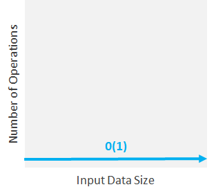
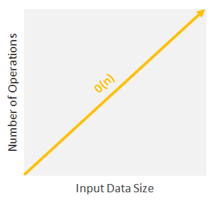
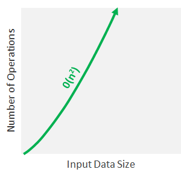
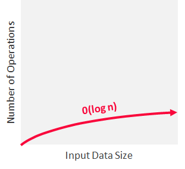
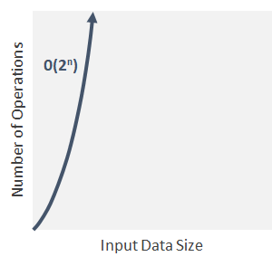

# Time Complexity

## Defination

The time complexity is a way of showing how the runtime of a function increases as the size of the input increases.

When we consider the complexity of an algorithm, we shouldn’t really care about the exact number of operations that are performed; instead, we should care about how the number of operations relates to the problem size. Think about it: if the problem size doubles, does the number of operations stay the same? Do they double? Do they increase in some other way? To answer these questions, we need to measure the time complexity of algorithms.

Time complexity represents the number of times a statement is executed. The time complexity of an algorithm is NOT the actual time required to execute a particular code, since that depends on other factors like programming language, operating software, processing power, etc. The idea behind time complexity is that it can measure only the execution time of the algorithm in a way that depends only on the algorithm itself and its input.

To express the time complexity of an algorithm, we use something called the “Big O notation”. The Big O notation is a language we use to describe the time complexity of an algorithm. It’s how we compare the efficiency of different approaches to a problem, and helps us to make decisions.

Big O notation expresses the run time of an algorithm in terms of how quickly it grows relative to the input (this input is called “n”). This way, if we say for example that the run time of an algorithm grows “on the order of the size of the input”, we would state that as “O(n)”. If we say that the run time of an algorithm grows “on the order of the square of the size of the input”, we would express it as “O(n²)”. But what does that mean exactly?

## Different Types of Time Complexity

### Constant Time Complexity: O(1)

When time complexity is constant (notated as “O(1)”), the size of the input (n) doesn’t matter. Algorithms with Constant Time Complexity take a constant amount of time to run, independently of the size of n. They don’t change their run-time in response to the input data, which makes them the fastest algorithms out there.

 

For example, you’d use an algorithm with constant time complexity if you wanted to know if a number is odd or even. No matter if the number is 1 or 9 billions (the input “n”), the algorithm would perform the same operation only once, and bring you the result.

```java
function isEvenOrOdd(n) {
  return n % 2 ? 'Odd' : 'Even';
}

console.log(isEvenOrOdd(10)); // => Even
console.log(isEvenOrOdd(10001)); // => Odd
```

It doesn’t matter if n is 10 or 10,001. It will execute line 2 one time.

### Linear Time Complexity: O(n)

When time complexity grows in direct proportion to the size of the input, you are facing Linear Time Complexity, or O(n). Algorithms with this time complexity will process the input (n) in “n” number of operations. This means that as the input grows, the algorithm takes proportionally longer to complete.

 

 These are the type of situations where you have to look at every item in a list to accomplish a task (e.g. find the maximum or minimum value). Or you can also think about everyday tasks like reading a book or finding a CD (remember them?) in a CD stack: if all data has to be examined, the larger the input size, the higher the number of operations are.

Linear running time algorithms are very common, and they relate to the fact that the algorithm visits every element from the input.

Example: Look-up table

```java
const dictionary = {the: 22038615, be: 12545825, and: 10741073, of: 10343885, a: 10144200, in: 6996437, to: 6332195 /* ... */};

function getWordFrequency(dictionary, word) {
  return dictionary[word];
}

console.log(getWordFrequency(dictionary, 'the'));
console.log(getWordFrequency(dictionary, 'in'));
```

Again, we can be sure that even if the dictionary has 10 or 1 million words, it would still execute line 4 once to find the word. However, if we decided to store the dictionary as an array rather than a hash map, it would be a different story. In the next section, we will explore what’s the running time to find an item in an array.

Linear time complexity O(n) means that the algorithms take proportionally longer to complete as the input grows.

Examples of linear time algorithms:

1. Get the max/min value in an array.
2. Find a given element in a collection.
3. Print all the values in a list.

### Quadratic Time Complexity: O(n²)

In this type of algorithms, the time it takes to run grows directly proportional to the square of the size of the input (like linear, but squared).

In most scenarios and particularly for large data sets, algorithms with quadratic time complexities take a lot of time to execute and should be avoided.

 

 Nested For Loops run on quadratic time, because you’re running a linear operation within another linear operation, or n*n which equals n².

If you face these types of algorithms, you’ll either need a lot of resources and time, or you’ll need to come up with a better algorithm.

### Logarithmic Time Complexity: O(log n)

Algorithms with this complexity make computation amazingly fast. An algorithm is said to run in logarithmic time if its time execution is proportional to the logarithm of the input size. This means that instead of increasing the time it takes to perform each subsequent step, the time is decreased at a magnitude that is inversely proportional to the input “n”.

 

 What’s the secret of it? These type of algorithms never have to go through all of the input, since they usually work by discarding large chunks of unexamined input with each step. This time complexity is generally associated with algorithms that divide problems in half every time, which is a concept known as “Divide and Conquer”. Divide and Conquer algorithms solve problems using the following steps:

1. They divide the given problem into sub-problems of the same type.
2. They recursively solve these sub-problems.
3. They appropriately combine the sub-answers to answer the given problem.

Consider this example: let’s say that you want to look for a word in a dictionary that has every word sorted alphabetically. There are at least two algorithms to do that:

Algorithm A:

* Starts at the beginning of the book and goes in order until it finds the contact you are looking for.

Algorithm B:

* Opens the book in the middle and checks the first word on it.
* If the word that you are looking for is alphabetically bigger, then it looks in the right half. Otherwise, it looks in the left half.

Which one of both is faster? While algorithm A goes word by word O(n), algorithm B splits the problem in half on each iteration O(log n), achieving the same result in a much more efficient way.

Logarithmic time algorithms (O(log n)) are the second quickest ones after constant time algorithms (O(1)).

### Exponential Time Complexity: O(2^n)

In exponential time algorithms, the growth rate doubles with each addition to the input (n), often iterating through all subsets of the input elements. Any time an input unit increases by 1, it causes you to double the number of operations performed. This doesn’t sound good, right?

Algorithms with this time complexity are usually used in situations where you don’t know that much about the best solution, and you have to try every possible combination or permutation on the data.

 

 Exponential time complexity is usually seen in Brute-Force algorithms. These algorithms blindly iterate an entire domain of possible solutions in search of one or more solutions which satisfy a condition. They try to find the correct solution by simply trying every possible solution until they happen to find the correct one. This is obviously a not optimal way of performing a task, since it will affect the time complexity. Brute-Force algorithms are used in cryptography as attacking methods to defeat password protection by trying random strings until they find the correct password that unlocks the system.

As in quadratic time complexity, you should avoid algorithms with exponential running times since they don’t scale well.

## How to measure time complexity?

Generally speaking, we’ve seen that the fewer operations the algorithm has, the faster it will be. This looks like a good principle, but how can we apply it to reality?

In some cases, this may be relatively easy. Let’s say you have an outer For Loop that iterates through all the items in the input list and then a nested inner For Loop, which again iterates through all the items in the input list. The total number of steps performed is n * n, where n is the number of items in the input array.

To find the answer, we need to break down the algorithm code into parts and try to find the complexity of the individual pieces. Yes, sorry to tell you that, but there isn’t a button you can press that tells you the time complexity of an algorithm. You have to do it yourself.

 

 As a rule of thumb, it is best to try and keep your functions running below or within the range of linear time-complexity, but obviously it won’t always be possible.

There are different Big O notations, like “best case”, “average case”, and “worst case”, but what really matters is the worst case scenario; those are the ones that can seriously crash everything. They go right to the heart of why time complexity matters and point to why some algorithms simply cannot solve a problem without taking a few billion years to do it.

Worst case analysis gives the maximum number of basic operations that have to be performed during execution of the algorithm. It assumes that the input is in the worst possible state and maximum work has to be done to put things right. For example, for a sorting algorithm which aims to sort an array in ascending order, the worst case occurs when the input array is in descending order. In this case, maximum number of basic operations (comparisons and assignments) have to be done to set the array in ascending order. Think it this way: if you had to search for a name in a directory by reading every name until you found the right one, the worst case scenario is that the name you want is the very last entry in the directory.

To sum up, the better the time complexity of an algorithm is, the faster the algorithm will carry out the work in practice.

Examples:


