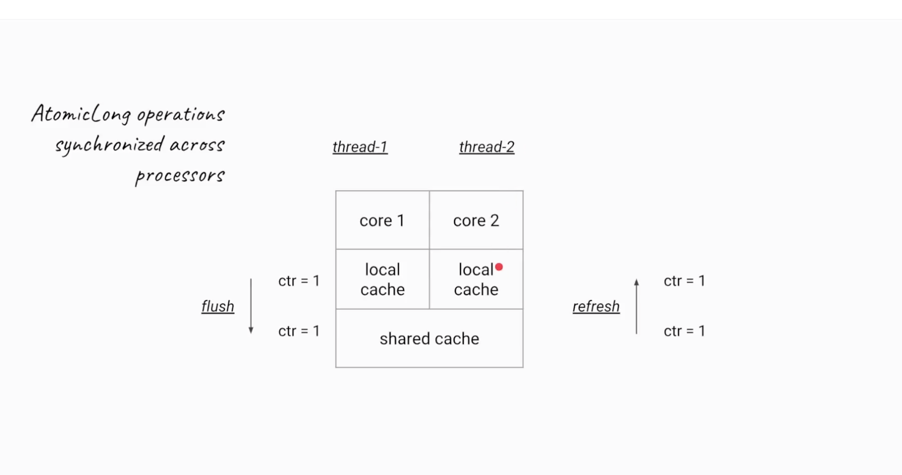
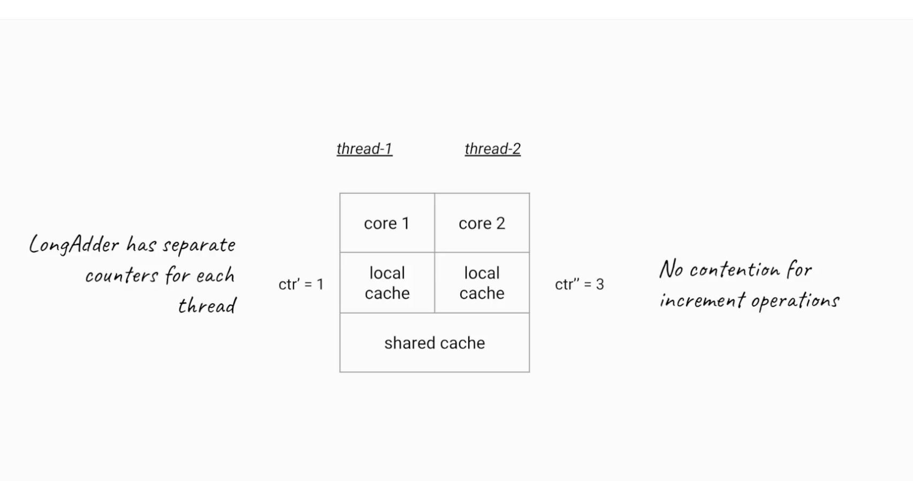

# Java 8 New Features

## Lambda Expression
Java programming language, a Lambda expression (or function) is just an anonymous function, i.e., a function with no name and without being bounded to an identifier. They are written exactly in the place where it’s needed, typically as a parameter to some other function.

They enable you to treat functionality as a method argument, or code as data. Lambda expressions let you express instances of single-method interfaces (referred to as functional interfaces) more compactly.

## Java 8 Streams
Simply put, streams are wrappers around a data source, allowing us to operate with that data source and making bulk processing convenient and fast.

A stream does not store data and, in that sense, is not a data structure. It also never modifies the underlying data source.

This new functionality – java.util.stream – supports functional-style operations on streams of elements, such as map-reduce transformations on collections.


## Functional Interface
Functional interfaces are also called Single Abstract Method interfaces (SAM Interfaces). As name suggest, they permit exactly one abstract method inside them. Java 8 introduces an annotation i.e. @FunctionalInterface which can be used for compiler level errors when the interface you have annotated violates the contracts of Functional Interface.

```
@FunctionalInterface
public interface FirstFunctionalInterface {
    public void fun();
}
```
Please note that a functional interface is valid even if the @FunctionalInterface annotation would be omitted. It is only for informing the compiler to enforce single abstract method inside interface.

Also, since default methods are not abstract you’re free to add default methods to your functional interface as many as you like.

Another important point to remember is that if an interface declares an abstract method overriding one of the public methods of java.lang.Object, that also does not count toward the interface’s abstract method count since any implementation of the interface will have an implementation from java.lang.Object or elsewhere. for example, below is perfectly valid functional interface.

```
@FunctionalInterface
public interface MyFirstFunctionalInterface 
{
    public void firstWork();
 
    @Override
    public String toString();                //Overridden from Object class
 
    @Override
    public boolean equals(Object obj);        //Overridden from Object class
}
```

## Default Methods
Java 8 allows you to add non-abstract methods in interfaces. These methods must be declared default methods. Default methods were introduces in java 8 to enable the functionality of lambda expression.

Default methods enable you to add new functionality to the interfaces of your libraries and ensure binary compatibility with code written for older versions of those interfaces.

## Type Inference
Inference means - conclusion reached on the basis of evidence and reasoning.
Type inference is a Java compiler's ability to look at each method invocation and corresponding declaration to determine the type argument (or arguments) that make the invocation applicable

```
List<Integer> intList = Arrays.asList(5, 2, 4, 2, 1);
Collections.sort(intList, (a, b) -> a.compareTo(b));
 
List<String> strList = Arrays.asList("Red", "Blue", "Green");
Collections.sort(strList, (a, b) -> a.compareTo(b));
```

The compiler performs invocation type inference analysis to determine the type arguments. The expected target types are also used in this analysis. It deduces the arguments in the three instances as ArrayList<String>, ArrayList<Integer> and ArrayList<Number>.


## Adder & Accumators

Java 8 introduces LongAdder, LongAccumulator, DoubleAdder and DoubleAccumulator, which are recommended instead of the Atomic classes when multiple threads update frequently but read less frequently. It implement the base class, Striped64.

LongAdder and LongAccumators which are recommended instead of the Atomic classes when multiple threads update frequently and less read frequently. During high contention, they were designed in such a way they can grow dynamically.

### How Atomic variables are slow

Atomic variables are copied from threads local memory to shared memory to other threads local memory which makes it slow. This happens because there has to be synchronization. Below is the example



### Adder

There are two classes LongAdder & DoubleAdder.

LongAdder, on the other hand, uses a very clever trick to reduce contention between threads, when these are incrementing it.

When we want to increment an instance of the LongAdder, we need to call the increment() method. That implementation keeps an array of counters that can grow on demand.

And so, when more threads are calling increment(), the array will be longer. Each record in the array can be updated separately – reducing the contention. Due to that fact, the LongAdder is a very efficient way to increment a counter from multiple threads.

```java
public class Task implements Runnable {
    private LongAdder longAdder;

    public Task(LongAdder longAdder) {
        this.longAdder = longAdder;
    }

    @Override
    public void run() {
        longAdder.increment();
    }
}

public class LongAdderClass {

    public static void main(String[] args) throws InterruptedException {
        LongAdder longAdder = new LongAdder();

        ExecutorService executorService = Executors.newFixedThreadPool(10);
        for (int i = 0; i < 20; i++) {
            executorService.submit(new Task(longAdder));
        }

        executorService.shutdown();
        executorService.awaitTermination(1, TimeUnit.DAYS);

        System.out.println(longAdder.sum());

    }
}
```



This class extends Number, but does not define methods such as equals, hashCode and compareTo because instances are expected to be mutated, and so are not useful as collection keys.


> So LongAdder is not always a replacement for AtomicLong. We need to consider the following aspects:

* When no contention is present AtomicLong performs better.
* LongAdder will allocate Cells (a final class declared in abstract class Striped64) to avoid contention which consumes memory. So in case we have a tight memory budget we should prefer AtomicLong.

### Accumulator

Two classes new in Java 8 deserve some attention: LongAccumulator andDoubleAccumulator. They are designed to accumulate (more on what does that mean later) values across threads safely while being extremely fast.

Accumulator is also similar to Adder classes. We can have do binary oberations and result can be then accumated at the end of processing.

So the accumulator takes a binary operator and combines initial value with every accumulated value.