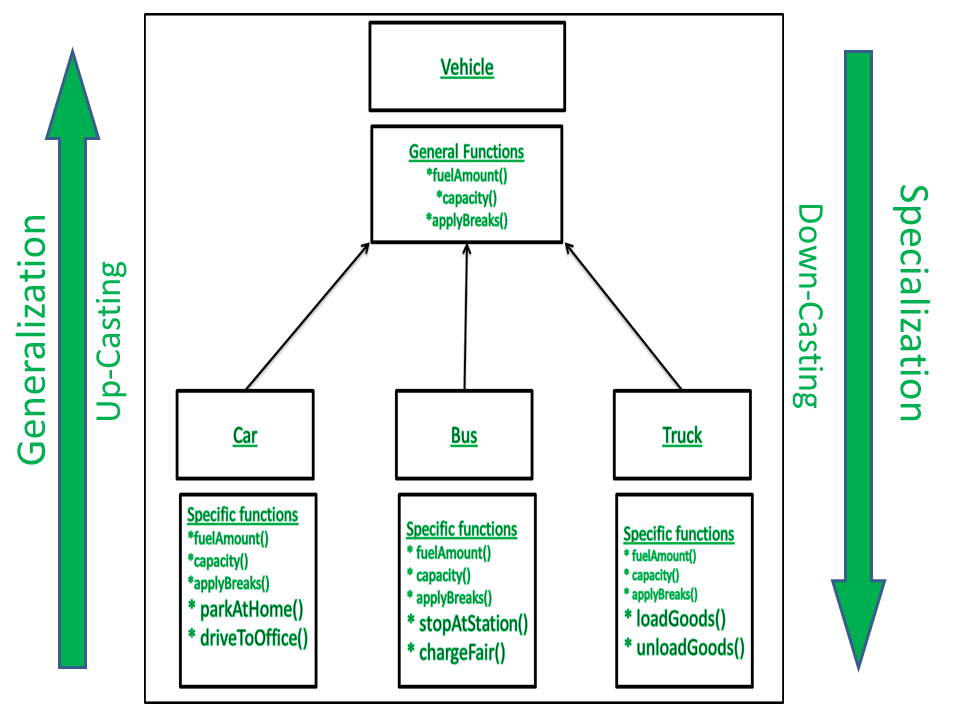
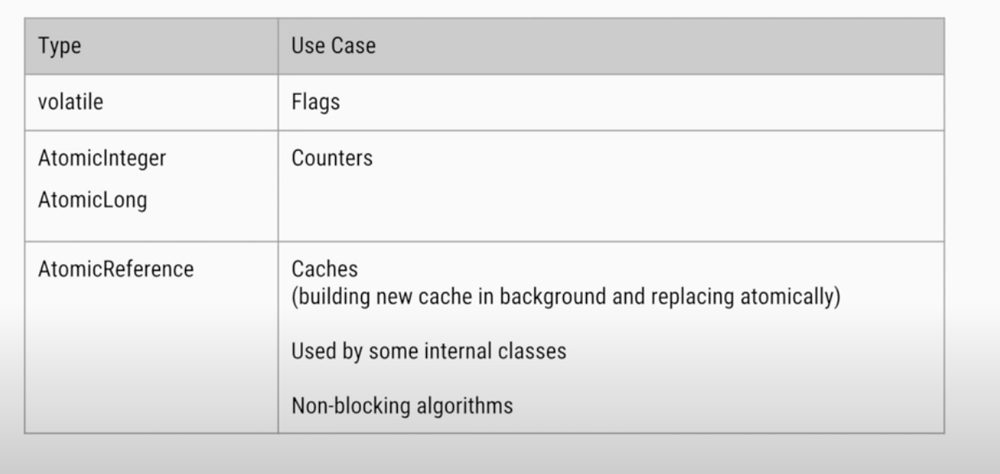

# Java Fundamentals

## Classes

Classes are the starting point of all objects, and we may consider them as the template for creating objects. A class would typically contain member fields, member methods, and a special constructor method.

## Objects

Objects are created from classes and are called instances of the class. We create objects from classes using their constructors:

## Why Java is not a purely Object-Oriented Language?

Pure Object Oriented Language or Complete Object Oriented Language are Fully Object Oriented Language which supports or have features which treats everything inside program as objects. It doesn’t support primitive datatype(like int, char, float, bool, etc.). There are seven qualities to be satisfied for a programming language to be pure Object Oriented. They are:

* Encapsulation/Data Hiding
* Inheritance
* Polymorphism
* Abstraction
* All predefined types are objects
* All user defined types are objects
* All operations performed on objects must be only through methods exposed at the objects.

## Abstraction

Abstraction is hiding complexities of implementation and exposing simpler interfaces.

Abstraction occurs when a programmer hides any irrelevant data about an object or an instantiated class to reduce complexity and help users interact with a program more efficiently. The term abstraction vs encapsulation can be used to describe the process of hiding some of the information contained in an object or class, but it may also refer to the object itself. An abstraction is any named entity that contains a selection of data and behaviors specific to a particular usage of the originating entity.

If we think about a typical computer, one can only see the external interface, which is most essential for interacting with it, while internal chips and circuits are hidden from the user.

In OOP, abstraction means hiding the complex implementation details of a program, exposing only the API required to use the implementation. In Java, we achieve abstraction by using interfaces and abstract classes.

## Encapsulation

Encapsulation in OOP Meaning: In object-oriented computer programming languages, the notion of encapsulation (or OOP Encapsulation) refers to the bundling of data, along with the methods that operate on that data, into a single unit.

Many programming languages use encapsulation frequently in the form of classes. A class is a program-code-template that allows developers to create an object that has both variables (data) and behaviors (functions or methods). A class is an example of encapsulation in computer science in that it consists of data and methods that have been bundled into a single unit.

Encapsulation is hiding the state or internal representation of an object from the consumer of an API and providing publicly accessible methods bound to the object for read-write access. This allows for hiding specific information and controlling access to internal implementation.

For example, member fields in a class are hidden from other classes, and they can be accessed using the member methods. One way to do this is to make all data fields private and only accessible by using the public member methods:

```java
public class Car {

    // ...
    private int speed;

    public int getSpeed() {
        return color;
    }

    public void setSpeed(int speed) {
        this.speed = speed;
    }
    // ...
}
```

Here, the field speed is encapsulated using the private access modifier, and can only be accessed using the public getSpeed() and setSpeed() methods. We can read more about access modifiers in our access modifiers article.

## Association

Association is the weakest relationship between the three. It isn't a “has-a” relationship, none of the objects are parts or members of another.

In Object-Oriented programming, an Object communicates to other Object to use functionality and services provided by that object.

There are four different types of association: bi-directional, uni-directional, aggregation (includes composition aggregation) and reflexive. Bi-directional and uni-directional associations are the most common ones (i.e one to one, one to many, many to one and many to many).

> Composition and Aggregation are the two forms of association.

## Aggregation

Aggregation is a specialized form of association where all objects have their own lifecycly but there exists an ownership as well. It's like parent child.

Example: Library and Students. Here the student can exist without library, the relation between student and library is aggregation.

## Composition

The composition is specialize form of aggregation. It is a strong type of aggregation. Here the child object does not have it's own lifecycle and if parent object gets deleted then all it's child objects will also get deleted.

Furthermore, the composition is the strongest form of association, which means that the object(s) that compose or are contained by one object are destroyed too when that object is destroyed.

* When attempting to represent real-world whole-part relationships, e.g. an engine is a part of a car.
* When the container is destroyed, the contents are also destroyed, e.g. a university and its departments.

## Generalization

Generalization is the process of extracting shared characteristics from two or more classes, and combining them into a generalized superclass. Shared characteristics can be attributes, associations, or methods.

Animal is a generalization , Dog is specialization. Your superclass is a generalized class , but your subclass will be a specialized inheritor of your superclass. It becomes more specialized and less generalized as you move down the inheritance hierarchy.

## Specialization

If some new subclasses are created from an existing superclass to do specific job of the superclass, then it is known as specialization.

Animal is a generalization , Dog is specialization. Your superclass is a generalized class , but your subclass will be a specialized inheritor of your superclass. It becomes more specialized and less generalized as you move down the inheritance hierarchy .



## Inheritance (IS a Relationship)

Inheritance is the mechanism that allows one class to acquire all the properties from another class by inheriting the class. We call the inheriting class a child class and the inherited class as the superclass or parent class.

In Java, we do this by extending the parent class. Thus, the child class gets all the properties from the parent:

```java
public class Car extends Vehicle { 
    //...
}
```

When we extend a class, we form an IS-A relationship. The Car IS-A Vehicle. So, it has all the characteristics of a Vehicle.

## Inheritance and Composition (Is-a vs Has-a relationship) in Java

Inheritance is an "is-a" relationship. Composition is a "has-a" relationship. inheritance is strongly coupled where as composition is loosely coupled in Java.

Example of Inheritance

```java
class Animal{
   String name="Orio";
}
class Dog extends Animal{
   String type="Dog";
   public static void main(String args[]){
      Dog p=new Dog();
      System.out.println("Name:"+p.name);
      System.out.println("Type:"+p.type);
   }
}
```

Example of Composition

```java
public class Student {
}
public class College {
   private Student student;
   public College() {
      this.student = new Student();
   }
}
```

## Polymorphism

Polymorphism is the ability of an OOP language to process data differently depending on their types of inputs. In Java, this can be the same method name having different method signatures and performing different functions:

In below example, we can see that the method read() has three different forms with different functionalities. This type of polymorphism is static or compile-time polymorphism and is also called method overloading.

```java
public class TextFile extends GenericFile {
    //...
 
    public String read() {
        return this.getContent()
          .toString();
    }
 
    public String read(int limit) {
        return this.getContent()
          .toString()
          .substring(0, limit);
    }
 
    public String read(int start, int stop) {
        return this.getContent()
          .toString()
          .substring(start, stop);
    }
}
```

There is also runtime or dynamic polymorphism, where the child class overrides the parent's method:

```java
public class GenericFile {
    private String name;
 
    //...
 
    public String getFileInfo() {
        return "Generic File Impl";
    }
}
```

A child class can extend the GenericFile class and override the getFileInfo() method:

```java
public class ImageFile extends GenericFile {
    private int height;
    private int width;
 
    //... getters and setters
     
    public String getFileInfo() {
        return "Image File Impl";
    }
}
```

## When we have wrappers classes, why primitives are supported?

Wrappers, being objects, get placed in the heap. Primitives are just "values" and go in the stack. This is more efficient, because for wrapped primitives in the heap you need (at least) both the value (which is in the stack) and the reference to the wrapper object.

Whether this performance gain matters at all depends on what you're doing. For heavy numerical work, definitely, but for 99 % of stuff out there, this is rather an annoyance. For one thing, you can't store primitives in a Collection anyway; they get autoboxed. So the only way to store lots of them is to use plain arrays, which in turn can lead to other kinds of inefficiencies (if you need to resize them, for instance).

## What Happens When There Is Not Enough Heap Space to Accommodate Storage of New Objects?

If there is no memory space for creating a new object in Heap, Java Virtual Machine throws OutOfMemoryError or more specifically java.lang.OutOfMemoryError heap space.

## How many ways we can create singleton object?

## Differences between Externalizable vs Serializable

|Serializable|Externalizable|
|:--- | :--- |
|Serializable is a marker interface i.e. does not contain any method. | Externalizable interface contains two methods writeExternal() and readExternal() which implementing classes MUST override.|
|Serializable interface pass the responsibility of serialization to JVM and it’s default algorithm.	|Externalizable provides control of serialization logic to programmer – to write custom logic.|
|Mostly, default serialization is easy to implement, but has higher performance cost.	|Serialization done using Externalizable, add more responsibility to programmer but often result in better performance.|
|It’s hard to analyze and modify class structure because any change may break the serialization.|It’s more easy to analyze and modify class structure because of complete control over serialization logic.|

### Early Initialization

The easiest way to achieve thread safety is to inline the object creation or to use an equivalent static block. This takes advantage of the fact that static fields and blocks are initialized one after another

```java
public class EarlyInitSingleton {
    private static final EarlyInitSingleton INSTANCE = new EarlyInitSingleton();
    public static EarlyInitSingleton getInstance() {
        return INSTANCE;
    }
    
     // private constructor and other methods...
}
```

### Initialization on Demand

Additionally, since we know from the Java Language Specification reference in the previous paragraph that a class initialization occurs the first time we use one of its methods or fields, we can use a nested static class to implement lazy initialization:

```java
public class InitOnDemandSingleton {
    private static class InstanceHolder {
        private static final InitOnDemandSingleton INSTANCE = new InitOnDemandSingleton();
    }
    public static InitOnDemandSingleton getInstance() {
        return InstanceHolder.INSTANCE;
    }

     // private constructor and other methods...
}
```

In this case, the InstanceHolder class will assign the field the first time we access it by invoking getInstance.

### Enum Singleton

The last solution comes from the Effective Java book (Item 3) by Joshua Block and uses an enum instead of a class. At the time of writing, this is considered to be the most concise and safe way to write a singleton:

```java
public enum EnumSingleton {
    INSTANCE;

    // other methods...
}
```

### Double-Checked Locking

```java
public class DclSingleton {
    private static volatile DclSingleton instance; // Should be volatile to avoid cache incoherence issues (fully initialize objected being used)
    public static DclSingleton getInstance() {
        if (instance == null) {
            synchronized (DclSingleton.class) {
                if (instance == null) {
                    instance = new DclSingleton();
                }
            }
        }
        return instance;
    }

    // private constructor and other methods...
}
```

Ref: https://www.youtube.com/watch?v=Z5TRputhzHs

## Describe Strong, Weak, Soft and Phantom References and Their Role in Garbage Collection?

Much as memory is managed in Java, an engineer may need to perform as much optimization as possible to minimize latency and maximize throughput, in critical applications. Much as it is impossible to explicitly control when garbage collection is triggered in the JVM, it is possible to influence how it occurs as regards the objects we have created.

Java provides us with reference objects to control the relationship between the objects we create and the garbage collector.

> StringBuilder sb = new StringBuilder();

In the above snippet, the new keyword creates a new StringBuilder object and stores it on the heap. The variable sb then stores a strong reference to this object. What this means for the garbage collector is that the particular StringBuilder object is not eligible for collection at all due to a strong reference held to it by sb. The story only changes when we nullify sb like this:

> sb = null;

After calling the above line, the object will then be eligible for collection.

We can change this relationship between the object and the garbage collector by explicitly wrapping it inside another reference object which is located inside java.lang.ref package.

**weak reference** this is the type of references that will be removed by the garbage collector on the next pass, if there are no other type references to the object.

You can get an object value from the WeakReference until the GC decides to collect the object. As soon as the GC decides to do it (not after the GC finalize the object and clear an allocated memory), you will get the NULL from the WeakReference. This happens when the GC is just marking the object for a further processing. It is important to understand, that all finalization actions are executed only after this. When we look at the PhantomReference, we’ll return to this point.

```java
@Test
public void testWeakAfterGC() {
    // Arrange
    String instance = new String("123");
    WeakReference<String> reference = new WeakReference<>(instance);

    // Act
    instance = null;
    String instanceFromWeakRef = reference.get();
    System.out.println(instanceFromWeakRef); // Prints - 123 (i.e., we can get the object from weakreference back until the GC has not run)

    System.gc();

    // Asserts
    Assertions.assertThat(reference.get()).isNull();
}
```
Java provides us the WeakHashMap data structure. It’s a something like a HashMap, which uses the WeakReference as a key of the Map. If a key of the WeakHashMap becomes garbage, its entry is removed automatically.

**soft reference** can be created to the above object like this:

The behavior of SoftReference is similar to WeakReference, but GC collect this kind of reference only when our application does not have enough of memory.

```java
@Test
public void softTest() {
    // Arrange
    String instance = new String("123323");
    SoftReference<String> softReference = new SoftReference<>(instance);
    instance = null;
    Assertions.assertThat(softReference).isNotNull();
    Assertions.assertThat(softReference.get()).isNotNull();

    // Act
    GcUtils.tryToAllocateAllAvailableMemory(); 

    // Asserts
    Assertions.assertThat(softReference.get()).isNull();
}
```

The GC collects our SoftReference before we get the OutOfMemoryError.

This behavior is a good reason to use SoftReferences as a cache for a data that is difficult to build in memory.

For example, a reading video or graphics data from a slow file storage. When your application has enough of memory, you can receive this data from the cache, but if application reaches of a memory limit, then the cache cleans. And now, you need restore this data on the next request.

However in many cases you need to prefer a cache based on the LRU algorithm.

**phantom reference**

PhantomReferences can be used to notify you when some object is out of scope to do some resource cleanup. Remember that the object.finalize() method is not guaranteed to be called at the end of the life of an object, so if you need to close files or free resources, you can rely on Phantom.

Phantom references have two major differences from soft and weak references.

We can't get a referent of a phantom reference. The referent is never accessible directly through the API and this is why we need a reference queue to work with this type of references.

The Garbage Collector adds a phantom reference to a reference queue after the finalize method of its referent is executed. It implies that the instance is still in the memory.

What good are PhantomReferences? I'm only aware of two serious cases for them: first, they allow you to determine exactly when an object was removed from memory. They are in fact the only way to determine that. This isn't generally that useful, but might come in handy in certain very specific circumstances like manipulating large images: if you know for sure that an image should be garbage collected, you can wait until it actually is before attempting to load the next image, and therefore make the dreaded OutOfMemoryError less likely.

Unlike finalize(), which makes an object reachable again, objects referable by a Reference object only can not be made reachable again.

```java
public class Foo {

    private String bar;

    public Foo(String bar) {
        this.bar = bar;
    }

    public String foo() {
        return bar;
    }
}
```

```java
// initialize
ReferenceQueue<Foo> queue = new ReferenceQueue<Foo>();
ArrayList< PhantomReference<Foo>> list=new ArrayList<PhantomReference<Foo>>();

for ( int i = 0; i < 10; i++) {
    Foo o = new Foo( Integer.toOctalString( i));
    list.add(new PhantomReference<Foo>(o, queue));
}

// make sure the garbage collector does it’s magic
System.gc();

// lets see what we’ve got
Reference<? extends Foo> referenceFromQueue;
for ( PhantomReference<Foo> reference : list)
    System.out.println(reference.isEnqueued()); // This is print true

while ( (referenceFromQueue = queue.poll()) != null) {
    System.out.println(referenceFromQueue.get()); // This will print null 
    referenceFromQueue.clear();
}
```

To perform some postmortem cleanup on objects that garbage collector consider as unreachable, one can use finalization. This feature can be utilized to reclaim native resources associated with an object. However, finalizers have many problems associated.

Firstly, we can’t foresee the call of finalize(). Since the Garbage Collection is unpredictable, the calling of finalize() cannot be predicted. There is no guarantee that the object will be garbage collected. The object might never become eligible for GC because it could be reachable through the entire lifetime of the JVM. It is also possible that no garbage collection actually runs from the time the object became eligible and before JVM stops.

Secondly, Finalization can slowdown an application. Managing objects with a finalize() method takes more resources from the JVM than normal objects.

In short, Finalize() isn't used often, and also there is no much reason to use it. If we have a class with methods like close() or cleanup() and that should be called once user done with the object then placing these methods call in finalize() can be used as a safety measure, but not necessary.

People usually attempt to use finalize() method to perform postmortem cleanup on objects which usually not advisable. As mentioned earlier, Finalizers have an impact on the performance of the garbage collector since Objects with finalizers are slow to garbage collect.

Phantom references are safe way to know an object has been removed from memory. For instance, consider an application that deals with large images. Suppose that we want to load a big image in to memory when large image is already in memory which is ready for garbage collected. In such case, we want to wait until the old image is collected before loading a new one. Here, the phantom reference is flexible and safely option to choose. The reference of the old image will be enqueued in the ReferenceQueue once the old image object is finalized. After receiving that reference, we can load the new image in to memory.

Similarly we can use Phantom References to implement a Connection Pool. We can easily gain control over the number of open connections, and can block until one becomes available.

https://github.com/mtumilowicz/phantom-reference

**Reachability**

Going from strongest to weakest, the different levels of reachability reflect the life cycle of an object. They are operationally defined as follows:

* An object is strongly reachable if it can be reached by some thread without traversing any reference objects. A newly-created object is strongly reachable by the thread that created it.
* An object is softly reachable if it is not strongly reachable but can be reached by traversing a soft reference.
* An object is weakly reachable if it is neither strongly nor softly reachable but can be reached by traversing a weak reference. When the weak references to a weakly-reachable object are cleared, the object becomes eligible for finalization.
* An object is phantom reachable if it is neither strongly, softly, nor weakly reachable, it has been finalized, and some phantom reference refers to it.

Finally, an object is unreachable, and therefore eligible for reclamation, when it is not reachable in any of the above ways.

## Volatile keyword in Java

Volatile specifier is used to indicate that a variable’s value can be modified by multiple threads simultaneously.
The value of this variable will never be cached thread-locally: all reads and writes will go straight to “main memory” ( that is not right at all practically :), but this is what mostly written everywhere.)

Volatile comes with two major concepts : Visibility and Ordering.

Visibility: If one thread changes a value of a variable, the change will be visible immediately to other threads reading the variable. This is guaranteed by not allowing the compiler or the JVM to allocate those variables in the CPU registers. Any write to a volatile variable is flushed immediately to main memory and any read of it is fetched from main memory. That means there is a little bit of performance penalty, but that's far better from a concurrency point of view.

Ordering: Sometimes for performance optimization, the JVM reorders instructions. This is not allowed when accessing volatile variables. Access to volatile variables is not reordered with access to other volatile variables, nor with access to other normal fields around them. This makes writes to non-volatile fields around them visible immediately to other threads.

In a multithreaded application where the threads operate on non-volatile variables, each thread may copy variables from main memory into a CPU cache while working on them, for performance reasons. If your computer contains more than one CPU, each thread may run on a different CPU. That means, that each thread may copy the variables into the CPU cache of different CPUs. This is illustrated here:


With non-volatile variables there are no guarantees about when the Java Virtual Machine (JVM) reads data from main memory into CPU caches, or writes data from CPU caches to main memory.

Imagine, that only Thread 1 increments the counter variable, but both Thread 1 and Thread 2 may read the counter variable from time to time.

If the counter variable is not declared volatile there is no guarantee about when the value of the counter variable is written from the CPU cache back to main memory. This means, that the counter variable value in the CPU cache may not be the same as in main memory. This situation is illustrated here:


The problem with threads not seeing the latest value of a variable because it has not yet been written back to main memory by another thread, is called a "visibility" problem. The updates of one thread are not visible to other threads.

The most commonly used atomic variable classes in Java are AtomicInteger, AtomicLong, AtomicBoolean, and AtomicReference. These classes represent an int, long, boolean, and object reference respectively which can be atomically updated. The main methods exposed by these classes are:

* get() – gets the value from the memory, so that changes made by other threads are visible; equivalent to reading a volatile variable
* set() – writes the value to memory, so that the change is visible to other threads; equivalent to writing a volatile variable
* lazySet() – eventually writes the value to memory, maybe reordered with subsequent relevant memory operations. One use case is nullifying references, for the sake of garbage collection, which is never going to be accessed again. In this case, better performance is achieved by delaying the null volatile write
* compareAndSet() – same as described in section 3, returns true when it succeeds, else false
* weakCompareAndSet() – same as described in section 3, but weaker in the sense, that it does not create happens-before orderings. This means that it may not necessarily see updates made to other variables. As of Java 9, this method has been deprecated in all atomic implementations in favor of weakCompareAndSetPlain(). The memory effects of weakCompareAndSet() were plain but its names implied volatile memory effects. To avoid this confusion, they deprecated this method and added four methods with different memory effects such as weakCompareAndSetPlain() or weakCompareAndSetVolatile()

### The Java volatile Visibility Guarantee

The Java volatile keyword is intended to address variable visibility problems. By declaring the counter variable volatile all writes to the counter variable will be written back to main memory immediately. Also, all reads of the counter variable will be read directly from main memory.

### Full volatile Visibility Guarantee

Actually, the visibility guarantee of Java volatile goes beyond the volatile variable itself. The visibility guarantee is as follows:

* If Thread A writes to a volatile variable and Thread B subsequently reads the same volatile variable, then all variables visible to Thread A before writing the volatile variable, will also be visible to Thread B after it has read the volatile variable.
* If Thread A reads a volatile variable, then all all variables visible to Thread A when reading the volatile variable will also be re-read from main memory.

Ref: http://tutorials.jenkov.com/java-concurrency/volatile.html

Ref: https://www.youtube.com/watch?v=WH5UvQJizH0

### Volatile is Not Always Enough

Even if the volatile keyword guarantees that all reads of a volatile variable are read directly from main memory, and all writes to a volatile variable are written directly to main memory, there are still situations where it is not enough to declare a variable volatile.

Imagine if Thread 1 reads a shared counter variable with the value 0 into its CPU cache, increment it to 1 and not write the changed value back into main memory. Thread 2 could then read the same counter variable from main memory where the value of the variable is still 0, into its own CPU cache. Thread 2 could then also increment the counter to 1, and also not write it back to main memory. This situation is illustrated in the diagram below:


Thread 1 and Thread 2 are now practically out of sync. The real value of the shared counter variable should have been 2, but each of the threads has the value 1 for the variable in their CPU caches, and in main memory the value is still 0. It is a mess! Even if the threads eventually write their value for the shared counter variable back to main memory, the value will be wrong.

### When is volatile Enough?

if two threads are both reading and writing to a shared variable, then using the volatile keyword for that is not enough. You need to use a synchronized in that case to guarantee that the reading and writing of the variable is atomic. Reading or writing a volatile variable does not block threads reading or writing. For this to happen you must use the synchronized keyword around critical sections.

As an alternative to a synchronized block you could also use one of the many atomic data types found in the java.util.concurrent package. For instance, the AtomicLong or AtomicReference or one of the others.

### Performance Considerations of volatile

Reading and writing of volatile variables causes the variable to be read or written to main memory. Reading from and writing to main memory is more expensive than accessing the CPU cache. Accessing volatile variables also prevent instruction reordering which is a normal performance enhancement technique. Thus, you should only use volatile variables when you really need to enforce visibility of variables.

### Using volatile vs AtomicInteger in Java concurrency

Ref : https://www.youtube.com/watch?v=WH5UvQJizH0

### Difference Between Atomic, Volatile, and Synchronized In java

**LOCKING:** The synchronized keyword is used to implement a lock-based threading model, whereas volatile and atomic variables give are non-lock based, which means threads do not require a lock to access these variables.

**PERFORMANCE:** Atomic variables perform better than a synchronized keyword because atomic variables use concurrency support provided by hardware for various atomic operations, like Compare-And-Swap or read-modify-write. Note that synchronization uses a locking mechanism.

**DEPENDENCY:** Volatile variable is generally used when the value of the variable does not depend on its previous value. Hence volatile variables are suitable for boolean variables. Whereas atomic variables can be used for variables where the value of the variable depends on its previous value like increment or decrement operations.



Reading and writing of volatile variables causes the variable to be read or written to main memory. Reading from and writing to main memory is more expensive than accessing the CPU cache. Accessing volatile variables also prevent instruction reordering which is a normal performance enhancement technique. Thus, you should only use volatile variables when you really need to enforce visibility of variables.

## AtomicLong

The AtomicLong class provides you with a long variable which can be read and written atomically, and which also contains advanced atomic operations like compareAndSet(). The AtomicLong class is located in the java.util.concurrent.atomic package, so the full class name is java.util.concurrent.atomic.AtomicLong .

The reasoning behind the AtomicLong design is explained in my Java Concurrency tutorial in the text about Compare and Swap.

**Compare and swap **is a technique used when designing concurrent algorithms. Basically, compare and swap compares an expected value to the concrete value of a variable, and if the concrete value of the variable is equals to the expected value, swaps the value of the variable for a new variable. Compare and swap may sound a bit complicated but it is actually reasonably simple once you understand it, so let me elaborate a bit further on the topic.

### Compare And Swap As Atomic Operation

Modern CPUs have built-in support for atomic compare and swap operations. From Java 5 you can get access to these functions in the CPU via some of the new atomic classes in the java.util.concurrent.atomic package.

Here is an example showing how to implement the lock() method shown earlier using the AtomicBoolean class:

```java
public static class MyLock {
    private AtomicBoolean locked = new AtomicBoolean(false);

    public boolean lock() {
        return locked.compareAndSet(false, true);
    }

}
```

Notice how the locked variable is no longer a boolean but an AtomicBoolean. This class has a compareAndSet() function which will compare the value of the AtomicBoolean instance to an expected value, and if has the expected value, it swaps the value with a new value. In this case it compares the value of locked to false and if it is false it sets the new value of the AtomicBoolean to true.

The compareAndSet() method returns true if the value was swapped, and false if not.

## AtomicReference

The AtomicReference class provides an object reference variable which can be read and written atomically. By atomic is meant that multiple threads attempting to change the same AtomicReference (e.g. with a compare-and-swap operation) will not make the AtomicReference end up in an inconsistent state. AtomicReference even has an advanced compareAndSet() method which lets you compare the reference to an expected value (reference) and if they are equal, set a new reference inside the AtomicReference object.

### Creating an AtomicReference

```java
AtomicReference atomicReference = new AtomicReference();

String initialReference = "the initially referenced string";
AtomicReference<String> atomicStringReference = new AtomicReference<String>(initialReference);
```

```java
import java.util.concurrent.atomic.AtomicReference;
public class AtomicRefEg {
    static AtomicReference<Person> p  = new AtomicReference<Person>(new Person(20));
    public static void main(String[] args) throws InterruptedException {
        Thread t1 = new Thread(new Runnable(){
            @Override
            public void run() {
                for(int i=1 ; i<=3 ; i++){
                    p.set(new Person(p.get().age+10));
                    System.out.println("Atomic Check by first thread: "+Thread.currentThread().getName()+" is "+p.get().age);
                }
            }
        });
        Thread t2 = new Thread(new Runnable(){
            @Override
            public void run() {
                Person per = p.get();
                for(int i=1 ; i<=3 ; i++){
                    System.err.println(p.get().equals(per)+"_"+per.age+"_"+p.get().age);
                    p.compareAndSet(per, new Person(p.get().age+10));
                    System.out.println("Atomic Check by second thread : "+Thread.currentThread().getName()+" is "+p.get().age);
                }
            }
        });
        t1.start();
        t2.start();
        t1.join();
        t2.join();
        System.out.println("Final value: "+p.get().age);
    }
}
class Person {
    int age;
    public Person(int i) {
        age=i;
    }
}
```

### Comparing and Setting the AtomicReference Reference

The AtomicReference class contains a useful method named compareAndSet(). The compareAndSet() method can compare the reference stored in the AtomicReference instance with an expected reference, and if they two references are the same (not equal as in equals() but same as in ==), then a new reference can be set on the AtomicReference instance.

If compareAndSet() sets a new reference in the AtomicReference the compareAndSet() method returns true. Otherwise compareAndSet() returns false.

## AtomicStampedReference

The AtomicStampedReference is designed to solve the A-B-A problem. The A-B-A problem is when a reference is changed from pointing to A, then to B and then back to A.

When using compare-and-swap operations to change a reference atomically, and making sure that only one thread can change the reference from an old reference to a new, detecting the A-B-A situation is impossible.

```java
Initially: x = 0
Thread1: read x // sees x = 0
Thread2: x = 1
Thread3: x = 0
Thread1: read x // again sees x = 0, thinking that nothing has changed
```

To solve the above problem, we can maintain a stamp that should be updated(incremented) whenever a thread changes some state:

```java
Initially: x = 0, stamp = 0
Thread1: read stamp // sees stamp = 0
Thread2: x = 1, stamp = 1
Thread3: x = 0, stamp = 2
Thread1: read stamp,x // sees stamp = 2 which is != 0 hence do some processing
```

By using an AtomicStampedReference instead of an AtomicReference it is possible to detect the A-B-A situation. Thread 1 can copy the reference and stamp out of the AtomicStampedReference atomically using get(). If another thread changes the reference from A to B and then back to A, then the stamp will have changed.

The AtomicStampedReference class provides an object reference variable which can be read and written atomically. By atomic is meant that multiple threads attempting to change the same AtomicStampedReference will not make the AtomicStampedReference end up in an inconsistent state.

The AtomicStampedReference is different from the AtomicReference in that the AtomicStampedReference keeps both an object reference and a stamp internally. The reference and stamp can be swapped using a single atomic compare-and-swap operation, via the compareAndSet() method.

```java
import java.util.concurrent.atomic.AtomicStampedReference;
public class AtomicRefEg {
    static int stampVal = 1;
    static AtomicStampedReference<Person> s  = new AtomicStampedReference<Person>(new Person(20), stampVal);
    public static void main(String[] args) throws InterruptedException {
        Thread t1 = new Thread(new Runnable(){
            @Override
            public void run() {
                for(int i=1 ; i<=3 ; i++) {
                    System.out.println("stamp value for first thread:"+stampVal);
                    s.compareAndSet(s.getReference(), new Person(s.getReference().age+10), stampVal, ++stampVal);
                    System.out.println("Atomic Check by first thread: "+Thread.currentThread().getName()+" is "+s.getReference().age);
                }
            }
        });
        Thread t2 = new Thread(new Runnable() {
            @Override
            public void run() {
                for(int i=1 ; i<=3 ; i++){
                    System.out.println("stamp value for second thread:"+stampVal);
                    s.compareAndSet(s.getReference(), new Person(s.getReference().age+10), stampVal, ++stampVal);
                    System.out.println("Atomic Check by second thread : "+Thread.currentThread().getName()+" is "+s.getReference().age);
                }
            }
        });
        t1.start();
        t2.start();
        t1.join();
        t2.join();
        System.out.println("Final value: "+s.getReference().age);
    }
}
class Person {
    int age;
    public Person(int i) {
        age=i;
    }
}
```

Ref: http://tutorials.jenkov.com/java-util-concurrent/atomicstampedreference.html

### AtomicStampedReference and the A-B-A Problem

The AtomicStampedReference is designed to solve the A-B-A problem. The A-B-A problem is when a reference is changed from pointing to A, then to B and then back to A.

When using compare-and-swap operations to change a reference atomically, and making sure that only one thread can change the reference from an old reference to a new, detecting the A-B-A situation is impossible.

The A-B-A problem can occur in non-blocking algorithms. Non-blocking algorithms often use a reference to an ongoing modification to the guarded data structure, to signal to other threads that a modification is currently ongoing. If thread 1 sees that there is no ongoing modification (reference points to null), another thread may submit a modification (reference is now non-null), complete the modification and swap the reference back to null without thread 1 detecting it. Exactly how the A-B-A problem occurs in non-blocking algorithms is explained in more detail in my tutorial about non-blocking algorithms.

By using an AtomicStampedReference instead of an AtomicReference it is possible to detect the A-B-A situation. Thread 1 can copy the reference and stamp out of the AtomicStampedReference atomically using get(). If another thread changes the reference from A to B and then back to A, then the stamp will have changed (provided threads update the stamp sensibly - e.g increment it).

The code below shows how to detect the A-B-A situation using the AtomicStampedReference:

```java
int[] stampHolder = new int[1];
Object ref = atomicStampedReference.get(stampHolder);

if(ref == null){
    //prepare optimistic modification
}

//if another thread changes the
//reference and stamp here,
//it can be detected

int[] stampHolder2 = new int[1];
Object ref2 = atomicStampedReference.get(stampHolder);

if(ref == ref2 && stampHolder[0] == stampHolder2[0]){
    //no modification since optimistic modification was prepared

} else {
    //retry from scratch.
}
```

## What special guarantees does the JVM hold for final fields of a class?

JVM basically guarantees that final fields of a class will be initialized before any thread gets hold of the object. Without this guarantee, a reference to an object may be published, i.e. become visible, to another thread before all the fields of this object are initialized, due to reorderings or other optimizations. This could cause racy access to these fields.

This is why, when creating an immutable object, you should always make all its fields final, even if they are not accessible via getter methods.

## Static vs Non Static Initialization Blocks

```java
public class StaticNonStaticBlocks {

    private final static String FINAL_STRING = "FINAL_STRING";
    private static String STATIC_STRING = "STATIC_STRING";

    static {
        System.out.println("In static block");
    }

    {
        System.out.println("In non static block");
        beforeConstructor();
    }

    public StaticNonStaticBlocks() {
        System.out.println("In constructor");
    }

    public void beforeConstructor() {
        System.out.println("In beforeConstructor");
    }

    public static void main(String[] args) {
        StaticNonStaticBlocks si = new StaticNonStaticBlocks();
    }
}

// Output
// In static block
// In non static block
// In beforeConstructor
// In constructor
```
Static block will be called first, then the non static block then the beforeConstructor method and then the constructor.

The code in the "static" section(s) will be executed at class load time, before any instances of the class are constructed (and before any static methods are called from elsewhere). That way you can make sure that the class resources are all ready to use.

It's also possible to have non-static initializer blocks. Those act like extensions to the set of constructor methods defined for the class. They look just like static initializer blocks, except the keyword "static" is left off.

The need for a non-static block is to execute any logic whenever an object is created irrespective of the constructor.

## What Is a Stringbuilder and What Are Its Use Cases? What Is the Difference Between Appending a String to a Stringbuilder and Concatenating Two Strings with a + Operator? How Does Stringbuilder Differ from Stringbuffer?

https://javapapers.com/java/java-string-vs-stringbuilder-vs-stringbuffer-concatenation-performance-micro-benchmark/

### StringBuilder

First up is the humble StringBuilder. This class provides an array of String-building utilities that makes easy work of String manipulation.

```java
StringBuilder stringBuilder = new StringBuilder(100);

stringBuilder.append("Baeldung");
stringBuilder.append(" is");
stringBuilder.append(" awesome");

assertEquals("Baeldung is awesome", stringBuilder.toString());
```

Internally, StringBuilder maintains a mutable array of characters. In our code sample, we've declared this to have an initial size of 100 through (default 16) the StringBuilder constructor. Because of this size declaration, the StringBuilder can be a very efficient way to concatenate Strings.

StringBuilder's default constructor will create an array which can hold 16 char elements. #append(String) copies the characters of the string to the StringBuidler's array using String#getChars(int, int, char[], int). The array is re-sized using Arrays.copyOf(char[], int) only when there is no space to add more characters. Each time this happens the capacity of the array is doubled + 2. The end is marked by counting how many characters are in the array.

It's also worth noting that the StringBuffer class is the synchronized version of StringBuilder.

Although synchronization is often synonymous with thread safety, it's not recommended for use in multithreaded applications due to StringBuffer's builder pattern. While individual calls to a synchronized method are thread safe, multiple calls are not.

### String + operator

Next up is the addition operator (+). This is the same operator that results in the addition of numbers and is overloaded to concatenate when applied to Strings.

```
String myString = "The " + "quick " + "brown " + "fox...";
assertEquals("The quick brown fox...", myString);
```
At first glance, this may seem much more concise than the StringBuilder option. However, when the source code compiles, the + symbol translates to chains of StringBuilder.append() calls. Due to this, mixing the StringBuilder and + method of concatenation is considered bad practice.

Additionally, String concatenation using the + operator within a loop should be avoided. Since the String object is immutable, each call for concatenation will result in a new String object being created.

### String.join (Java 8+)

If our application is running on Java 8 or above, we can take advantage of the String.join method. With this, we can join an array of Strings with a common delimiter, ensuring no spaces are missed.

```
String[] strings = {"I'm", "running", "out", "of", "pangrams!"};

String myString = String.join(" ", strings);

assertEquals("I'm running out of pangrams!", myString);
```

A huge advantage of this method is not having to worry about the delimiter between our strings.

### StringJoiner (Java 8+)

StringJoiner abstracts all of the String.join functionality into a simple to use class. The constructor takes a delimiter, with an optional prefix and suffix. We can append Strings using the well-named add method.

```
StringJoiner fruitJoiner = new StringJoiner(", ");

fruitJoiner.add("Apples");
fruitJoiner.add("Oranges");
fruitJoiner.add("Bananas");

assertEquals("Apples, Oranges, Bananas", fruitJoiner.toString());
```

By using this class, instead of the String.join method, we can append Strings as the program runs; There's no need to create the array first!

### String.intern()

Basically doing String.intern() on a series of strings will ensure that all strings having same contents share same memory. So if you have list of names where 'john' appears 1000 times, by interning you ensure only one 'john' is actually allocated memory.

This can be useful to reduce memory requirements of your program. But be aware that the cache is maintained by JVM in permanent memory pool which is usually limited in size compared to heap so you should not use intern if you don't have too many duplicate values.

In JDK 7, interned strings are no longer allocated in the permanent generation of the Java heap, but are instead allocated in the main part of the Java heap (known as the young and old generations), along with the other objects created by the application. This change will result in more data residing in the main Java heap, and less data in the permanent generation, and thus may require heap sizes to be adjusted. Most applications will see only relatively small differences in heap usage due to this change, but larger applications that load many classes or make heavy use of the String.intern() method will see more significant differences.

### What is JIT compiler?

The Just-In-Time (JIT) compiler is a an essential part of the JRE i.e. Java Runtime Environment, that is responsible for performance optimization of java based applications at run time. Compiler is one of the key aspects in deciding performance of an application for both parties i.e. the end user and the application developer.

In order to improve performance, JIT compilers interact with the Java Virtual Machine (JVM) at run time and compile suitable bytecode sequences into native machine code. While using a JIT compiler, the hardware is able to execute the native code, as compared to having the JVM interpret the same sequence of bytecode repeatedly and incurring an overhead for the translation process. This subsequently leads to performance gains in the execution speed, unless the compiled methods are executed less frequently.

The JIT compiler doesn't compile every method that gets called because thousands of methods can be called at startup. Instead, OpenJ9 records the number of times a method is called. When the count reaches a pre-defined invocation threshold, JIT compilation is triggered. Once a method has been compiled by the JIT, the VM can call the compiled method rather than interpreting it.

## What Is Ahead of Time Compilation? (From Java 9)

AOT compilation is one way of improving the performance of Java programs and in particular the startup time of the JVM. The JVM executes Java bytecode and compiles frequently executed code to native code. This is called Just-in-Time (JIT) Compilation. The JVM decides which code to JIT compile based on profiling information collected during execution.

While this technique enables the JVM to produce highly optimized code and improves peak performance, the startup time is likely not optimal, as the executed code is not yet JIT compiled. AOT aims to improve this so-called warming-up period. The compiler used for AOT is Graal.

JAOT Compilation

> jaotc --output jaotCompilation.so JaotCompilation.class

Running the JAOT program

> java -XX:AOTLibrary=./jaotCompilation.so JaotCompilation

The argument -XX:AOTLibrary accepts a relative or full path to the library. Alternatively, we can copy the library to the lib folder in the Java home directory and only pass the name of the library.

https://www.youtube.com/watch?v=sJVenujWGjs

https://www.baeldung.com/ahead-of-time-compilation
## What Is a JIT Compiler?

When we compile our Java program (e.g., using the javac command), we'll end up with our source code compiled into the binary representation of our code – a JVM bytecode. This bytecode is simpler and more compact than our source code, but conventional processors in our computers cannot execute it.

To be able to run a Java program, the JVM interprets the bytecode. Since interpreters are usually a lot slower than native code executing on a real processor, the JVM can run another compiler which will now compile our bytecode into the machine code that can be run by the processor. This so-called just-in-time compiler is much more sophisticated than the javac compiler, and it runs complex optimizations to generate high-quality machine code.

Oracle’s Java HotSpot VM is equipped with a highly advanced just-in-time (JIT) compiler. This means that the class files (which are compiled from Java source code) are further compiled at runtime, and they can be turned into very highly optimized machine code. This optimized code runs extremely fast—usually as fast as (and, in certain cases, faster than) compiled C/C++ code.

Fortunately, a new open source tool called JITWatch is being developed to give developers much better insight into how the JIT compiler treats their code. For most effective use, the JITWatch tool relies on developers already understanding the basic mechanisms and terminology of JIT compilation.

Java HotSpot VM automatically monitors which methods are being executed. Once a method has become eligible (by meeting some criteria, such as being called often), it is scheduled for compilation into machine code, and it is then known as a hot method. The compilation into machine code happens on a separate JVM thread and will not interrupt the execution of the program. In fact, even while the compiler thread is compiling a hot method, the Java Virtual Machine (JVM) will keep on using the original, interpreted version of the method until the compiled version is ready.

**Some JIT Compilation Techniques**

One of the most common JIT compilation techniques used by Java HotSpot VM is inlining, which is the practice of substituting the body of a method into the places where that method is called. Inlining saves the cost of calling the method; no new stack frames need to be created. By default, Java HotSpot VM will try to inline methods that contain less than 35 bytes of JVM bytecode.

Another common optimization that Java HotSpot VM makes is monomorphic dispatch, which relies on the observed fact that, usually, there aren’t paths through a method that cause an object reference to be of one type most of the time but of another type at other times.
## AOT vs JIT compilation in Java

we use byte code so that it's portable across architectures the code is initially interpreted line by line and then after some threshold of 10000 times of execution it is converted into machine code based on some runtime analysis or core profiling the code is further optimized by the C2 compiler and if we choose we can use a AOT
compilation for some of our code or some of our libraries to avoid doing this interpretation and C1 compiler job and start our application even faster and all of this compile code is stored in code cache which as of Java 8 is off to 40 MB.

## What is C1 & C2 compilers in JIT

The JDK implementation by Oracle is based on the open-source OpenJDK project. This includes the HotSpot virtual machine, available since Java version 1.3. It contains two conventional JIT-compilers: the client compiler, also called C1 and the server compiler, called opto or C2.

C1 is designed to run faster and produce less optimized code, while C2, on the other hand, takes a little more time to run but produces a better-optimized code. The client compiler is a better fit for desktop applications since we don't want to have long pauses for the JIT-compilation. The server compiler is better for long-running server applications that can spend more time on the compilation.

Today, Java installation uses both JIT compilers during the normal program execution.

### Tiered Compilation

As we mentioned in the previous section, our Java program, compiled by javac, starts its execution in an interpreted mode. The JVM tracks each frequently called method and compiles them. In order to do that, it uses C1 for the compilation. But, the HotSpot still keeps an eye on the future calls of those methods. If the number of calls increases, the JVM will recompile these methods once more, but this time using C2.

This is the default strategy used by the HotSpot, called tiered compilation.

### The Server Compiler

Let's now focus for a bit on C2, since it is the most complex of the two. C2 has been extremely optimized and produces code that can compete with C++ or be even faster. The server compiler itself is written in a specific dialect of C++.

However, it comes with some issues. Due to possible segmentation faults in C++, it can cause the VM to crash. Also, no major improvements have been implemented in the compiler over the last several years. The code in C2 has become difficult to maintain, so we couldn't expect new major enhancements with the current design. With that in mind, the new JIT compiler is being created in the project named GraalVM.

## How to create Noninstantiable (You cannot create instance of this class, Can be used as Utility classes) class.

```
public class UtilityClass {

// Suppress default constructor for noninstantiability
    private UtilityClass() {
        throw new AssertionError();
    }    
}
```

Because the explicit constructor is private, it is inaccessible outside the class. The AssertionError isn’t strictly required, but it provides insurance in case the constructor is accidentally invoked from within the class. It guarantees the class will never be instantiated under any circumstances. This idiom is mildly counterintuitive because the constructor is provided expressly so that it cannot be invoked. It is therefore wise to include a comment, as shown earlier.

As a side effect, this idiom also prevents the class from being subclassed. All constructors must invoke a superclass constructor, explicitly or implicitly, and a subclass would have no accessible superclass constructor to invoke.

Example: Objects class in Java

```java
public final class Objects {
    private Objects() {
        throw new AssertionError("No java.util.Objects instances for you!");
    }
}
```

## Project GraalVM

Project GraalVM is a research project created by Oracle. We can look at Graal as several connected projects: a new JIT compiler that builds on HotSpot and a new polyglot virtual machine. It offers a comprehensive ecosystem supporting a large set of languages (Java and other JVM-based languages; JavaScript, Ruby, Python, R,  C/C++, and other LLVM-based languages).

https://www.baeldung.com/graal-java-jit-compiler

https://blog.idrsolutions.com/2018/04/java-10-project-graal-explained-5-minutes/
