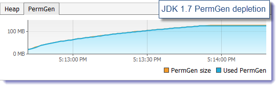
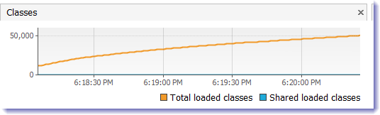
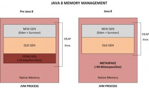
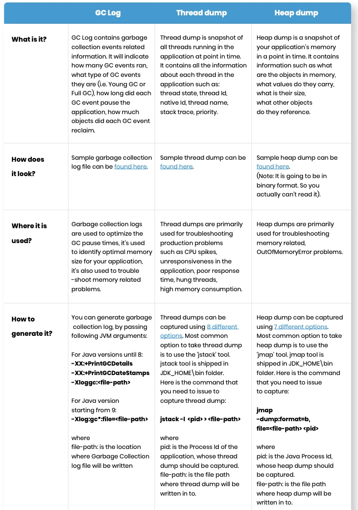

# Java Basics

## JVM

Java Virtual Machine (JVM) is an implementation of a virtual machine which executes a Java program.
The JVM first interprets the bytecode. It then stores the class information in the memory area. Finally, it executes the bytecode generated by the java compiler.

It is an abstract computing machine with its own instruction set and manipulates various memory areas at runtime.

Components of the JVM are:

* Class Loaders
* Run-Time Data Areas
* Execution Engine

### Class Loaders

Initial tasks of the JVM includes loading, verifying and linking the bytecode. Class loaders handle these tasks.

Java provides a dynamic load feature; it loads and links the class when it refers to a class for the first time at runtime, not compile time. JVM's class loader executes the dynamic load. The features of Java class loader are as follows:

* Hierarchical Structure: Class loaders in Java are organized into a hierarchy with a parent-child relationship. The Bootstrap Class Loader is the parent of all class loaders.
* Delegation mode: Based on the hierarchical structure, load is delegated between class loaders. When a class is loaded, the parent class loader is checked to determine whether or not the class is in the parent class loader. If the upper class loader has the class, the class is used. If not, the class loader requested for loading loads the class.
* Visibility limit: A child class loader can find the class in the parent class loader; however, a parent class loader cannot find the class in the child class loader.
* Unload is not allowed: A class loader can load a class but cannot unload it. Instead of unloading, the current class loader can be deleted, and a new class loader can be created.

Each class loader has its namespace that stores the loaded classes. When a class loader loads a class, it searches the class based on FQCN (Fully Qualified Class Name) stored in the namespace to check whether or not the class has been already loaded. Even if the class has an identical FQCN but a different namespace, it is regarded as a different class. A different namespace means that the class has been loaded by another class loader.

When a class loader is requested for class load, it checks whether or not the class exists in the class loader cache, the parent class loader, and itself, in the order listed. In short, it checks whether or not the class has been loaded in the class loader cache. If not, it checks the parent class loader. If the class is not found in the bootstrap class loader, the requested class loader searches for the class in the file system.

* Bootstrap class loader: This is created when running the JVM. It loads Java APIs, including object classes. Unlike other class loaders, it is implemented in native code instead of Java.
* Extension class loader: It loads the extension classes excluding the basic Java APIs. It also loads various security extension functions.
* System class loader: If the bootstrap class loader and the extension class loader load the JVM components, the system   class loader loads the application classes. It loads the class in the $CLASSPATH specified by the user.
* User-defined class loader: This is a class loader that an application user directly creates on the code.

### Class Loading Stages

* Loading: A class is obtained from a file and loaded to the JVM memory.
* Verifying: Check whether or not the read class is configured as described in the Java Language Specification and JVM specifications. This is the most complicated test process of the class load processes, and takes the longest time. Most cases of the JVM TCK test cases are to test whether or not a verification error occurs by loading wrong classes.
* Preparing: Prepare a data structure that assigns the memory required by classes and indicates the fields, methods, and interfaces defined in the class.
* Resolving: Change all symbolic references in the constant pool of the class to direct references.
  Initializing: Initialize the class variables to proper values. Execute the static initializers and initialize the static fields to the configured values.

# Execution Engine

The bytecode that is assigned to the runtime data areas in the JVM via class loader is executed by the execution engine. The execution engine reads the Java Bytecode in the unit of instruction. It is like a CPU executing the machine command one by one. Each command of the bytecode consists of a 1-byte OpCode and additional Operand. The execution engine gets one OpCode and execute task with the Operand, and then executes the next OpCode.

But the Java Bytecode is written in a language that a human can understand, rather than in the language that the machine directly executes. Therefore, the execution engine must change the bytecode to the language that can be executed by the machine in the JVM. The bytecode can be changed to the suitable language in one of two ways.

* Interpreter: Reads, interprets and executes the bytecode instructions one by one. As it interprets and executes instructions one by one, it can quickly interpret one bytecode, but slowly executes the interpreted result. This is the disadvantage of the interpret language. The 'language' called Bytecode basically runs like an interpreter.
* JIT (Just-In-Time) compiler: The JIT compiler has been introduced to compensate for the disadvantages of the interpreter. The execution engine runs as an interpreter first, and at the appropriate time, the JIT compiler compiles the entire bytecode to change it to native code. After that, the execution engine no longer interprets the method, but directly executes using native code. Execution in native code is much faster than interpreting instructions one by one. The compiled code can be executed quickly since the native code is stored in the cache.

However, it takes more time for JIT compiler to compile the code than for the interpreter to interpret the code one by one. Therefore, if the code is to be executed just once, it is better to interpret it instead of compiling. Therefore, the JVMs that use the JIT compiler internally check how frequently the method is executed and compile the method only when the frequency is higher than a certain level.

How the execution engine runs is not defined in the JVM specifications. Therefore, JVM vendors improve their execution engines using various techniques, and introduce various types of JIT compilers.

Most JIT compilers run as shown in the figure below:

The JIT compiler converts the bytecode to an intermediate-level expression, IR (Intermediate Representation), to execute optimization, and then converts the expression to native code.

Oracle Hotspot VM uses a JIT compiler called Hotspot Compiler. It is called Hotspot because Hotspot Compiler searches the 'Hotspot' that requires compiling with the highest priority through profiling, and then it compiles the hotspot to native code. If the method that has the bytecode compiled is no longer frequently invoked, in other words, if the method is not the hotspot any more, the Hotspot VM removes the native code from the cache and runs in interpreter mode. The Hotspot VM is divided into the Server VM and the Client VM, and the two VMs use different JIT compilers.

The client VM and the server VM use an identical runtime; however, they use different JIT compilers, as shown in the above figure. The client VM and the server VM use an identical runtime, however, they use different JIT compilers as shown in the above figure. Advanced Dynamic Optimizing Compiler used by the server VM uses more complex and diverse performance optimization techniques.

IBM JVM has introduced AOT (Ahead-Of-Time) Compiler from IBM JDK 6 as well as the JIT compiler. This means that many JVMs share the native code compiled through the shared cache. In short, the code that has been already compiled through the AOT compiler can be used by another JVM without compiling. In addition, IBM JVM provides a fast way of execution by pre-compiling code to JXE (Java EXecutable) file format using the AOT compiler.

### Run-Time Data Areas

The JVM defines various memory areas to execute a Java program. These are used during runtime and are known as run-time data areas. Some of these areas are created on the JVM start-up and destroyed when the JVM exits while some are created when a thread is created and destroyed when a thread exits.

### Method Area

Basically, method area is analogous to the storage area for compiled code. It stores structures such as run-time constant pool, field and method data, the code for methods and constructors as well as fully qualified class names. The JVM stores these structure for each and every class.

The method area, also known as permanent generation space (PermGen), is created when the JVM starts up. The memory for this area does not need to be contiguous. All the JVM threads share this memory area.

*PermGen space is replaced by MetaSpace in Java 8.*

The PermSize and MaxPermSize JVM arguments are ignored and a warning is issued if present at start-up. Most allocations for the class metadata are now allocated out of native memory. * The classes that were used to describe class metadata have been removed.

# Metaspace: A new memory space is born
The JDK 8 HotSpot JVM is now using native memory for the representation of class metadata and is called Metaspace; similar to the Oracle JRockit and IBM JVM's.

The good news is that it means no more java.lang.OutOfMemoryError: PermGen space problems and no need for you to tune and monitor this memory space anymore…not so fast. While this change is invisible by default, we will show you next that you will still need to worry about the class metadata memory footprint. Please also keep in mind that this new feature does not magically eliminate class and classloader memory leaks. You will need to track down these problems using a different approach and by learning the new naming convention.

* PermGen space situation
  * This memory space is completely removed.
  * The PermSize and MaxPermSize JVM arguments are ignored and a warning is issued if present at start-up.

* Metaspace memory allocation model
  * Most allocations for the class metadata are now allocated out of native memory.
  * The klasses that were used to describe class metadata have been removed.

* Metaspace capacity
  * By default class metadata allocation is limited by the amount of available native memory (capacity will of course depend if you use a 32-bit JVM vs. 64-bit along with OS virtual memory availability).
  * A new flag is available (MaxMetaspaceSize), allowing you to limit the amount of native memory used for class metadata. If you don’t specify this flag, the Metaspace will dynamically re-size depending of the application demand at runtime.

* Metaspace garbage collection
  * Garbage collection of the dead classes and classloaders is triggered once the class metadata usage reaches the “MaxMetaspaceSize”.
  * Proper monitoring & tuning of the Metaspace will obviously be required in order to limit the frequency or delay of such garbage collections. Excessive Metaspace garbage collections may be a symptom of classes, classloaders memory leak or inadequate sizing for your application.

* Java heap space impact
  * Some miscellaneous data has been moved to the Java heap space. This means you may observe an increase of the Java heap space following a future JDK 8 upgrade.

* Metaspace monitoring
  * Metaspace usage is available from the HotSpot 1.8 verbose GC log output.
  * Jstat & JVisualVM have not been updated at this point based on our testing with b75 and the old PermGen space references are still present.

In order to better understand the runtime behavior of the new Metaspace memory space, we created a class metadata leaking Java program

* The following scenarios will be tested:
  * Run the Java program using JDK 1.7 in order to monitor & deplete the PermGen memory space set at 128 MB.
  * Run the Java program using JDK 1.8 (b75) in order to monitor the dynamic increase and garbage collection of the new Metaspace memory space.
  * Run the Java program using JDK 1.8 (b75) in order to simulate the depletion of the Metaspace by setting the MaxMetaspaceSize value at 128 MB.

* JDK 1.7 @64-bit – PermGen depletion
  * Java program with 50K configured iterations
  * Java heap space of 1024 MB
  * Java PermGen space of 128 MB (-XX:MaxPermSize=128m)

* JDK 1.8 @64-bit – Metaspace dynamic re-size
  * Java program with 50K configured iterations
  * Java heap space of 1024 MB
  * Java Metaspace space: unbounded (default)

* JDK 1.8 @64-bit – Metaspace depletion
  * Java program with 50K configured iterations
  * Java heap space of 1024 MB
  * Java Metaspace space: 128 MB (-XX:MaxMetaspaceSize=128m)

Ref: https://dzone.com/articles/java-8-permgen-metaspace

## What is Automatic Garbage Collection?

Automatic garbage collection is the process of looking at heap memory, identifying which objects are in use and which are not, and deleting the unused objects. An in use object, or a referenced object, means that some part of your program still maintains a pointer to that object. An unused object, or unreferenced object, is no longer referenced by any part of your program. So the memory used by an unreferenced object can be reclaimed.

In a programming language like C, allocating and deallocating memory is a manual process. In Java, process of deallocating memory is handled automatically by the garbage collector. The basic process can be described as follows.

### Step 1: Marking

The first step in the process is called marking. This is where the garbage collector identifies which pieces of memory are in use and which are not.

Referenced objects are shown in blue. Unreferenced objects are shown in gold. All objects are scanned in the marking phase to make this determination. This can be a very time consuming process if all objects in a system must be scanned.

### Step 2: Normal Deletion

Normal deletion removes unreferenced objects leaving referenced objects and pointers to free space.

The memory allocator holds references to blocks of free space where new object can be allocated.

#### Step 2a: Deletion with Compacting

To further improve performance, in addition to deleting unreferenced objects, you can also compact the remaining referenced objects. By moving referenced object together, this makes new memory allocation much easier and faster.

## Why Generational Garbage Collection?

As stated earlier, having to mark and compact all the objects in a JVM is inefficient. As more and more objects are allocated, the list of objects grows and grows leading to longer and longer garbage collection time. However, empirical analysis of applications has shown that most objects are short lived.

Here is an example of such data. The Y axis shows the number of bytes allocated and the X access shows the number of bytes allocated over time.

As you can see, fewer and fewer objects remain allocated over time. In fact most objects have a very short life as shown by the higher values on the left side of the graph.

## JVM Generations

The information learned from the object allocation behavior can be used to enhance the performance of the JVM. Therefore, the heap is broken up into smaller parts or generations. The heap parts are: Young Generation, Old or Tenured Generation, and Permanent Generation

The Young Generation is where all new objects are allocated and aged. When the young generation fills up, this causes a minor garbage collection. Minor collections can be optimized assuming a high object mortality rate. A young generation full of dead objects is collected very quickly. Some surviving objects are aged and eventually move to the old generation.

Stop the World Event - All minor garbage collections are "Stop the World" events. This means that all application threads are stopped until the operation completes. Minor garbage collections are always Stop the World events.

The Old Generation is used to store long surviving objects. Typically, a threshold is set for young generation object and when that age is met, the object gets moved to the old generation. Eventually the old generation needs to be collected. This event is called a major garbage collection.

Major garbage collection are also Stop the World events. Often a major collection is much slower because it involves all live objects. So for Responsive applications, major garbage collections should be minimized. Also note, that the length of the Stop the World event for a major garbage collection is affected by the kind of garbage collector that is used for the old generation space.

The Permanent generation contains metadata required by the JVM to describe the classes and methods used in the application. The permanent generation is populated by the JVM at runtime based on classes in use by the application. In addition, Java SE library classes and methods may be stored here.

Classes may get collected (unloaded) if the JVM finds they are no longer needed and space may be needed for other classes. The permanent generation is included in a full garbage collection.

## The Generational Garbage Collection Process

Now that you understand why the heap is separted into different generations, it is time to look at how exactly these spaces interact. The pictures that follow walks through the object allocation and aging process in the JVM.

1. First, any new objects are allocated to the eden space. Both survivor spaces start out empty.

2. When the eden space fills up, a minor garbage collection is triggered.

3. Referenced objects are moved to the first survivor space. Unreferenced objects are deleted when the eden space is cleared.

4. At the next minor GC, the same thing happens for the eden space. Unreferenced objects are deleted and referenced objects are moved to a survivor space. However, in this case, they are moved to the second survivor space (S1). In addition, objects from the last minor GC on the first survivor space (S0) have their age incremented and get moved to S1. Once all surviving objects have been moved to S1, both S0 and eden are cleared. Notice we now have differently aged object in the survivor space.

5. At the next minor GC, the same process repeats. However this time the survivor spaces switch. Referenced objects are moved to S0. Surviving objects are aged. Eden and S1 are cleared.

6. This slide demonstrates promotion. After a minor GC, when aged objects reach a certain age threshold (8 in this example) they are promoted from young generation to old generation.

7. As minor GCs continue to occure objects will continue to be promoted to the old generation space.

8. So that pretty much covers the entire process with the young generation. Eventually, a major GC will be performed on the old generation which cleans up and compacts that space.

## Java Garbage Collectors

### The Serial GC

The serial collector is the default for client style machines in Java SE 5 and 6. With the serial collector, both minor and major garbage collections are done serially (using a single virtual CPU). In addition, it uses a mark-compact collection method. This method moves older memory to the beginning of the heap so that new memory allocations are made into a single continuous chunk of memory at the end of the heap. This compacting of memory makes it faster to allocate new chunks of memory to the heap.

This is the simplest GC implementation, as it basically works with a single thread. As a result, this GC implementation freezes all application threads when it runs. Hence, it is not a good idea to use it in multi-threaded applications like server environments.

The Serial GC is the garbage collector of choice for most applications that do not have small pause time requirements and run on client-style machines. To enable Serial Garbage Collector, we can use the following argument:

> java -XX:+UseSerialGC -jar Application.java

#### Usage Cases

The Serial GC is the garbage collector of choice for most applications that do not have low pause time requirements and run on client-style machines. It takes advantage of only a single virtual processor for garbage collection work (therefore, its name). Still, on today's hardware, the Serial GC can efficiently manage a lot of non-trivial applications with a few hundred MBs of Java heap, with relatively short worst-case pauses (around a couple of seconds for full garbage collections).

Another popular use for the Serial GC is in environments where a high number of JVMs are run on the same machine (in some cases, more JVMs than available processors!). In such environments when a JVM does a garbage collection it is better to use only one processor to minimize the interference on the remaining JVMs, even if the garbage collection might last longer. And the Serial GC fits this trade-off nicely.

Finally, with the proliferation of embedded hardware with minimal memory and few cores, the Serial GC could make a comeback.

Command Line Switches
To enable the Serial Collector use:
-XX:+UseSerialGC

Here is a sample command line for starting the Java2Demo:
java -Xmx12m -Xms3m -Xmn1m -XX:PermSize=20m -XX:MaxPermSize=20m -XX:+UseSerialGC -jar c:\javademos\demo\jfc\Java2D\Java2demo.jar

### The Parallel GC

The parallel garbage collector uses multiple threads to perform the young genertion garbage collection. By default on a host with N CPUs, the parallel garbage collector uses N garbage collector threads in the collection. The number of garbage collector threads can be controlled with command-line options:
-XX:ParallelGCThreads=<desired number>

On a host with a single CPU the default garbage collector is used even if the parallel garbage collector has been requested. On a host with two CPUs the parallel garbage collector generally performs as well as the default garbage collector and a reduction in the young generationgarbage collector pause times can be expected on hosts with more than two CPUs. The Parallel GC comes in two flavors.

Young generation has multiple threads.
Old generation has only one thread (Multiple if we use -XX:+UseParallelOldGC).

#### Usage Cases
The Parallel collector is also called a throughput collector. Since it can use multilple CPUs to speed up application throughput. This collector should be used when a lot of work need to be done and long pauses are acceptable. For example, batch processing like printing reports or bills or performing a large number of database queries.

-XX:+UseParallelGC
With this command line option you get a multi-thread young generation collector with a single-threaded old generation collector. The option also does single-threaded compaction of old generation.

Here is a sample command line for starting the Java2Demo:
java -Xmx12m -Xms3m -Xmn1m -XX:PermSize=20m -XX:MaxPermSize=20m -XX:+UseParallelGC -jar c:\javademos\demo\jfc\Java2D\Java2demo.jar

-XX:+UseParallelOldGC
With the -XX:+UseParallelOldGC option, the GC is both a multithreaded young generation collector and multithreaded old generation collector. It is also a multithreaded compacting collector. HotSpot does compaction only in the old generation. Young generation in HotSpot is considered a copy collector; therefore, there is no need for compaction.

Compacting describes the act of moving objects in a way that there are no holes between objects. After a garbage collection sweep, there may be holes left between live objects. Compacting moves objects so that there are no remaining holes. It is possible that a garbage collector be a non-compacting collector. Therefore, the difference between a parallel collector and a parallel compacting collector could be the latter compacts the space after a garbage collection sweep. The former would not.

### The Concurrent Mark Sweep (CMS) Collector

The Concurrent Mark Sweep (CMS) collector (also referred to as the concurrent low pause collector) collects the tenured generation. It attempts to minimize the pauses due to garbage collection by doing most of the garbage collection work concurrently with the application threads. Normally the concurrent low pause collector does not copy or compact the live objects. A garbage collection is done without moving the live objects. If fragmentation becomes a problem, allocate a larger heap.

Note: CMS collector on young generation uses the same algorithm as that of the parallel collector.

The Concurrent Mark Sweep (CMS) implementation uses multiple garbage collector threads for garbage collection. It's designed for applications that prefer shorter garbage collection pauses, and that can afford to share processor resources with the garbage collector while the application is running.

Simply put, applications using this type of GC respond slower on average but do not stop responding to perform garbage collection.

#### Usage Cases
The CMS collector should be used for applications that require low pause times and can share resources with the garbage collector. Examples include desktop UI application that respond to events, a webserver responding to a request or a database responding to queries.

Command Line Switches
To enable the CMS Collector use:
-XX:+UseConcMarkSweepGC
and to set the number of threads use:
-XX:ParallelCMSThreads=<n>

Here is a sample command line for starting the Java2Demo:
java -Xmx12m -Xms3m -Xmn1m -XX:PermSize=20m -XX:MaxPermSize=20m -XX:+UseConcMarkSweepGC -XX:ParallelCMSThreads=2 -jar c:\javademos\demo\jfc\Java2D\Java2demo.jar

### The G1 Garbage Collector

The Garbage First or G1 garbage collector is available in Java 7 and is designed to be the long term replacement for the CMS collector. The G1 collector is a parallel, concurrent, and incrementally compacting low-pause garbage collector that has quite a different layout from the other garbage collectors described previously. However, detailed discussion is beyond the scope of this OBE.

G1 (Garbage First) Garbage Collector is designed for applications running on multi-processor machines with large memory space. It's available since JDK7 Update 4 and in later releases.

Unlike other collectors, G1 collector partitions the heap into a set of equal-sized heap regions, each a contiguous range of virtual memory. When performing garbage collections, G1 shows a concurrent global marking phase (i.e. phase 1 known as Marking) to determine the liveness of objects throughout the heap.

After the mark phase is completed, G1 knows which regions are mostly empty. It collects in these areas first, which usually yields a significant amount of free space (i.e. phase 2 known as Sweeping). It is why this method of garbage collection is called Garbage-First.

Command Line Switches
To enable the G1 Collector use:
-XX:+UseG1GC

Here is a sample command line for starting the Java2Demo:
java -Xmx12m -Xms3m -XX:+UseG1GC -jar c:\javademos\demo\jfc\Java2D\Java2demo.jar

## Java 8 Changes

Java 8u20 has introduced one more JVM parameter for reducing the unnecessary use of memory by creating too many instances of the same String. This optimizes the heap memory by removing duplicate String values to a global single char[] array.

This parameter can be enabled by adding -XX:+UseStringDeduplication as a JVM parameter.

Cases where String de-duplication could be harmful include:

There are lots of strings but a very low probability of duplicates: the time overhead of looking for duplicates and the space overhead of the de-duping data structure would not be repaid.
There is a reasonable probability of duplicates, but most strings die in within a couple of GC cycles1 anyway. The de-duplication is less beneficial if the de-duped strings were going to be GC'ed soon anyway.

(This is not about strings that don't survive the first GC cycle. It would make no sense for the GC to even try to de-dup strings that it knows to be garbage.)

### Metaspace

Simply put, Metaspace is a new memory space – starting from the Java 8 version; it has replaced the older PermGen memory space. The most significant difference is how it handles memory allocation.

Specifically, this native memory region grows automatically by default.

We also have new flags to tune the memory:

MetaspaceSize and MaxMetaspaceSize – we can set the Metaspace upper bounds.
MinMetaspaceFreeRatio – is the minimum percentage of class metadata capacity free after garbage collection
MaxMetaspaceFreeRatio – is the maximum percentage of class metadata capacity free after a garbage collection to avoid a reduction in the amount of space
Additionally, the garbage collection process also gains some benefits from this change. The garbage collector now automatically triggers the cleaning of the dead classes once the class metadata usage reaches its maximum metaspace size.

Therefore, with this improvement, JVM reduces the chance to get the OutOfMemory error.

Despite all of these improvements, we still need to monitor and tune the metaspace to avoid memory leaks.

### Heap Area

The JVM allocates the memory for all the class instances and arrays from this area.

Garbage Collector (GC) reclaims the heap memory for objects. Basically, GC has three phases to reclaim memory from objects viz. two minor GC and one major GC.

The heap memory has three portions:

* Eden Space – it’s a part of Young Generation space. When we create an object, the JVM allocates memory from this space
* Survivor Space – it’s also a part of Young Generation space. Survivor space contains existing objects which have  
  survived the minor GC phases of GC
* Tenured Space – this is also known as the Old Generation space. It holds long surviving objects. Basically, a threshold
  is set for Young Generation objects and when this threshold is met, these objects are moved to tenured space.

JVM creates heap area as soon as it starts up. All the threads of the JVM share this area. The memory for the heap area does not need to be contiguous.

#### Stack area

Stores data as frames and each frame stores local variables, partial results and nested method calls. JVM creates the stack area whenever it creates a new thread. This area is private for each thread.

Each entry in the stack is called Stack Frame or Activation record. Each frame contains three parts:

* Local Variable Array – contains all the local variables and parameters of the method
* Operand Stack – used as a workspace for storing intermediate calculation’s result
* Frame Data – used to store partial results, return values for methods, and reference to the Exception table which
  provides corresponding catch block information in case of exceptions

### PC Registers

Each JVM thread has a separate PC Register which stores the address of the currently executing instruction. If the currently executing instruction is a part of the native method then this value is undefined.

### Native method stacks

Native methods are those which are written in languages other than Java.

JVM provides capabilities to call these native methods. Native method stacks are also known as “C stacks”. They store the native method information. Whenever the native methods are compiled into machine codes, they usually use a native method stack to keep track of their state.

The JVM creates these stacks whenever it creates a new thread. And thus JVM threads don’t share this area.

### Execution Engine

Execution engine executes the instructions using information present in the memory areas. It has three parts:

### Interpreter

Once classloaders load and verify bytecode, the interpreter executes the bytecode line by line. This execution is quite slow. The disadvantage of the interpreter is that when one method is called multiple times, every time new interpretation is required.

However, the JVM uses JIT Compiler to mitigate this disadvantage.

### Just-In-Time (JIT) Compiler

### Native Libraries

These are platform specific libraries and contains the implementation of native methods.

## JRE

Java Runtime Environment (JRE) is a bundle of software components used to run Java applications.
Core components of the JRE include:

* An implementation of a Java Virtual Machine (JVM)
* Classes required to run the Java programs
* Property Files

We discussed the JVM in the above section. Here we will focus on the core classes and support files.

### Class loading subsystem

### Bootstrap Classes

We’ll find bootstrap classes under jre/lib/. This path is also known as the bootstrap classpath. It includes:

* Runtime classes in rt.jar
* Internationalization classes in i18n.jar
* Character conversion classes in charsets.jar
* Others

Bootstrap ClassLoader loads these classes when the JVM starts up.

### Extension Classes

We can find extension classes in jre/lib/extn/ which acts as a directory for extensions to the Java platform. This path is also known as extension classpath.

It contains JavaFX runtime libraries in jfxrt.jar and locale data for java.text and java.util packages in localedata.jar. Users can also add custom jars into this directory.

### Property Settings

Java platform uses these property settings to maintain its configuration. Depending on their usage they are located in different folders inside /jre/lib/. These include:

* Calendar configurations in the calendar.properties
* Logging configurations in logging.properties
* Networking configurations in net.properties
* Deployment properties in /jre/lib/deploy/
* Management properties in /jre/lib/management/

## JDK

Java Development Kit (JDK) provides environment and tools for developing, compiling, debugging, and executing a Java program.

Core components of JDK include:

* JRE
* Development Tools

We discussed the JRE in the above section.

Now, we’ll focus on various development tools. Let’s categorize these tools based on their usage:

JIT compiler compiles the bytecode of the often-called methods into native code at run-time. Hence it is responsible for the optimization of the Java programs.

JVM automatically monitors which methods are being executed. Once a method becomes eligible for JIT compilation, it is scheduled for compilation into machine code. This method is then known as a hot method. This compilation into machine code happens on a separate JVM thread.

As a result, it does not interrupt the execution of the current program. After compilation into machine code, it runs faster.

### PermGen

Short form for Permanent Generation, PermGen is the memory area in Heap that is used by the JVM to store class and method objects. If your application loads lots of classes, PermGen utilization will be high. PermGen also holds ‘interned’ Strings

In JDK 7, interned strings are no longer allocated in the permanent generation of the Java heap, but are instead allocated in the main part of the Java heap (known as the young and old generations), along with the other objects created by the application. This change will result in more data residing in the main Java heap, and less data in the permanent generation, and thus may require heap sizes to be adjusted. Most applications will see only relatively small differences in heap usage due to this change, but larger applications that load many classes or make heavy use of the String.intern() method will see more significant differences.

PermGen (Permanent Generation) is a special heap space separated from the main memory heap.

The JVM keeps track of loaded class metadata in the PermGen. Additionally, the JVM stores all the static content in this memory section. This includes all the static methods, primitive variables, and references to the static objects.

Furthermore, it contains data about bytecode, names, and JIT information. Before Java 7, the String Pool was also part of this memory.

The default maximum memory size for 32-bit JVM is 64 MB and 82 MB for the 64-bit version.

However, we can change the default size with the JVM options:

-XX:PermSize=[size] is the initial or minimum size of the PermGen space
-XX:MaxPermSize=[size] is the maximum size

The size of the PermGen space is configured by the Java command line option -XX:MaxPermSize

Typically 256 MB should be more than enough of PermGen space for most of the applications

However, It is not unusal to see the error “java.lang.OutOfMemoryError: PermGen space“ if you are loading unusual number of classes.

Gone are the days of OutOfMemory Errors due to PermGen space. With Java 8, there is NO PermGen. That’s right. So no more OutOfMemory Errors due to PermGen

The key difference between PermGen and Metaspace is this: while PermGen is part of Java Heap (Maximum size configured by -Xmx option), Metaspace is NOT part of Heap. Rather Metaspace is part of Native Memory (process memory) which is only limited by the Host Operating System.

While you will NOT run out of PermGen space anymore (since there is NO PermGen), you may consume excessive Native memory making the total process size large. The issue is, if your application loads lots of classes (and/or interned strings), you may actually bring down the Entire Server (not just your application). Why ? Because the native memory is only limited by the Operating System. This means you can literally take up all the memory on the Server. Not good.

It is critical that you add the new option -XX:MaxMetaspaceSize  which sets the Maximum Metaspace size for your application.

Note that it is no longer sufficient to just monitor the Heap Size. You must also monitor the Metaspace which you can do by just keeping an eye on the ‘process size’ using your Operating System utilities (Example: ‘top’ in Unix/Linux, ‘Task Manager’ in Windows).

Most importantly, Oracle completely removed this memory space in the JDK 8 release. Therefore, if we use these tuning flags in Java 8 and newer versions, we'll get the following warnings:

> java -XX:PermSize=100m -XX:MaxPermSize=200m -version
OpenJDK 64-Bit Server VM warning: Ignoring option PermSize; support was removed in 8.0
OpenJDK 64-Bit Server VM warning: Ignoring option MaxPermSize; support was removed in 8.0
...

## Handling out of Memory

It's very common for a large application to face out of memory error which, in turn, results in the application crash. It's a very critical scenario and very hard to replicate to troubleshoot the issue.

That's why JVM comes with some parameters which dump heap memory into a physical file which can be used later for finding out leaks:

* -XX:+HeapDumpOnOutOfMemoryError
* -XX:HeapDumpPath=./java_pid<pid>.hprof
* -XX:OnOutOfMemoryError="< cmd args >;< cmd args >"
* -XX:+UseGCOverheadLimit

A couple of points to note here:

HeapDumpOnOutOfMemoryError instructs the JVM to dump heap into physical file in case of OutOfMemoryError
HeapDumpPath denotes the path where the file is to be written; any filename can be given; however, if JVM finds a <pid> tag in the name, the process id of the current process causing the out of memory error will be appended to the file name with .hprof format
OnOutOfMemoryError is used to issue emergency commands to be executed in case of out of memory error; proper command should be used in the space of cmd args. For example, if we want to restart the server as soon as out of memory occur, we can set the parameter:

> -XX:OnOutOfMemoryError="shutdown -r"

UseGCOverheadLimit is a policy that limits the proportion of the VM's time that is spent in GC before an OutOfMemory error is thrown

## What is Garbage Collection log, Thread dump & Heap dump?

## What is System.gc()?

System.gc() is an API provided in java, Android, C# and other popular languages. When invoked it will make its best effort to clear accumulated unreferenced object (i.e. garbage) from memory.

## What are the downsides of invoking System.gc()?

When System.gc() or Runtime.getRuntime().gc() API calls are invoked from your application, stop-the-world Full GC events will be triggered. During stop-the-world full GCs, entire JVM will freeze (i.e. all the customer transaction that are in motion will be paused). Typically, these Full GCs take a long duration to complete. Thus, it has the potential to result in poor user experiences and your SLAs at unnecessary times when GC isn’t required to be run.

JVM has sophisticated algorithm working all the time in the background doing all computations and calculations on when to trigger GC. When you invoke System.gc() call, all those computations will go for toss. What if JVM has triggered GC event just a millisecond back and once again from your application you are going invoking System.gc()? Because from your application you don’t know when GC ran.

## What is JIT compiler?

The Just-In-Time (JIT) compiler is a an essential part of the JRE i.e. Java Runtime Environment, that is responsible for performance optimization of java based applications at run time. Compiler is one of the key aspects in deciding performance of an application for both parties i.e. the end user and the application developer.

Bytecode is one of the most important features of java that aids in cross-platform execution. Way of converting bytecode to native machine language for execution has a huge impact on the speed of it. These Bytecode have to be interpreted or compiled to proper machine instructions depending on the instruction set architecture. Moreover these can be directly executed if the instruction architecture is bytecode based. Interpreting the bytecode affects the speed of execution.

In order to improve performance, JIT compilers interact with the Java Virtual Machine (JVM) at run time and compile suitable bytecode sequences into native machine code. While using a JIT compiler, the hardware is able to execute the native code, as compared to having the JVM interpret the same sequence of bytecode repeatedly and incurring an overhead for the translation process. This subsequently leads to performance gains in the execution speed, unless the compiled methods are executed less frequently.

The JIT compiler doesn't compile every method that gets called because thousands of methods can be called at startup. Instead, OpenJ9 records the number of times a method is called. When the count reaches a pre-defined invocation threshold, JIT compilation is triggered. Once a method has been compiled by the JIT, the VM can call the compiled method rather than interpreting it.

Java follows object oriented approach, as a result it consists of classes. These constitute of bytecode which are platform neutral and are executed by the JVM across diversified architectures.

* At run time, the JVM loads the class files, the semantic of each is determined and appropriate computations are performed. The additional processor and memory usage during interpretation makes a Java application perform slowly as compared to a native application.

* The JIT compiler aids in improving the performance of Java programs by compiling bytecode into native machine code at run time.

* The JIT compiler is enabled throughout, while it gets activated, when a method is invoked. For a compiled method, the JVM directly calls the compiled code, instead of interpreting it. Theoretically speaking, If compiling did not require any processor time or memory usage, the speed of a native compiler and that of a Java compiler would have been same.

* JIT compilation requires processor time and memory usage. When the java virtual machine first starts up, thousands of methods are invoked. Compiling all these methods can significantly affect startup time, even if the end result is a very good performance optimization.

Ref:
* https://www.eclipse.org/openj9/docs/jit/
* https://www.geeksforgeeks.org/just-in-time-compiler/
* https://www.youtube.com/watch?v=sJVenujWGjs

## What Is Ahead of Time Compilation? (From Java 9)

AOT compilation is one way of improving the performance of Java programs and in particular the startup time of the JVM. The JVM executes Java bytecode and compiles frequently executed code to native code. This is called Just-in-Time (JIT) Compilation. The JVM decides which code to JIT compile based on profiling information collected during execution.

While this technique enables the JVM to produce highly optimized code and improves peak performance, the startup time is likely not optimal, as the executed code is not yet JIT compiled. AOT aims to improve this so-called warming-up period. The compiler used for AOT is Graal.

### JAOT Compilation

> jaotc --output jaotCompilation.so JaotCompilation.class

This produces the library jaotCompilation.so in the current directory.

### Running the JAOT program

> java -XX:AOTLibrary=./jaotCompilation.so JaotCompilation

The argument -XX:AOTLibrary accepts a relative or full path to the library. Alternatively, we can copy the library to the lib folder in the Java home directory and only pass the name of the library.
