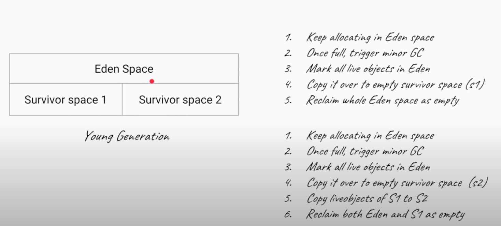
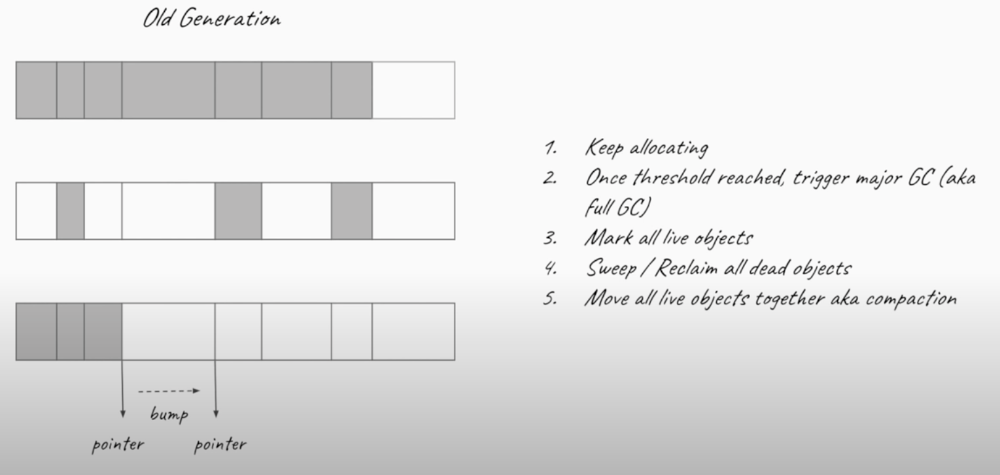
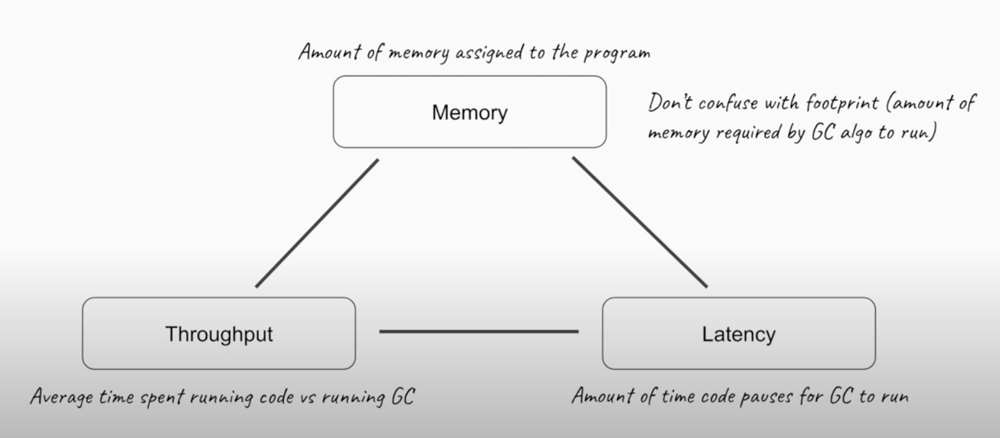

# Garbage Collection

## What Are Stack and Heap? What Is Stored in Each of These Memory Structures, and How Are They Interrelated?

The stack is a part of memory that contains information about nested method calls down to the current position in the program. It also contains all local variables and references to objects on the heap defined in currently executing methods.

This structure allows the runtime to return from the method knowing the address whence it was called, and also clear all local variables after exiting the method. Every thread has its own stack.

The heap is a large bulk of memory intended for allocation of objects. When you create an object with the new keyword, it gets allocated on the heap. However, the reference to this object lives on the stack.

## What Is Generational Garbage Collection and What Makes It a Popular Garbage Collection Approach?

Generational garbage collection can be loosely defined as the strategy used by the garbage collector where the heap is divided into a number of sections called generations, each of which will hold objects according to their “age” on the heap.

Whenever the garbage collector is running, the first step in the process is called marking. This is where the garbage collector identifies which pieces of memory are in use and which are not. This can be a very time-consuming process if all objects in a system must be scanned.

As more and more objects are allocated, the list of objects grows and grows leading to longer and longer garbage collection time. However, empirical analysis of applications has shown that most objects are short-lived.

With generational garbage collection, objects are grouped according to their “age” in terms of how many garbage collection cycles they have survived. This way, the bulk of the work spread across various minor and major collection cycles.

Today, almost all garbage collectors are generational. This strategy is so popular because, over time, it has proven to be the optimal solution.

## Describe in Detail How Generational Garbage Collection Works

To properly understand how generational garbage collection works, it is important to first remember how Java heap is structured to facilitate generational garbage collection.

The heap is divided up into smaller spaces or generations. These spaces are Young Generation, Old or Tenured Generation, and Permanent Generation.

The young generation hosts most of the newly created objects. An empirical study of most applications shows that majority of objects are quickly short lived and therefore, soon become eligible for collection. Therefore, new objects start their journey here and are only “promoted” to the old generation space after they have attained a certain “age”.

The term “age” in generational garbage collection refers to the number of collection cycles the object has survived.

The young generation space is further divided into three spaces: an Eden space and two survivor spaces such as Survivor 1 (s1) and Survivor 2 (s2).

The old generation hosts objects that have lived in memory longer than a certain “age”. The objects that survived garbage collection from the young generation are promoted to this space. It is generally larger than the young generation. As it is bigger in size, the garbage collection is more expensive and occurs less frequently than in the young generation.

The permanent generation or more commonly called, PermGen, contains metadata required by the JVM to describe the classes and methods used in the application. It also contains the string pool for storing interned strings. It is populated by the JVM at runtime based on classes in use by the application. In addition, platform library classes and methods may be stored here.

First, any new objects are allocated to the Eden space. Both survivor spaces start out empty. When the Eden space fills up, a minor garbage collection is triggered. Referenced objects are moved to the first survivor space. Unreferenced objects are deleted.

During the next minor GC, the same thing happens to the Eden space. Unreferenced objects are deleted and referenced objects are moved to a survivor space. However, in this case, they are moved to the second survivor space (S2).

In addition, objects from the last minor GC in the first survivor space (S1) have their age incremented and are moved to S2. Once all surviving objects have been moved to S2, both S1 and Eden space are cleared. At this point, S2 contains objects with different ages.

At the next minor GC, the same process is repeated. However this time the survivor spaces switch. Referenced objects are moved to S1 from both Eden and S2. Surviving objects are aged. Eden and S2 are cleared.

After every minor garbage collection cycle, the age of each object is checked. Those that have reached a certain arbitrary age, for example, 8, are promoted from the young generation to the old or tenured generation. For all subsequent minor GC cycles, objects will continue to be promoted to the old generation space.

This pretty much exhausts the process of garbage collection in the young generation. Eventually, a major garbage collection will be performed on the old generation which cleans up and compacts that space. For each major GC, there are several minor GCs.

## What are the different garbage collections supported by java?

* The Serial GC
* Parallel GC
* The Concurrent Mark Sweep (CMS) Collector
* G1 Garbage Collector
* Z Garbage Collector

https://www.baeldung.com/jvm-garbage-collectors

|Garbage Collector|Optimized For|
|:--- | :--- |
|The Serial GC |Memory Footprint ((data structor used to store the gc information))|
|Parallel GC |Throughput|
|CMS |Latency|
|G1 |Throughput & Latency Balance|
|Z1 | |

> Memory: Amount of memory assigned to the program called as heap.

> Throughput: It is houmuch amout of time your code is run vs houmuch amout of time the garbage collection is run. so for example if the throughput is 99% then your program ran for 99% of time and 1% was garbage collector. so we need higher throughput

> Latency: It is houmch amout of time the program stops for garbage collection to run. it is generally in milliseconds.

> We need latency as low as possible or as predictable as possible

### The Serial GC

This is the simplest GC implementation, as it basically works with a single thread. As a result, this GC implementation freezes all application threads when it runs. Hence, it is not a good idea to use it in multi-threaded applications like server environments.

The Serial GC is the garbage collector of choice for most applications that do not have small pause time requirements and run on client-style machines. To enable Serial Garbage Collector, we can use the following argument:

> java -XX:+UseSerialGC -jar Application.java

* Smallest footprint(data structor used to store the gc information) of any collectors
* Use single thread for both minor and major collection
* Objects in old gen are allocated with simple bump the pointer technique.
* Best of program with small memory, or running on shared CPU.

#### Usage Cases

The Serial GC is the garbage collector of choice for most applications that do not have low pause time requirements and run on client-style machines. It takes advantage of only a single virtual processor for garbage collection work (therefore, its name). Still, on today's hardware, the Serial GC can efficiently manage a lot of non-trivial applications with a few hundred MBs of Java heap, with relatively short worst-case pauses (around a couple of seconds for full garbage collections).

Another popular use for the Serial GC is in environments where a high number of JVMs are run on the same machine (in some cases, more JVMs than available processors!). In such environments when a JVM does a garbage collection it is better to use only one processor to minimize the interference on the remaining JVMs, even if the garbage collection might last longer. And the Serial GC fits this trade-off nicely.

Finally, with the proliferation of embedded hardware with minimal memory and few cores, the Serial GC could make a comeback.

Command Line Switches
To enable the Serial Collector use:
-XX:+UseSerialGC

Here is a sample command line for starting the Java2Demo:
java -Xmx12m -Xms3m -Xmn1m -XX:PermSize=20m -XX:MaxPermSize=20m -XX:+UseSerialGC -jar c:\javademos\demo\jfc\Java2D\Java2demo.jar

### Parallel Garbage Collector

It's the default GC of the JVM and sometimes called Throughput Collectors. Unlike Serial Garbage Collector, this uses multiple threads for managing heap space. But it also freezes other application threads while performing GC.

> java -XX:+UseParallelGC -jar Application.java

* Parallel Collector - Multiple threads for minor GC, single thread for major GC.
* Parallel old collector - Multiple threads for both minor and major GC. Default since java 7u4.
* Dosen't run with the application. i.e while GC is running applications are stopped.
* Greates throughput in multi-processor system.
* Great for batch application.

#### Usage Cases
The Parallel collector is also called a throughput collector. Since it can use multilple CPUs to speed up application throughput. This collector should be used when a lot of work need to be done and long pauses are acceptable. For example, batch processing like printing reports or bills or performing a large number of database queries.

-XX:+UseParallelGC
With this command line option you get a multi-thread young generation collector with a single-threaded old generation collector. The option also does single-threaded compaction of old generation.

Here is a sample command line for starting the Java2Demo:
java -Xmx12m -Xms3m -Xmn1m -XX:PermSize=20m -XX:MaxPermSize=20m -XX:+UseParallelGC -jar c:\javademos\demo\jfc\Java2D\Java2demo.jar

-XX:+UseParallelOldGC
With the -XX:+UseParallelOldGC option, the GC is both a multithreaded young generation collector and multithreaded old generation collector. It is also a multithreaded compacting collector. HotSpot does compaction only in the old generation. Young generation in HotSpot is considered a copy collector; therefore, there is no need for compaction.

Compacting describes the act of moving objects in a way that there are no holes between objects. After a garbage collection sweep, there may be holes left between live objects. Compacting moves objects so that there are no remaining holes. It is possible that a garbage collector be a non-compacting collector. Therefore, the difference between a parallel collector and a parallel compacting collector could be the latter compacts the space after a garbage collection sweep. The former would not.

### The Concurrent Mark Sweep (CMS) Collector

* Concurrent mark and sweep collector for old generation means it runs with application for garbage collection.
* Runs concurrently with application (But still has stop the world pauses).
* Lesss throughput than parallel collector.
* More footprint (data structor used to store the gc information) than parallel collector.
* Smaller pause times thean parallel collector.
* Great for general application.
* Deprecated in Java-9

### G1 Garbage Collector

G1 (Garbage First) Garbage Collector is designed for applications running on multi-processor machines with large memory space. It's available since JDK7 Update 4 and in later releases.

* G1 is the new default garbage collector in JDK 9
* The goal is throughput and low latency
* The default pause target for G1 is 200 miliseconds
* G1 divides the heap into multiple regions usually around 2000 regions.
* G1 finds all the live object concurrently (The java aplication is not stopped).
* G1 keeps track of pointers between regions. so that it can transfer the objects between regions.
* G1 can decide to collect a few regions at a time.
    - fewer objects to collect -> shorter pauses
    - More information -> more control over pauses
* As g1 begins the collection it needs at least one empty region to move live objects.
* Live objects are moved to the empty regions freeing the memory in old regions.
* Thus the new regions are more compact.

Unlike other collectors, the G1 collector partitions the heap into a set of equal-sized heap regions, each a contiguous range of virtual memory. When performing garbage collections, G1 shows a concurrent global marking phase (i.e. phase 1 known as Marking) to determine the liveness of objects throughout the heap.

After the mark phase is completed, G1 knows which regions are mostly empty. It collects in these areas first, which usually yields a significant amount of free space (i.e. phase 2 known as Sweeping). It is why this method of garbage collection is called Garbage-First.

To enable the G1 Garbage Collector, we can use the following argument

>java -XX:+UseG1GC -jar Application.java

Ref: https://blogs.oracle.com/javamagazine/understanding-the-jdks-new-superfast-garbage-collectors

### Shenandoah (sheh.nuhn.dow.uh) Garbage Collector

Shenandoah is a new GC that was released as part of JDK 12.

Shenandoah’s key advance over G1 is to do more of its garbage collection cycle work concurrently with the application threads. G1 can evacuate its heap regions, that is, move objects, only when the application is paused, while Shenandoah can relocate objects concurrently with the application. To achieve the concurrent relocation, it uses what’s known as a Brooks pointer. This pointer is an additional field that each object in the Shenandoah heap has and which points back to the object itself.

Shenandoah does this because when it moves an object, it also needs to fix up all the objects in the heap that have references to that object. When Shenandoah moves an object to a new location, it leaves the old Brooks pointer in place, forwarding references to the new location of the object. When an object is referenced, the application follows the forwarding pointer to the new location. Eventually the old object with the forwarding pointer needs to be cleaned up, but by decoupling the cleanup operation from the step of moving the object itself, Shenandoah can more easily accomplish the concurrent relocation of objects.

To use Shenandoah in your application from Java 12 onwards, enable it with the following options:

> -XX:+UnlockExperimentalVMOptions -XX:+UseShenandoahGC

Ref: https://blogs.oracle.com/javamagazine/understanding-the-jdks-new-superfast-garbage-collectors

### Z Garbage Collector

ZGC (Z Garbage Collector) is a scalable low-latency garbage collector which debuted in Java 11 as an experimental option for Linux. JDK 14 introduced  ZGC under the Windows and macOS operating systems. ZGC has obtained the production status from Java 15 onwards.

ZGC performs all expensive work concurrently, without stopping the execution of application threads for more than 10 ms, which makes it suitable for applications that require low latency. It uses load barriers with colored pointers to perform concurrent operations when the threads are running and they are used to keep track of heap usage.

Reference coloring (colored pointers) is the core concept of ZGC. It means that ZGC uses some bits (metadata bits) of reference to mark the state of the object. It also handles heaps ranging from 8MB to 16TB in size. Furthermore, pause times do not increase with the heap, live-set, or root-set size.

Similar to G1, Z Garbage Collector partitions the heap, except that heap regions can have different sizes.

This makes ZGC a good fit for applications that require large amounts of memory, such as with big data. However, ZGC is also a good candidate for smaller heaps that require predictable and extremely low pause times

To enable the Z Garbage Collector, we can use the following argument in JDK versions lower than 15:

> java -XX:+UnlockExperimentalVMOptions -XX:+UseZGC Application.java

From version 15 we don't need experimental mode on:

> java -XX:+UseZGC Application.java

We should note that ZGC is not the default Garbage Collector.

Ref: https://blogs.oracle.com/javamagazine/understanding-the-jdks-new-superfast-garbage-collectors

## How Do You Trigger Garbage Collection from Java Code?

You, as Java programmer, can not force garbage collection in Java; it will only trigger if JVM thinks it needs a garbage collection based on Java heap size.

Additionally, there are methods like System.gc() and Runtime.gc() which is used to send request of Garbage collection to JVM but it’s not guaranteed that garbage collection will happen.