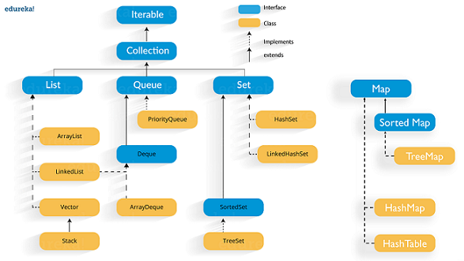
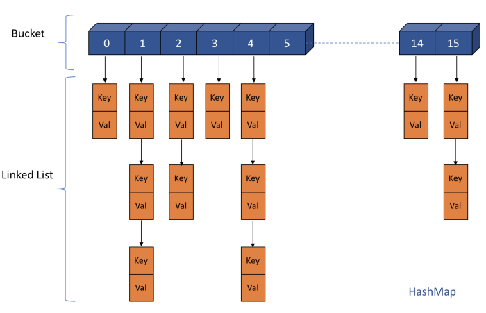
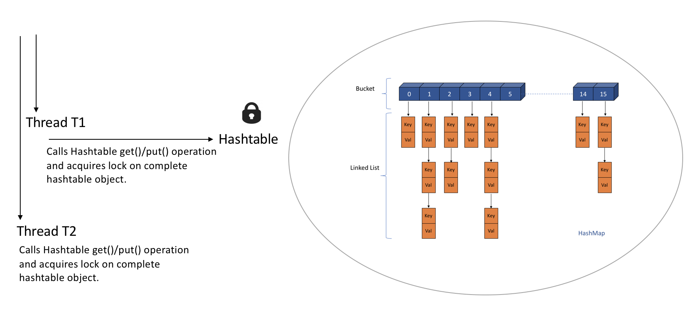
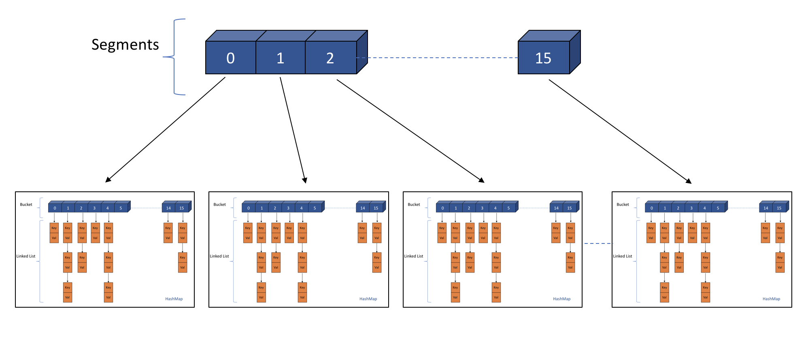
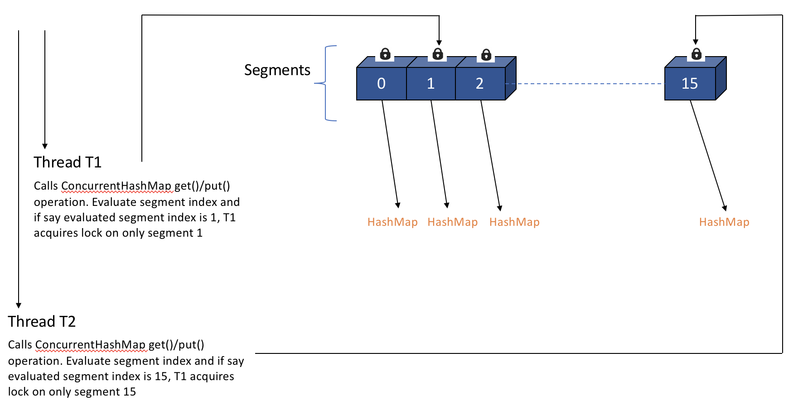
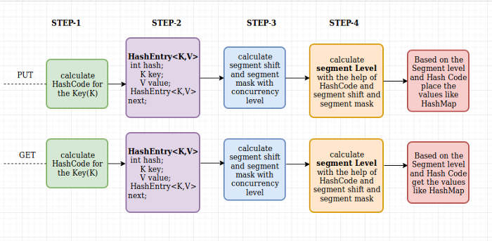
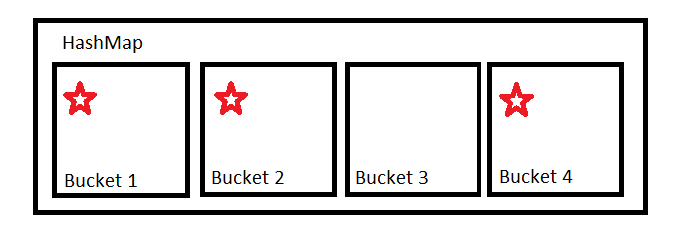
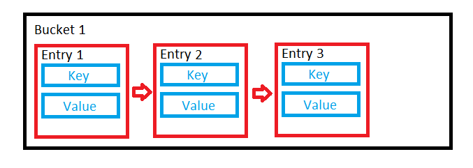
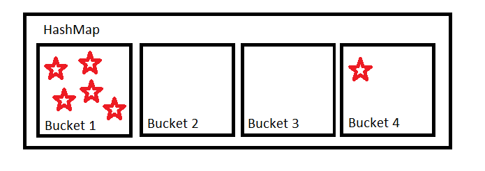
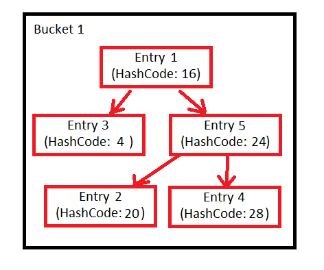

# Collections in Java

Collection Framework is one of the most important pillars that support the fundamental concepts of the Java programming language.

## Collection hierarchy in Java

The **Iterable** interface represents any collection that can be iterated using the for-each loop. The Collection interface inherits from Iterable and adds generic methods for checking if an element is in a collection, adding and removing elements from the collection, determining its size etc.

The **List**, **Set**, and **Queue** interfaces inherit from the Collection interface.

List is an ordered collection, and its elements can be accessed by their index in the list.

**Set** is an unordered collection with distinct elements, similar to the mathematical notion of a set.

**Queue** is a collection with additional methods for adding, removing and examining elements, useful for holding elements prior to processing.

**Map** interface is also a part of the collection framework, yet it does not extend Collection. This is by design, to stress the difference between collections and mappings which are hard to gather under a common abstraction. The Map interface represents a key-value data structure with unique keys and no more than one value for each key.

## Describe Various Implementations of the Map Interface and Their Use Case Differences

One of the most often used implementations of the Map interface is the HashMap. It is a typical hash map data structure that allows accessing elements in constant time, or O(1), but does not preserve order and is not thread-safe.

To preserve insertion order of elements, you can use the LinkedHashMap class which extends the HashMap and additionally ties the elements into a linked list, with foreseeable overhead.

The TreeMap class stores its elements in a red-black tree structure, which allows accessing elements in logarithmic time, or O(log(n)). It is slower than the HashMap for most cases, but it allows keeping the elements in order according to some Comparator.

The ConcurrentHashMap is a thread-safe implementation of a hash map. It provides full concurrency of retrievals (as the get operation does not entail locking) and high expected concurrency of updates.

The Hashtable class has been in Java since version 1.0. It is not deprecated but is mostly considered obsolete. It is a thread-safe hash map, but unlike ConcurrentHashMap, all its methods are simply synchronized, which means that all operations on this map block, even retrieval of independent values.

## Difference between ConcurrentHashMap and Hashtable

This diagram is seems to be similar to the internal implementation of HashMap, but Hashtable is synchronized and provides thread safety like concurrentHashMap but in the performance point of view,Hashtable write operation uses map wide lock which means it locks the complete map object.

Example for better understanding

Thread T1 calls get()/put() operation on Hashtable and acquires the lock on complete hashtable object.

Now if Thread T2 calls get()/put() operation, It has to wait till T1 finishes get()/put() operation and releases the lock on the object.

ConcurrentHashMap works a bit different as it acquires lock per Segment which means instead of single map wide lock, it has multiple Segment level locks. it uses a Locking technique name ReentrantLock

So 2 Threads operating on different segments can acquire lock on those segments without interfering with each other and can proceed simultaneously as they are working on separate Segment locks.

Simultaneous Read and Write operations by Multiple Threads on same or different segments of ConcurrentHashMap

Read/Get Operation :- Two Threads T1 and T2 can read data from the same or different segment of ConcurrentHashMap at the same time without blocking each other.

Write/Put Operation :- Two Threads T1 and T2 can write data on different segment at the same time without blocking the other.

But Two threads can’t write data on same segments at the same time. One has to wait for other to complete the operation.

Read-Write Operation :- Two threads can read and write data on different segments at the same time without blocking each other.

In general, Retrieval operations do not block, so may overlap with write (put/remove) operations. Latest updated value will be returned by get operation which is most recently updated value by write operation (including put/remove).

Thread T1 calls concurrentHashMap.put(key, value), It acquires lock on say Segment 1and invokes put method.

Thread T2 calls concurrentHashMap.put(key, value), It acquires lock on say Segment 15 and invokes put method as shown in above diagram

### How the put and gets will carried on Concurrent HashMap

If we give concurrency level or initialCapacity = 10 and it will consider concurrency level or initialCapacity as 16 ( next 2 to the power x is 16)

**PUT:**

Based on segment index, HashEntry<K,V>(node) is placed in particular segment then Based on the hashindex, HashEntry<K,V>(node) is placed in array inside the segment which is similarly like how nodes are placed inside the bucket in HashMap

**GET:**

## Difference between Hashtable and Collections.synchronizedMap(HashMap)

* The Hashtable class has all its methods synchronized i.e. the locking is done at the method level and hence one can say that the mutex is always at the Hashtable object (this) level.

* The method Collections.synchronizedMap(Map) returns an instance of SynchronizedMap which is an inner class to the Collections class. This class has all its methods in a Synchronized block with a mutex. The difference lies in the mutex here. The inner class SynchronizedMap has two constructors, one which takes only Map as an argument and another which takes a Map and an Object (mutex) as an argument. By default if one uses the first constructor of passing only a Map, this is used as a mutex. Though, the developer is allowed to pass another object of mutex as a second argument by which the lock on the Map methods would be only on that Object and hence less restrictive than Hashtable.

* Hence, Hashtable uses method level synchronization but Collections.synchronizedMap(Map) provides a flexibility to developer lock on provided mutex with Synchronized block.

Based on segment index, we figure out particular segment then Based on the hashindex, we will get values from the array inside the segment which is similarly like how we will get values from the bucket in HashMap

## Explain the Difference Between Linkedlist and Arraylist

**ArrayList** is an implementation of the List interface that is based on an array. ArrayList internally handles resizing of this array when the elements are added or removed. You can access its elements in constant time by their index in the array. However, inserting or removing an element infers shifting all consequent elements which may be slow if the array is huge and the inserted or removed element is close to the beginning of the list.

**LinkedList** is a doubly-linked list: single elements are put into Node objects that have references to previous and next Node. This implementation may appear more efficient than ArrayList if you have lots of insertions or deletions in different parts of the list, especially if the list is large.

## What Is the Difference Between Hashset and Treeset

Both **HashSet** and **TreeSet** classes implement the Set interface and represent sets of distinct elements. Additionally, TreeSet implements the NavigableSet interface. This interface defines methods that take advantage of the ordering of elements.

**HashSet** is internally based on a **HashMap**, and **TreeSet** is backed by a **TreeMap** instance, which defines their properties: HashSet does not keep elements in any particular order. Iteration over the elements in a HashSet produces them in a shuffled order. TreeSet, on the other hand, produces elements in order according to some predefined Comparator.

## How Is Hashmap Implemented in Java? How Does Its Implementation Use Hashcode and Equals Methods of Objects? What Is the Time Complexity of Putting and Getting an Element from Such Structure?

The HashMap class represents a typical hash map data structure with certain design choices.

The HashMap is backed by a resizable array that has a size of power-of-two. When the element is added to a HashMap, first its hashCode is calculated (an int value). Then a certain number of lower bits of this value are used as an array index. This index directly points to the cell of the array (called a bucket) where this key-value pair should be placed. Accessing an element by its index in an array is a very fast O(1) operation, which is the main feature of a hash map structure.

A hashCode is not unique, however, and even for different hashCodes, we may receive the same array position. This is called a collision. There is more than one way of resolving collisions in the hash map data structures. In Java's HashMap, each bucket actually refers not to a single object, but to a red-black tree of all objects that landed in this bucket (prior to Java 8, this was a linked list).

When there are at least 8 entries (TREEIFY_THRESHOLD) in a single bucket and the total number of buckets is more then 64 (MIN_TREEIFY_CAPACITY) then that single bucket will be transformed to a perfectly balanced red black tree node.

There is also the shrinkage that you should be aware of (if you want) that happens when you remove entries (UNTREEIFY_THRESHOLD == 6).

So when the HashMap has determined the bucket for a key, it has to traverse this tree to put the key-value pair in its place. If a pair with such key already exists in the bucket, it is replaced with a new one.

### Details

HashMap contains a certain number of buckets. It uses hashCode to determine which bucket to put these into. For simplicity's sake imagine it as a modulus.

If our hashcode is 123456 and we have 4 buckets, 123456 % 4 = 0 so the item goes in the first bucket, Bucket 1.

If our hashCode function is good, it should provide an even distribution so that all the buckets will be used somewhat equally. In this case, the bucket uses a linked list to store the values.

But you can't rely on people to implement good hash functions. People will often write poor hash functions which will result in a non-even distribution. It's also possible that we could just get unlucky with our inputs.

The less even this distribution is, the further we're moving from O(1) operations and the closer we're moving towards O(n) operations.

The implementation of HashMap tries to mitigate this by organising some buckets into trees rather than linked lists if the buckets become too large. This is what TREEIFY_THRESHOLD = 8 is for. If a bucket contains more than eight items, it should become a tree.

This tree is a Red-Black tree, presumably chosen because it offers some worst-case guarantees. It is first sorted by hash code. If the hash codes are the same, it uses the compareTo method of Comparable if the objects implement that interface, else the identity hash code.

If entries are removed from the map, the number of entries in the bucket might reduce such that this tree structure is no longer necessary. That's what the UNTREEIFY_THRESHOLD = 6 is for. If the number of elements in a bucket drops below six, we might as well go back to using a linked list.

Finally, there is the MIN_TREEIFY_CAPACITY = 64.

When a hash map grows in size, it automatically resizes itself to have more buckets. If we have a small HashMap, the likelihood of us getting very full buckets is quite high, because we don't have that many different buckets to put stuff into. It's much better to have a bigger HashMap, with more buckets that are less full. This constant basically says not to start making buckets into trees if our HashMap is very small - it should resize to be larger first instead.

## What Is the Difference Between Fail-Fast and Fail-Safe Iterators?

Iterators for different collections are either fail-fast or fail-safe, depending on how they react to concurrent modifications. The concurrent modification is not only a modification of collection from another thread but also modification from the same thread but using another iterator or modifying the collection directly.

**Fail-fast** iterators (those returned by HashMap, ArrayList, and other non-thread-safe collections) iterate over the collection's internal data structure, and they throw ConcurrentModificationException as soon as they detect a concurrent modification.

**Fail-safe** iterators (returned by thread-safe collections such as ConcurrentHashMap, CopyOnWriteArrayList) create a copy of the structure they iterate upon. They guarantee safety from concurrent modifications. Their drawbacks include excessive memory consumption and iteration over possibly out-of-date data in case the collection was modified.

