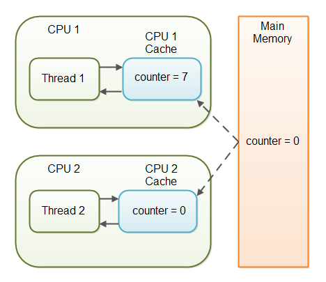

# Java Basics

## Java Versions and New Additions

### New in Java 12

* A low pause time garbage collector called Shenandoah.
* Java switch expressions (preview - may be removed from Java again).
* JVM Constants API.
* Abortable mixed collections in G1 (garbage collections).
* Promptly return unused committed memory from G1.

### New in Java 11

* Removed Java EE and Corba modules from JDK.
* HTTP Client made standard (the one added in Java 9).
* Java var keyword allowed as lambda expression parameter type.
* Key agreement via elliptic curve cryptography.
* Unicode 10.
* New cryptographic algorithms.
* Launch single file source code programs (compiled when executed).
* TLS 1.3 support.
* Deprecate the Nashorn JavaScript engine

### New in Java 10

* Local-Variable Type Inference
* Parallel Full Garbage Collection for G1 (a Garbage Collector)
* Graal included as experimental JIT compiler
* Several internal, JVM and platform level changes

### New in Java 9

* Java Modules
* Java Reflection Module class
* Java Try With Resources Enhancement
* Java Compact Strings
* Java Microbenchmark Harness (JMH) included in the JDK

### New in Java 8

* Java Lambda Expressions
* Java Streams (functional streams)
* JavaFX (bundled with Java SE from Java 8).
* The Nashorn JavaScript engine.

### New in Java 7

* Try with resources
* Catching Multiple Exceptions
* Java Fork and Join via ForkJoinPool
* Strings in Java switch statements.
* New file system API in Java NIO 2.0
* Type inference in generic declarations (the socalled "diamond" operator).
* Numeric literals with underscores as visual separators (e.g. 1_000_000).
* Binary numeric literals (e.g. 0b10100101).
* Support for dynamically typed languages in the Java Virtual Machine (JVM).

## What special guarantees does the JMM hold for final fields of a class?

JVM basically guarantees that final fields of a class will be initialized before any thread gets hold of the object. Without this guarantee, a reference to an object may be published, i.e. become visible, to another thread before all the fields of this object are initialized, due to reorderings or other optimizations. This could cause racy access to these fields.

This is why, when creating an immutable object, you should always make all its fields final, even if they are not accessible via getter methods.

## Volatile keyword in Java

Volatile specifier is used to indicate that a variable’s value can be modified by multiple threads simultaneously.
The value of this variable will never be cached thread-locally: all reads and writes will go straight to “main memory” ( that is not right at all practically :), but this is what mostly written everywhere.)

Volatile comes with two major concepts : Visibility and Ordering.

Visibility: If one thread changes a value of a variable, the change will be visible immediately to other threads reading the variable. This is guaranteed by not allowing the compiler or the JVM to allocate those variables in the CPU registers. Any write to a volatile variable is flushed immediately to main memory and any read of it is fetched from main memory. That means there is a little bit of performance penalty, but that's far better from a concurrency point of view.

Ordering: Sometimes for performance optimization, the JVM reorders instructions. This is not allowed when accessing volatile variables. Access to volatile variables is not reordered with access to other volatile variables, nor with access to other normal fields around them. This makes writes to non-volatile fields around them visible immediately to other threads.

In a multithreaded application where the threads operate on non-volatile variables, each thread may copy variables from main memory into a CPU cache while working on them, for performance reasons. If your computer contains more than one CPU, each thread may run on a different CPU. That means, that each thread may copy the variables into the CPU cache of different CPUs. This is illustrated here:

With non-volatile variables there are no guarantees about when the Java Virtual Machine (JVM) reads data from main memory into CPU caches, or writes data from CPU caches to main memory. 

Imagine too, that only Thread 1 increments the counter variable, but both Thread 1 and Thread 2 may read the counter variable from time to time.

If the counter variable is not declared volatile there is no guarantee about when the value of the counter variable is written from the CPU cache back to main memory. This means, that the counter variable value in the CPU cache may not be the same as in main memory. This situation is illustrated here:

The problem with threads not seeing the latest value of a variable because it has not yet been written back to main memory by another thread, is called a "visibility" problem. The updates of one thread are not visible to other threads.

### The Java volatile Visibility Guarantee

The Java volatile keyword is intended to address variable visibility problems. By declaring the counter variable volatile all writes to the counter variable will be written back to main memory immediately. Also, all reads of the counter variable will be read directly from main memory.

### Full volatile Visibility Guarantee

Actually, the visibility guarantee of Java volatile goes beyond the volatile variable itself. The visibility guarantee is as follows:

* If Thread A writes to a volatile variable and Thread B subsequently reads the same volatile variable, then all variables visible to Thread A before writing the volatile variable, will also be visible to Thread B after it has read the volatile variable.
* If Thread A reads a volatile variable, then all all variables visible to Thread A when reading the volatile variable will also be re-read from main memory.

Ref: http://tutorials.jenkov.com/java-concurrency/volatile.html

## Concurrency vs Parallelism

* **Concurrency** : is when two or more tasks can start, run, and complete in overlapping time periods. It doesn't necessarily mean they'll ever both be running at the same instant. For example, multitasking on a single-core machine.

    A condition that exists when at least two threads are making progress. A more generalized form of parallelism that can include time-slicing as a form of virtual parallelism.

* **Parallelism** : is when tasks literally run at the same time, e.g., on a multicore processor.
    
    A condition that arises when at least two threads are executing simultaneously.

