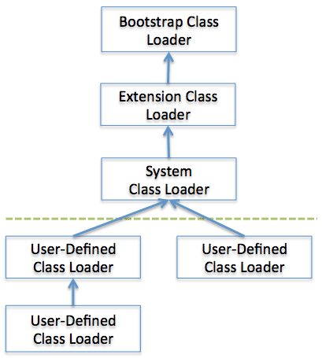

# Class Loader

Java provides a dynamic load feature; it loads and links the class when it refers to a class for the first time at runtime, not compile time. JVM's class loader executes the dynamic load. The features of Java class loader are as follows:

* Hierarchical Structure: Class loaders in Java are organized into a hierarchy with a parent-child relationship. The Bootstrap Class Loader is the parent of all class loaders.
* Delegation mode: Based on the hierarchical structure, load is delegated between class loaders. When a class is loaded, the parent class loader is checked to determine whether or not the class is in the parent class loader. If the upper class loader has the class, the class is used. If not, the class loader requested for loading loads the class.
* Visibility limit: A child class loader can find the class in the parent class loader; however, a parent class loader cannot find the class in the child class loader.
* Unload is not allowed: A class loader can load a class but cannot unload it. Instead of unloading, the current class loader can be deleted, and a new class loader can be created.

Each class loader has its namespace that stores the loaded classes. When a class loader loads a class, it searches the class based on FQCN (Fully Qualified Class Name) stored in the namespace to check whether or not the class has been already loaded. Even if the class has an identical FQCN but a different namespace, it is regarded as a different class. A different namespace means that the class has been loaded by another class loader.

When a class loader is requested for class load, it checks whether or not the class exists in the class loader cache, the parent class loader, and itself, in the order listed. In short, it checks whether or not the class has been loaded in the class loader cache. If not, it checks the parent class loader. If the class is not found in the bootstrap class loader, the requested class loader searches for the class in the file system.

* Bootstrap class loader: This is created when running the JVM. It loads Java APIs, including object classes. Unlike other class loaders, it is implemented in native code instead of Java.
* Extension class loader: It loads the extension classes excluding the basic Java APIs. It also loads various security extension functions.
* System class loader: If the bootstrap class loader and the extension class loader load the JVM components, the system   class loader loads the application classes. It loads the class in the $CLASSPATH specified by the user.
* User-defined class loader: This is a class loader that an application user directly creates on the code.

## Class Loading Stages

* Loading: A class is obtained from a file and loaded to the JVM memory.
* Verifying: Check whether or not the read class is configured as described in the Java Language Specification and JVM specifications. This is the most complicated test process of the class load processes, and takes the longest time. Most cases of the JVM TCK test cases are to test whether or not a verification error occurs by loading wrong classes.
* Preparing: Prepare a data structure that assigns the memory required by classes and indicates the fields, methods, and interfaces defined in the class.
* Resolving: Change all symbolic references in the constant pool of the class to direct references.
Initializing: Initialize the class variables to proper values. Execute the static initializers and initialize the static fields to the configured values.