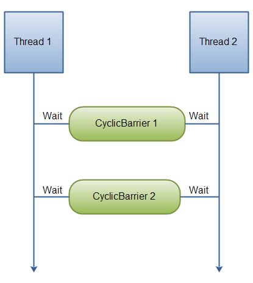

# Executor Framework
> Executor, a simple interface that supports launching new tasks.

> ExecutorService, a subinterface of Executor, which adds features that help manage the lifecycle, both of the individual tasks and of  the executor itself.

> ScheduledExecutorService, a subinterface of ExecutorService, supports future and/or periodic execution of tasks.

> Future, A Future represents the result of an asynchronous computation.

> CountDownLatch, CountDownLatch (introduced in JDK 5) is a utility class which blocks a set of threads until some operation completes.


# Executor Interface
The Executor interface provides a single method, execute, designed to be a drop-in replacement for a common thread-creation idiom. If r is a Runnable object, and e is an Executor object you can replace
```
public class Hello implements Runnable {
    @Override
    public void run() {
        System.out.println("Hello World!!");}
    }
}

public void execute() {
    Thread thread = new Thread(new PrintRunnable());
    thread.start();
}
```
with
```
public class Invoker implements Executor {
    @Override
    public void execute(Runnable r) {
        r.run();
    }
}

public void execute() {
    Executor executor = new Invoker();
    executor.execute( () -> {
        System.out.println("Hello World!!");
    });
}
```
However, the definition of execute is less specific. The low-level idiom creates a new thread and launches it immediately. Depending on the Executor implementation, execute may do the same thing, but is more likely to use an existing worker thread to run r, or to place r in a queue to wait for a worker thread to become available. (We'll describe worker threads in the section on Thread Pools.)

The executor implementations in java.util.concurrent are designed to make full use of the more advanced ExecutorService and ScheduledExecutorService interfaces, although they also work with the base Executor interface.

# ExecutorService Interface
The ExecutorService interface supplements execute with a similar, but more versatile submit method. Like execute, submit accepts Runnable objects, but also accepts Callable objects, which allow the task to return a value. The submit method returns a Future object, which is used to retrieve the Callable return value and to manage the status of both Callable and Runnable tasks.

ExecutorService also provides methods for submitting large collections of Callable objects. Finally, ExecutorService provides a number of methods for managing the shutdown of the executor. To support immediate shutdown, tasks should handle interrupts correctly.

# ExecutorService
ExecutorService is a complete solution for asynchronous processing. It manages an in-memory queue and schedules submitted tasks based on thread availability.

```
public class Task implements Runnable {
    @Override
    public void run() {
        // task details
    }
}
```
Now we can create the ExecutorService instance and assign this task. At the time of creation, we need to specify the thread-pool size.

```
ExecutorService executor = Executors.newFixedThreadPool(10);
```

# ScheduledExecutorService Interface
The ScheduledExecutorService interface supplements the methods of its parent ExecutorService with schedule, which executes a Runnable or Callable task after a specified delay. In addition, the interface defines scheduleAtFixedRate and scheduleWithFixedDelay, which executes specified tasks repeatedly, at defined intervals.

# Future
A Future represents the result of an asynchronous computation. Methods are provided to check if the computation is complete, to wait for its completion, and to retrieve the result of the computation. The result can only be retrieved using method get when the computation has completed, blocking if necessary until it is ready. Cancellation is performed by the cancel method. Additional methods are provided to determine if the task completed normally or was cancelled. Once a computation has completed, the computation cannot be cancelled. If you would like to use a Future for the sake of cancellability but not provide a usable result, you can declare types of the form Future<?> and return null as a result of the underlying task.

```
public void invoke() {
    ExecutorService executorService = Executors.newFixedThreadPool(10);
 
    Future<String> future = executorService.submit(() -> {
        // ...
        Thread.sleep(10000l);
        return "Hello world";
    });
}
if (future.isDone() && !future.isCancelled()) {
    try {
        str = future.get();
    } catch (InterruptedException | ExecutionException e) {
        e.printStackTrace();
    }
}
```

We can also specify a timeout for a given operation. If the task takes more than this time, a TimeoutException is thrown:

```
try {
    future.get(10, TimeUnit.SECONDS);
} catch (InterruptedException | ExecutionException | TimeoutException e) {
    e.printStackTrace();
}
```

# CountDownLatch
CountDownLatch (introduced in JDK 5) is a utility class which blocks a set of threads until some operation completes. A CountDownLatch is initialized with a counter(Integer type); this counter decrements as the dependent threads complete execution. But once the counter reaches zero, other threads get released.

Example
```
public class Worker implements Runnable {
    private List<String> outputScraper;
    private CountDownLatch countDownLatch;
 
    public Worker(List<String> outputScraper, CountDownLatch countDownLatch) {
        this.outputScraper = outputScraper;
        this.countDownLatch = countDownLatch;
    }
 
    @Override
    public void run() {
        doSomeWork();
        outputScraper.add("Counted down");
        countDownLatch.countDown();
    }
}
```
Then, let’s create a test in order to prove that we can get a CountDownLatch to wait for the Worker instances to complete:
```
@Test
public void whenParallelProcessing_thenMainThreadWillBlockUntilCompletion()
  throws InterruptedException {
 
    List<String> outputScraper = Collections.synchronizedList(new ArrayList<>());
    CountDownLatch countDownLatch = new CountDownLatch(5);
    List<Thread> workers = Stream
      .generate(() -> new Thread(new Worker(outputScraper, countDownLatch)))
      .limit(5)
      .collect(toList());
 
      workers.forEach(Thread::start);
      countDownLatch.await(); 
      outputScraper.add("Latch released");
 
      assertThat(outputScraper)
        .containsExactly(
          "Counted down",
          "Counted down",
          "Counted down",
          "Counted down",
          "Counted down",
          "Latch released"
        );
    }
```
Naturally “Latch released” will always be the last output – as it’s dependant on the CountDownLatch releasing.

## Testing concurrency using CountDownLatch
If we took the previous example, but this time started thousands of threads instead of five, it’s likely that many of the earlier ones will have finished processing before we have even called start() on the later ones. This could make it difficult to try and reproduce a concurrency problem, as we wouldn’t be able to get all our threads to run in parallel.

To get around this, let’s get the CountdownLatch to work differently than in the previous example. Instead of blocking a parent thread until some child threads have finished, we can block each child thread until all the others have started.

Let’s modify our run() method so it blocks before processing:

```
public class WaitingWorker implements Runnable {
 
    private List<String> outputScraper;
    private CountDownLatch readyThreadCounter;
    private CountDownLatch callingThreadBlocker;
    private CountDownLatch completedThreadCounter;
 
    public WaitingWorker(
      List<String> outputScraper,
      CountDownLatch readyThreadCounter,
      CountDownLatch callingThreadBlocker,
      CountDownLatch completedThreadCounter) {
 
        this.outputScraper = outputScraper;
        this.readyThreadCounter = readyThreadCounter;
        this.callingThreadBlocker = callingThreadBlocker;
        this.completedThreadCounter = completedThreadCounter;
    }
 
    @Override
    public void run() {
        readyThreadCounter.countDown();
        try {
            callingThreadBlocker.await();
            doSomeWork();
            outputScraper.add("Counted down");
        } catch (InterruptedException e) {
            e.printStackTrace();
        } finally {
            completedThreadCounter.countDown();
        }
    }
}
```
Now, let’s modify our test so it blocks until all the Workers have started, unblocks the Workers, and then blocks until the Workers have finished:

```
@Test
public void whenDoingLotsOfThreadsInParallel_thenStartThemAtTheSameTime()
 throws InterruptedException {
  
    List<String> outputScraper = Collections.synchronizedList(new ArrayList<>());
    CountDownLatch readyThreadCounter = new CountDownLatch(5);
    CountDownLatch callingThreadBlocker = new CountDownLatch(1);
    CountDownLatch completedThreadCounter = new CountDownLatch(5);
    List<Thread> workers = Stream
      .generate(() -> new Thread(new WaitingWorker(
        outputScraper, readyThreadCounter, callingThreadBlocker, completedThreadCounter)))
      .limit(5)
      .collect(toList());
 
    workers.forEach(Thread::start);
    readyThreadCounter.await(); 
    outputScraper.add("Workers ready");
    callingThreadBlocker.countDown(); 
    completedThreadCounter.await(); 
    outputScraper.add("Workers complete");
 
    assertThat(outputScraper)
      .containsExactly(
        "Workers ready",
        "Counted down",
        "Counted down",
        "Counted down",
        "Counted down",
        "Counted down",
        "Workers complete"
      );
}
```
This pattern is really useful for trying to reproduce concurrency bugs, as can be used to force thousands of threads to try and perform some logic in parallel.

## Terminating a CountdownLatch Early
Sometimes, we may run into a situation where the Workers terminate in error before counting down the CountDownLatch. This could result in it never reaching zero and await() never terminating:

```
@Override
public void run() {
    if (true) {
        throw new RuntimeException("Oh dear, I'm a BrokenWorker");
    }
    countDownLatch.countDown();
    outputScraper.add("Counted down");
}

@Test
public void whenFailingToParallelProcess_thenMainThreadShouldGetNotGetStuck()
  throws InterruptedException {
  
    List<String> outputScraper = Collections.synchronizedList(new ArrayList<>());
    CountDownLatch countDownLatch = new CountDownLatch(5);
    List<Thread> workers = Stream
      .generate(() -> new Thread(new BrokenWorker(outputScraper, countDownLatch)))
      .limit(5)
      .collect(toList());
 
    workers.forEach(Thread::start);
    countDownLatch.await();
}
```
Clearly, this is not the behavior we want – it would be much better for the application to continue than infinitely block.
To get around this, let’s add a timeout argument to our call to await().

```
boolean completed = countDownLatch.await(3L, TimeUnit.SECONDS);
assertThat(completed).isFalse();
```
# CyclicBarrier
The java.util.concurrent.CyclicBarrier class is a synchronization mechanism that can synchronize threads progressing through some algorithm. In other words, it is a barrier that all threads must wait at, until all threads reach it, before any of the threads can continue. Here is a diagram illustrating that:



## Creating a CyclicBarrier
When you create a CyclicBarrier you specify how many threads are to wait at it, before releasing them. Here is how you create a CyclicBarrier:

```
CyclicBarrier barrier = new CyclicBarrier(2);
```
## Waiting at a CyclicBarrier
Here is how a thread waits at a CyclicBarrier:
```
barrier.await();
```
You can also specify a timeout for the waiting thread. When the timeout has passed the thread is also released, even if not all N threads are waiting at the CyclicBarrier. Here is how you specify a timeout:
```
barrier.await(10, TimeUnit.SECONDS);
```
The waiting threads waits at the CyclicBarrier until either:

The last thread arrives (calls await() )
The thread is interrupted by another thread (another thread calls its interrupt() method)
Another waiting thread is interrupted
Another waiting thread times out while waiting at the CyclicBarrier
The CyclicBarrier.reset() method is called by some external thread.

## CyclicBarrier Example
```
Runnable barrier1Action = new Runnable() {
    public void run() {
        System.out.println("BarrierAction 1 executed ");
    }
};
Runnable barrier2Action = new Runnable() {
    public void run() {
        System.out.println("BarrierAction 2 executed ");
    }
};

CyclicBarrier barrier1 = new CyclicBarrier(2, barrier1Action);
CyclicBarrier barrier2 = new CyclicBarrier(2, barrier2Action);

CyclicBarrierRunnable barrierRunnable1 =
        new CyclicBarrierRunnable(barrier1, barrier2);

CyclicBarrierRunnable barrierRunnable2 =
        new CyclicBarrierRunnable(barrier1, barrier2);

new Thread(barrierRunnable1).start();
new Thread(barrierRunnable2).start();
```
```
public class CyclicBarrierRunnable implements Runnable{

    CyclicBarrier barrier1 = null;
    CyclicBarrier barrier2 = null;

    public CyclicBarrierRunnable(
            CyclicBarrier barrier1,
            CyclicBarrier barrier2) {

        this.barrier1 = barrier1;
        this.barrier2 = barrier2;
    }

    public void run() {
        try {
            Thread.sleep(1000);
            System.out.println(Thread.currentThread().getName() +
                                " waiting at barrier 1");
            this.barrier1.await();

            Thread.sleep(1000);
            System.out.println(Thread.currentThread().getName() +
                                " waiting at barrier 2");
            this.barrier2.await();

            System.out.println(Thread.currentThread().getName() +
                                " done!");

        } catch (InterruptedException e) {
            e.printStackTrace();
        } catch (BrokenBarrierException e) {
            e.printStackTrace();
        }
    }
}
```
Here is the console output for an execution of the above code. Note that the sequence in which the threads gets to write to the console may vary from execution to execution. Sometimes Thread-0 prints first, sometimes Thread-1 prints first etc.
```
Thread-0 waiting at barrier 1
Thread-1 waiting at barrier 1
BarrierAction 1 executed
Thread-1 waiting at barrier 2
Thread-0 waiting at barrier 2
BarrierAction 2 executed
Thread-0 done!
Thread-1 done!
```

