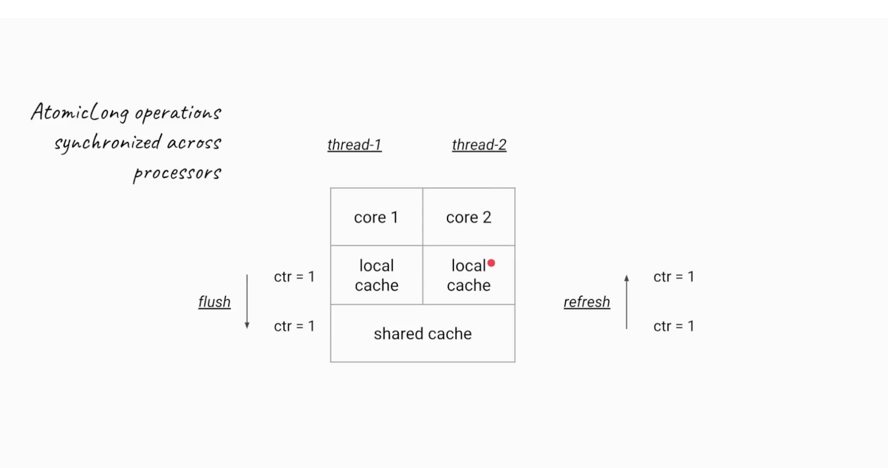
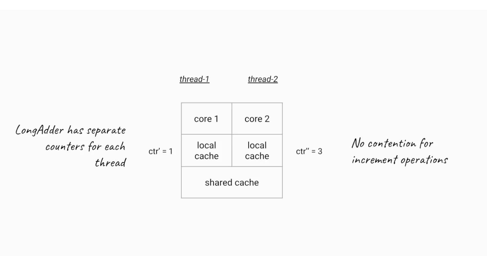
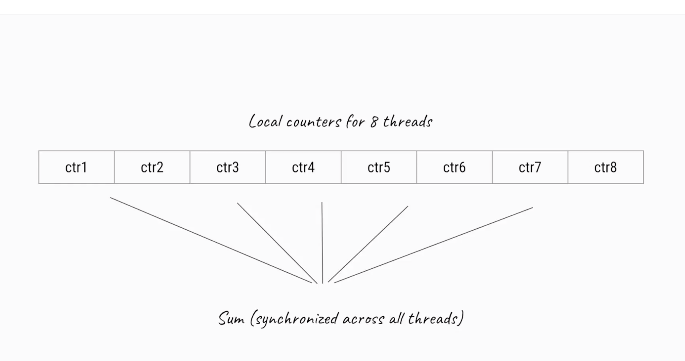

# New classes related to thread in java 8

## Adder & Accumators

Java 8 introduces LongAdder, LongAccumulator, DoubleAdder and DoubleAccumulator, which are recommended instead of the Atomic classes when multiple threads update frequently but read less frequently. It implement the base class, Striped64.

LongAdder and LongAccumators which are recommended instead of the Atomic classes when multiple threads update frequently and less read frequently. During high contention, they were designed in such a way they can grow dynamically.

### How Atomic variables are slow

Atomic variables are copied from threads local memory to shared memory to other threads local memory which makes it slow. This happens because there has to be synchronization. Below is the example



### Adder

There are two classes LongAdder & DoubleAdder.

LongAdder, on the other hand, uses a very clever trick to reduce contention between threads, when these are incrementing it.

When we want to increment an instance of the LongAdder, we need to call the increment() method. That implementation keeps an array of counters that can grow on demand.

And so, when more threads are calling increment(), the array will be longer. Each record in the array can be updated separately – reducing the contention. Due to that fact, the LongAdder is a very efficient way to increment a counter from multiple threads.

```java
public class Task implements Runnable {
    private LongAdder longAdder;

    public Task(LongAdder longAdder) {
        this.longAdder = longAdder;
    }

    @Override
    public void run() {
        longAdder.increment();
    }
}

public class LongAdderClass {

    public static void main(String[] args) throws InterruptedException {
        LongAdder longAdder = new LongAdder();

        ExecutorService executorService = Executors.newFixedThreadPool(10);
        for (int i = 0; i < 20; i++) {
            executorService.submit(new Task(longAdder));
        }

        executorService.shutdown();
        executorService.awaitTermination(1, TimeUnit.DAYS);

        System.out.println(longAdder.sum());

    }
}
```



This class extends Number, but does not define methods such as equals, hashCode and compareTo because instances are expected to be mutated, and so are not useful as collection keys.



> So LongAdder is not always a replacement for AtomicLong. We need to consider the following aspects:

* When no contention is present AtomicLong performs better.
* LongAdder will allocate Cells (a final class declared in abstract class Striped64) to avoid contention which consumes memory. So in case we have a tight memory budget we should prefer AtomicLong.

### Accumulator

Two classes new in Java 8 deserve some attention: LongAccumulator andDoubleAccumulator. They are designed to accumulate (more on what does that mean later) values across threads safely while being extremely fast. 

Accumulator is also similar to Adder classes. We can have do binary oberations and result can be then accumated at the end of processing.

So the accumulator takes a binary operator and combines initial value with every accumulated value.


