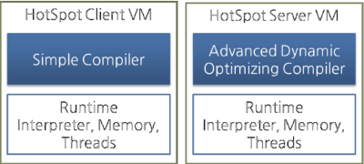

# Execution Engine

The bytecode that is assigned to the runtime data areas in the JVM via class loader is executed by the execution engine. The execution engine reads the Java Bytecode in the unit of instruction. It is like a CPU executing the machine command one by one. Each command of the bytecode consists of a 1-byte OpCode and additional Operand. The execution engine gets one OpCode and execute task with the Operand, and then executes the next OpCode.

But the Java Bytecode is written in a language that a human can understand, rather than in the language that the machine directly executes. Therefore, the execution engine must change the bytecode to the language that can be executed by the machine in the JVM. The bytecode can be changed to the suitable language in one of two ways.

* Interpreter: Reads, interprets and executes the bytecode instructions one by one. As it interprets and executes instructions one by one, it can quickly interpret one bytecode, but slowly executes the interpreted result. This is the disadvantage of the interpret language. The 'language' called Bytecode basically runs like an interpreter.
* JIT (Just-In-Time) compiler: The JIT compiler has been introduced to compensate for the disadvantages of the interpreter. The execution engine runs as an interpreter first, and at the appropriate time, the JIT compiler compiles the entire bytecode to change it to native code. After that, the execution engine no longer interprets the method, but directly executes using native code. Execution in native code is much faster than interpreting instructions one by one. The compiled code can be executed quickly since the native code is stored in the cache. 

However, it takes more time for JIT compiler to compile the code than for the interpreter to interpret the code one by one. Therefore, if the code is to be executed just once, it is better to interpret it instead of compiling. Therefore, the JVMs that use the JIT compiler internally check how frequently the method is executed and compile the method only when the frequency is higher than a certain level.

How the execution engine runs is not defined in the JVM specifications. Therefore, JVM vendors improve their execution engines using various techniques, and introduce various types of JIT compilers. 

Most JIT compilers run as shown in the figure below: 

The JIT compiler converts the bytecode to an intermediate-level expression, IR (Intermediate Representation), to execute optimization, and then converts the expression to native code.

Oracle Hotspot VM uses a JIT compiler called Hotspot Compiler. It is called Hotspot because Hotspot Compiler searches the 'Hotspot' that requires compiling with the highest priority through profiling, and then it compiles the hotspot to native code. If the method that has the bytecode compiled is no longer frequently invoked, in other words, if the method is not the hotspot any more, the Hotspot VM removes the native code from the cache and runs in interpreter mode. The Hotspot VM is divided into the Server VM and the Client VM, and the two VMs use different JIT compilers.

The client VM and the server VM use an identical runtime; however, they use different JIT compilers, as shown in the above figure. The client VM and the server VM use an identical runtime, however, they use different JIT compilers as shown in the above figure. Advanced Dynamic Optimizing Compiler used by the server VM uses more complex and diverse performance optimization techniques.

IBM JVM has introduced AOT (Ahead-Of-Time) Compiler from IBM JDK 6 as well as the JIT compiler. This means that many JVMs share the native code compiled through the shared cache. In short, the code that has been already compiled through the AOT compiler can be used by another JVM without compiling. In addition, IBM JVM provides a fast way of execution by pre-compiling code to JXE (Java EXecutable) file format using the AOT compiler.

