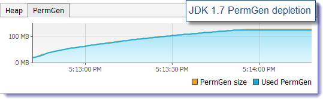
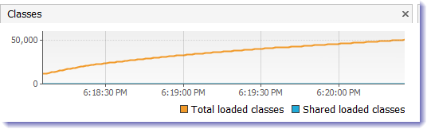
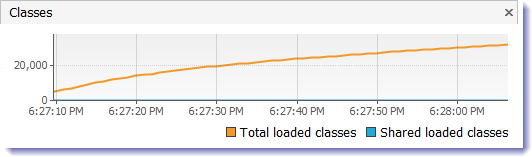

# Metaspace: A new memory space is born
The JDK 8 HotSpot JVM is now using native memory for the representation of class metadata and is called Metaspace; similar to the Oracle JRockit and IBM JVM's.

The good news is that it means no more java.lang.OutOfMemoryError: PermGen space problems and no need for you to tune and monitor this memory space anymore…not so fast. While this change is invisible by default, we will show you next that you will still need to worry about the class metadata memory footprint. Please also keep in mind that this new feature does not magically eliminate class and classloader memory leaks. You will need to track down these problems using a different approach and by learning the new naming convention.

* PermGen space situation
    * This memory space is completely removed.
    * The PermSize and MaxPermSize JVM arguments are ignored and a warning is issued if present at start-up.

* Metaspace memory allocation model
    * Most allocations for the class metadata are now allocated out of native memory.
    * The klasses that were used to describe class metadata have been removed.

* Metaspace capacity
    * By default class metadata allocation is limited by the amount of available native memory (capacity will of course depend if you use a 32-bit JVM vs. 64-bit along with OS virtual memory availability).
    * A new flag is available (MaxMetaspaceSize), allowing you to limit the amount of native memory used for class metadata. If you don’t specify this flag, the Metaspace will dynamically re-size depending of the application demand at runtime.

* Metaspace garbage collection
    * Garbage collection of the dead classes and classloaders is triggered once the class metadata usage reaches the “MaxMetaspaceSize”.
    * Proper monitoring & tuning of the Metaspace will obviously be required in order to limit the frequency or delay of such garbage collections. Excessive Metaspace garbage collections may be a symptom of classes, classloaders memory leak or inadequate sizing for your application.

* Java heap space impact
    * Some miscellaneous data has been moved to the Java heap space. This means you may observe an increase of the Java heap space following a future JDK 8 upgrade.

* Metaspace monitoring
    * Metaspace usage is available from the HotSpot 1.8 verbose GC log output.
    * Jstat & JVisualVM have not been updated at this point based on our testing with b75 and the old PermGen space references are still present.

In order to better understand the runtime behavior of the new Metaspace memory space, we created a class metadata leaking Java program

 * The following scenarios will be tested:
    * Run the Java program using JDK 1.7 in order to monitor & deplete the PermGen memory space set at 128 MB.
    * Run the Java program using JDK 1.8 (b75) in order to monitor the dynamic increase and garbage collection of the new Metaspace memory space.
    * Run the Java program using JDK 1.8 (b75) in order to simulate the depletion of the Metaspace by setting the MaxMetaspaceSize value at 128 MB.

* JDK 1.7 @64-bit – PermGen depletion
    * Java program with 50K configured iterations
    * Java heap space of 1024 MB
    * Java PermGen space of 128 MB (-XX:MaxPermSize=128m)

* JDK 1.8 @64-bit – Metaspace dynamic re-size
    * Java program with 50K configured iterations
    * Java heap space of 1024 MB
    * Java Metaspace space: unbounded (default)

* JDK 1.8 @64-bit – Metaspace depletion
    * Java program with 50K configured iterations
    * Java heap space of 1024 MB
    * Java Metaspace space: 128 MB (-XX:MaxMetaspaceSize=128m)

Ref: https://dzone.com/articles/java-8-permgen-metaspace