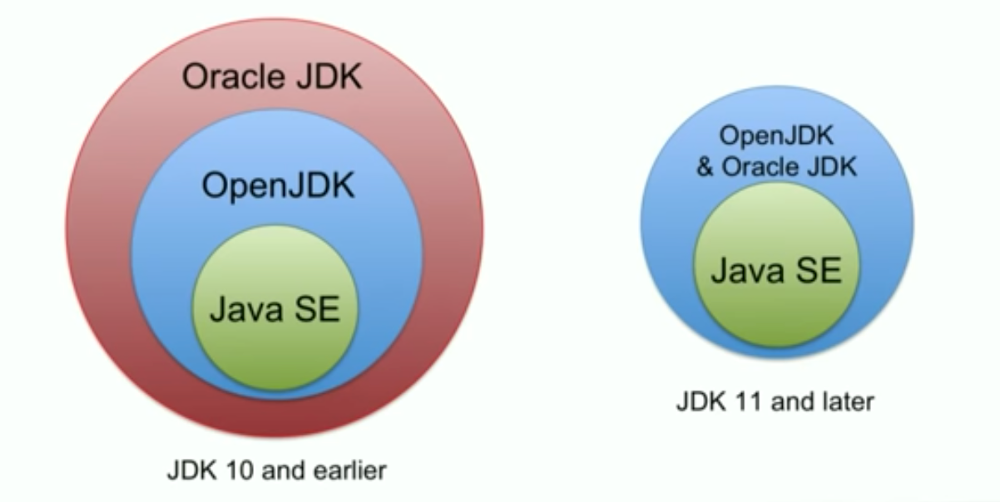

# Java Versions and New Additions

## New in Java 12

* A low pause time garbage collector called Shenandoah.
* Java switch expressions (preview - may be removed from Java again).
* JVM Constants API.
* Abortable mixed collections in G1 (garbage collections).
* Promptly return unused committed memory from G1.

## New in Java 11

* Removed Java EE and Corba modules from JDK.
* HTTP Client made standard (the one added in Java 9).
* Java var keyword allowed as lambda expression parameter type.
* Key agreement via elliptic curve cryptography.
* Unicode 10.
* New cryptographic algorithms.
* Launch single file source code programs (compiled when executed).
* TLS 1.3 support.
* Deprecate the Nashorn JavaScript engine

## New in Java 10

* Local-Variable Type Inference
* Parallel Full Garbage Collection for G1 (a Garbage Collector)
* Graal included as experimental JIT compiler
* Several internal, JVM and platform level changes

## New in Java 9

* Java Modules
* Java Reflection Module class
* Java Try With Resources Enhancement
* Java Compact Strings
* Java Microbenchmark Harness (JMH) included in the JDK

## New in Java 8

* Java Lambda Expressions
* Java Streams (functional streams)
* JavaFX (bundled with Java SE from Java 8).
* The Nashorn JavaScript engine.

## New in Java 7

* Try with resources
* Catching Multiple Exceptions
* Java Fork and Join via ForkJoinPool
* Strings in Java switch statements.
* New file system API in Java NIO 2.0
* Type inference in generic declarations (the socalled "diamond" operator).
* Numeric literals with underscores as visual separators (e.g. 1_000_000).
* Binary numeric literals (e.g. 0b10100101).
* Support for dynamically typed languages in the Java Virtual Machine (JVM).