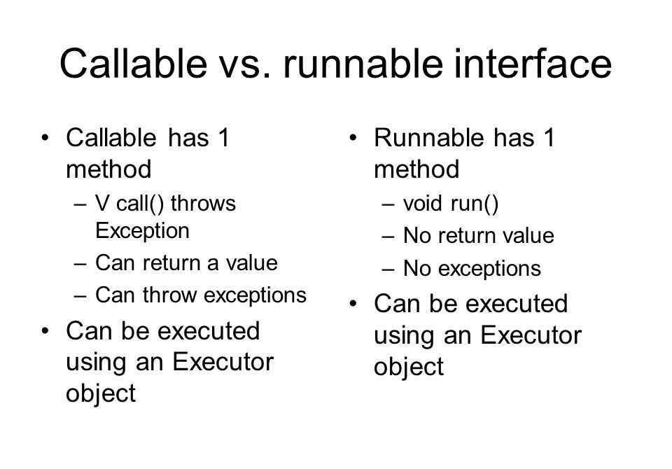

# Java Multithreading & Concurrency

## What is the difference between a process and a thread?
Both processes and threads are units of concurrency, but they have a fundamental difference: processes do not share a common memory, while threads do.

From the operating system’s point of view, a process is an independent piece of software that runs in its own virtual memory space. Any multitasking operating system (which means almost any modern operating system) has to separate processes in memory so that one failing process wouldn’t drag all other processes down by scrambling common memory.

The processes are thus usually isolated, and they cooperate by the means of inter-process communication which is defined by the operating system as a kind of intermediate API.

On the contrary, a thread is a part of an application that shares a common memory with other threads of the same application. Using common memory allows to shave off lots of overhead, design the threads to cooperate and exchange data between them much faster.

## How can you create a Thread instance and run it?
To create an instance of a thread, you have two options. First, pass a Runnable instance to its constructor and call start(). Runnable is a functional interface, so it can be passed as a lambda expression:

```java
Thread thread1 = new Thread(() ->
  System.out.println("Hello World from Runnable!"));
thread1.start();
```

Thread also implements Runnable, so another way of starting a thread is to create an anonymous subclass, override its run() method, and then call start():

```
Thread thread2 = new Thread() {
    @Override
    public void run() {
        System.out.println("Hello World from subclass!");
    }
};
thread2.start();
```

## Describe the different states of a Thread and when do the state transitions occur.
The state of a Thread can be checked using the Thread.getState() method. Different states of a Thread are described in the Thread.State enum. They are:

* NEW — a new Thread instance that was not yet started via Thread.start()
* RUNNABLE — a running thread. It is called runnable because at any given time it could be either running or waiting for the next quantum of time from the thread scheduler. A NEW thread enters the RUNNABLE state when you call Thread.start() on it
* BLOCKED — a running thread becomes blocked if it needs to enter a synchronized section but cannot do that due to another thread holding the monitor of this section
* WAITING — a thread enters this state if it waits for another thread to perform a particular action. For instance, a thread enters this state upon calling the Object.wait() method on a monitor it holds, or the Thread.join() method on another thread
* TIMED_WAITING — same as the above, but a thread enters this state after calling timed versions of Thread.sleep(), Object.wait(), Thread.join() and some other methods
* TERMINATED — a thread has completed the execution of its Runnable.run() method and terminated


### Code samples for different Thread States
> NEW - Thread is not yet started. It's only created with New keyword.
```java
Runnable runnable = () -> {
    System.out.println("Hello");
};

Thread t1 = new Thread(runnable);

// Thread is created and is in state NEW (It is not yet started or running)
System.out.println("Thread State : " + t1.getState());
t1.start(); // Now the thread is started and in different state.
```
> RUNNABLE - Thread is started or running. This is the state after *.start()* method is called on Thread class.
```java
Runnable runnable = () -> {

    System.out.println("Hello World!");
};

Thread t1 = new Thread(runnable);

System.out.println("Thread State : " + t1.getState()); //Thread is in NEW state.
t1.start();
System.out.println("Thread State : " + t1.getState()); // Thread is in RUNNABLE state.
```
> TIMED_WAITING - Goes into this state when timed versions of Thread.sleep(), Object.wait(), Thread.join() is called
```java
Runnable runnable = () -> {
    try {
        Thread.sleep(2000); // Timed versions of Thread.sleep()
    } catch (InterruptedException e) {
        e.printStackTrace();
    }
    System.out.println("Hello");
};

// Thread will in TIMED_WAITING state until the Thread.sleep() period mentioned in Runnable block is over

Thread t1 = new Thread(runnable);
System.out.println("Thread State : " + t1.getState()); // NEW State
t1.start();
System.out.println("Thread State : " + t1.getState()); // RUNNABLE State
while (t1.isAlive()) {
    Thread.sleep(500);
    System.out.println("Thread State : " + t1.getState()); // TIMED_WAITING state
}
```
> WAITING - A thread enters this state if it waits for another thread to perform a particular action
```java
Object monitor = new Object();

Runnable runnable = () -> {
    synchronized (monitor) {
        System.out.println("Runnable() Start");
        try {
            // wait(), notify(), notifyAll() always must be in synchronized block
            monitor.wait();
        } catch (InterruptedException e) {
            e.printStackTrace();
        }
        System.out.println("Runnable() End");
    }
};

Thread t1 = new Thread(runnable);
System.out.println("Thread State : " + t1.getState());  // NEW State
t1.start();
System.out.println("Thread State : " + t1.getState());  // RUNNABLE State
while (t1.isAlive()) {
    Thread.sleep(500);
    System.out.println("Thread State : " + t1.getState()); // WAITING state

    synchronized (monitor) {
        // wait(), notify(), notifyAll() always must be in synchronized block
        monitor.notify(); // This block will be in different thread in real scenario.
    }
}
```
> BLOCKED - One thread is holding the monitor required by another thread (Also example of DeadLock)
```java
public class ThreadDeadLock {

    public static void main(String[] args) throws InterruptedException {
        Object obj1 = new Object();
        Object obj2 = new Object();

        // synchronized on object 1 & Object 2
        Thread thread1 = new Thread(new SynchronizeThread(obj1, obj2), "Thread 1");

        // synchronized on object 2 & Object 1
        Thread thread2 = new Thread(new SynchronizeThread(obj2, obj1), "Thread 2");

        thread1.start();
        Thread.sleep(3000);
        thread2.start();
        Thread.sleep(3000);

        while (true) {
            // One of the thread will go in BLOCKED state as the object2 needed by thread 2 is already locked by thread 1.
            System.out.println("Thread 1 State : " + thread1.getState());
            System.out.println("Thread 2 State : " + thread2.getState());
        }
    }
}

class SynchronizeThread implements Runnable {
    private Object obj1;
    private Object obj2;

    public SynchronizeThread(Object obj1, Object obj2) {
        this.obj1 = obj1;
        this.obj2 = obj2;
    }

    @Override
    public void run() {
        String name = Thread.currentThread().getName();
        synchronized (obj1) {
            System.out.println(name + " acquired lock on Object1: " + obj1);
            try {
                Thread.sleep(5000);
            } catch (InterruptedException e) {
                e.printStackTrace();
            }

            synchronized (obj2) {
                System.out.println(name + " acquired lock on Object2: " + obj2);
            }
            System.out.println(name + " released lock on Object2: " + obj2);
        }
        System.out.println(name + " released lock on Object1: " + obj1);
        System.out.println(name + " Finished Crunchify Deadlock Test.");
    }
}
```

## Why Enclose wait() in a while Loop?
Since notify() and notifyAll() randomly wakes up threads that are waiting on this object’s monitor, it’s not always important that the condition is met. Sometimes it can happen that the thread is woken up, but the condition isn’t actually satisfied yet.

We can also define a check to save us from spurious wakeups – where a thread can wake up from waiting without ever having received a notification.

A thread can also wake up without being notified, interrupted, or timing out, a so-called spurious wakeup. While this will rarely occur in practice, applications must guard against it by testing for the condition that should have caused the thread to be awakened, and continuing to wait if the condition is not satisfied. In other words, waits should always occur in loops, like this one:

```
synchronized (obj) {
     while (<condition does not hold>)
         obj.wait(timeout);
     ... // Perform action appropriate to condition
 }
```
Ref:
https://wiki.sei.cmu.edu/confluence/display/java/THI03-J.+Always+invoke+wait%28%29+and+await%28%29+methods+inside+a+loop

## What is ThreadGroup and what is it's use.
ThreadGroup is a convenient class that groups some related threads as a single unit and allows you to perform some operations on a group as a whole, rather than with each separate thread.

We need to specify the name of the group upon creation like this:
```java
ThreadGroup groupA = new ThreadGroup("Group A");
ThreadGroup groupB = new ThreadGroup("Group B");
```
For example, suppose Task is a thread, you can create 4 threads and group them in one group like this:
```java
ThreadGroup group = new ThreadGroup("GroupA");
 
new Task(group, "A").start();
new Task(group, "B").start();
new Task(group, "C").start();
new Task(group, "D").start();
```

Using ThreadGroup can be a useful diagnostic technique in big application servers with thousands of threads. If your threads are logically grouped together, then when you get a stack trace you can see which group the offending thread was part of (e.g. "Tomcat threads", "MDB threads", "thread pool X", etc), which can be a big help in tracking down and fixing the problem.

## What is the difference between the Runnable and Callable interfaces? How are they used?
The Runnable interface has a single run method. It represents a unit of computation that has to be run in a separate thread. The Runnable interface does not allow this method to return value or to throw unchecked exceptions.
```java
public class RunnableTask implements Runnable {

    @Override
    public void run() {
        System.out.println("Task done");
    }
}

public class RunnableTaskExecute {

    public static void main(String[] args) {
        Thread runnable = new Thread(new RunnableTask());
        runnable.start();
    }
}
```

The Callable interface has a single call method and represents a task that has a value. That’s why the call method returns a value. It can also throw exceptions. Callable is generally used in ExecutorService instances to start an asynchronous task and then call the returned Future instance to get its value.

```java
import java.util.concurrent.Callable;

public class CallableTask implements Callable<String> {

    @Override
    public String call() {
        return "Task done";
    }
}
```

```java
import java.util.concurrent.ExecutionException;
import java.util.concurrent.ExecutorService;
import java.util.concurrent.Executors;
import java.util.concurrent.Future;

public class CallableTaskExecution {

    public static void main(String[] args) throws ExecutionException, InterruptedException {
        ExecutorService executer = Executors.newSingleThreadExecutor();
        Future<String> holder = executer.submit(new CallableTask());
        String result = holder.get();
        System.out.println(result);
    }
}s
```


## What is a daemon thread, what are its use cases? How can you create a daemon thread?
A daemon thread is a thread that does not prevent JVM from exiting. When all non-daemon threads are terminated, the JVM simply abandons all remaining daemon threads. Daemon threads are usually used to carry out some supportive or service tasks for other threads, but you should take into account that they may be abandoned at any time.

To start a thread as a daemon, you should use the setDaemon() method before calling start():

```java
Runnable runnable = () -> {
    try {
        Thread.sleep(100);
    } catch (InterruptedException e) {
        e.printStackTrace();
    }
    System.out.println("May or May Not Print this Message");
};

Thread t1 = new Thread(runnable);
t1.setDaemon(true);
t1.start();
```
Curiously, if you run this as a part of the main() method, the message might not get printed. This could happen if the main() thread would terminate before the daemon would get to the point of printing the message. You generally should not do any I/O in daemon threads, as they won’t even be able to execute their finally blocks and close the resources if abandoned.

## What is the Thread’s interrupt flag? How can you set and check it? How does it relate to the InterruptedException?
The interrupt flag, or interrupt status, is an internal Thread flag that is set when the thread is interrupted. To set it, simply call thread.interrupt() on the thread object.

If a thread is currently inside one of the methods that throw InterruptedException (wait, join, sleep etc.), then this method immediately throws InterruptedException. The thread is free to process this exception according to its own logic.

If a thread is not inside such method and thread.interrupt() is called, nothing special happens. It is thread’s responsibility to periodically check the interrupt status using static Thread.interrupted() or instance isInterrupted() method. The difference between these methods is that the static Thread.interrupt() clears the interrupt flag, while isInterrupted() does not.

```java
Runnable runnable1 = () -> {
    try {
        Thread.sleep(2000);
    } catch (InterruptedException e) {
        System.out.println("Error - Thread In Interrupted");
    }

    System.out.println("Thread will continue execution...");
};

Runnable runnable2 = () -> {
    for(int i=0;i<5;i++)
    {
        System.out.println(i);

        // Checking interrupt status and also clears the interrupted stats flag so next time it
        // will return false unless thread is again interrupted
        if (Thread.interrupted()) {
            System.out.println("Thread was interrupted");
        }

    }
};

Thread t1 = new Thread(runnable1);
t1.start();
t1.interrupt();

t1 = new Thread(runnable2);
t1.start();
t1.interrupt();
```

## What are Executor and ExecutorService? What are the differences between these interfaces?
Executor and ExecutorService are two related interfaces of java.util.concurrent framework. Executor is a very simple interface with a single execute method accepting Runnable instances for execution. In most cases, this is the interface that your task-executing code should depend on.

ExecutorService extends the Executor interface with multiple methods for handling and checking the lifecycle of a concurrent task execution service (termination of tasks in case of shutdown) and methods for more complex asynchronous task handling including Futures.


## What is a volatile field and what guarantees does the JMM hold for such field?
A volatile field has special properties according to the Java Memory Model (see Q9). The reads and writes of a volatile variable are synchronization actions, meaning that they have a total ordering (all threads will observe a consistent order of these actions). A read of a volatile variable is guaranteed to observe the last write to this variable, according to this order.

If you have a field that is accessed from multiple threads, with at least one thread writing to it, then you should consider making it volatile, or else there is a little guarantee to what a certain thread would read from this field.

Another guarantee for volatile is atomicity of writing and reading 64-bit values (long and double). Without a volatile modifier, a read of such field could observe a value partly written by another thread.

## Which of the following operations are atomic?
> Atomic means that the update operations done on that type are ensured to be done atomically (in one step, in one goal).

* writing to a non-volatile int;
* writing to a volatile int;
* writing to a non-volatile long;
* writing to a volatile long;
* incrementing a volatile long?

A write to an int (32-bit) variable is guaranteed to be atomic, whether it is volatile or not. A long (64-bit) variable could be written in two separate steps, for example, on 32-bit architectures, so by default, there is no atomicity guarantee. However, if you specify the volatile modifier, a long variable is guaranteed to be accessed atomically.

The increment operation is usually done in multiple steps (retrieving a value, changing it and writing back), so it is never guaranteed to be atomic, wether the variable is volatile or not. If you need to implement atomic increment of a value, you should use classes AtomicInteger, AtomicLong etc.

## What is the meaning of a synchronized keyword in the definition of a method? Of a static method? Before a block?
The synchronized keyword before a block means that any thread entering this block has to acquire the monitor (the object in brackets). If the monitor is already acquired by another thread, the former thread will enter the BLOCKED state and wait until the monitor is released.

```java
synchronized(object) {
    // ...
}
```

A synchronized instance method has the same semantics, but the instance itself acts as a monitor.
```java
synchronized void instanceMethod() {
    // ...
}
```

For a static synchronized method, the monitor is the Class object representing the declaring class.
```java
static synchronized void staticMethod() {
    // ...
}
```

## If two threads call a synchronized method on different object instances simultaneously, could one of these threads block? What if the method is static?
If the method is an instance method, then the instance acts as a monitor for the method. Two threads calling the method on different instances acquire different monitors, so none of them gets blocked.

If the method is static, then the monitor is the Class object. For both threads, the monitor is the same, so one of them will probably block and wait for another to exit the synchronized method.

## What is the purpose of the wait, notify and notifyAll methods of the Object class?
A thread that owns the object’s monitor (for instance, a thread that has entered a synchronized section guarded by the object) may call object.wait() to temporarily release the monitor and give other threads a chance to acquire the monitor. This may be done, for instance, to wait for a certain condition.

When another thread that acquired the monitor fulfills the condition, it may call object.notify() or object.notifyAll() and release the monitor. The notify method awakes a single thread in the waiting state, and the notifyAll method awakes all threads that wait for this monitor, and they all compete for re-acquiring the lock.

The following BlockingQueue implementation shows how multiple threads work together via the wait-notify pattern. If we put an element into an empty queue, all threads that were waiting in the take method wake up and try to receive the value. If we put an element into a full queue, the put method waits for the call to the get method. The get method removes an element and notifies the threads waiting in the put method that the queue has an empty place for a new item.

```java
public class BlockingQueue<T> {
 
    private List<T> queue = new LinkedList<T>();
 
    private int limit = 10;
 
    public synchronized void put(T item) {
        while (queue.size() == limit) {
            try {
                wait();
            } catch (InterruptedException e) {}
        }
        if (queue.isEmpty()) {
            notifyAll();
        }
        queue.add(item);
    }
 
    public synchronized T take() throws InterruptedException {
        while (queue.isEmpty()) {
            try {
                wait();
            } catch (InterruptedException e) {}
        }
        if (queue.size() == limit) {
            notifyAll();
        }
        return queue.remove(0);
    }
     
}ac
```

## Describe the conditions of deadlock, livelock, and starvation. Describe the possible causes of these conditions.

**Livelock** is a case of multiple threads reacting to conditions, or events, generated by themselves. An event occurs in one thread and has to be processed by another thread. During this processing, a new event occurs which has to be processed in the first thread, and so on. Such threads are alive and not blocked, but still, do not make any progress because they overwhelm each other with useless work.

**Starvation** is a case of a thread unable to acquire resource because other thread (or threads) occupy it for too long or have higher priority. A thread cannot make progress and thus is unable to fulfill useful work.

## Describe the purpose and use-cases of the fork/join framework.
The fork/join framework allows parallelizing recursive algorithms. The main problem with parallelizing recursion using something like ThreadPoolExecutor is that you may quickly run out of threads because each recursive step would require its own thread, while the threads up the stack would be idle and waiting.

The fork/join framework entry point is the ForkJoinPool class which is an implementation of ExecutorService. It implements the work-stealing algorithm, where idle threads try to “steal” work from busy threads. This allows to spread the calculations between different threads and make progress while using fewer threads than it would require with a usual thread pool.