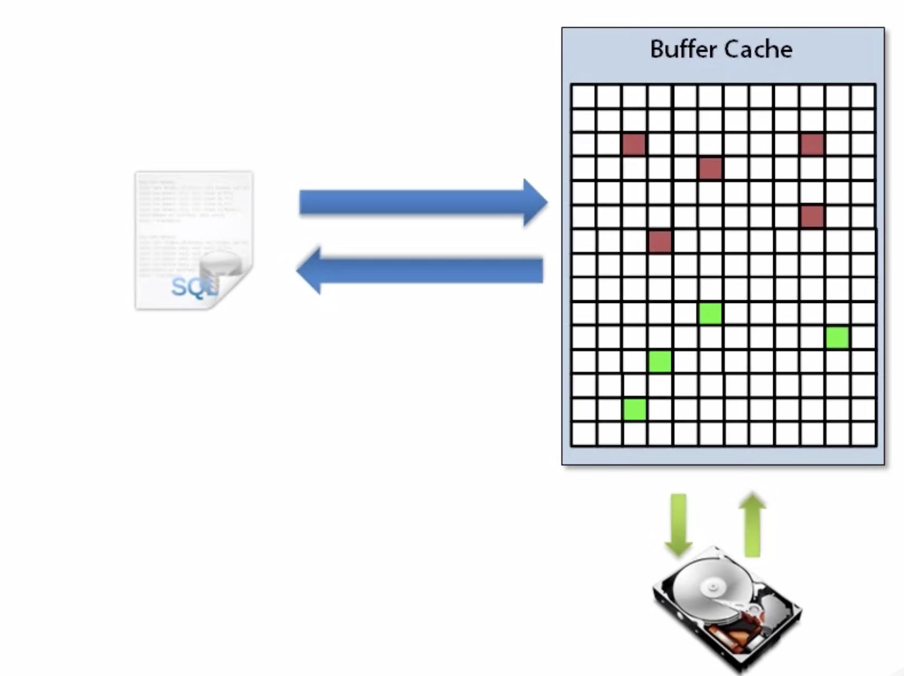

# Oracle Architecture

## System Global Area (SGA)

The System Global Area (SGA) is a group of shared memory areas that are dedicated to an Oracle ?instance? (an instance is your database programs and RAM).

All Oracle processes use the SGA to hold information. The SGA is used to store incoming data (the data buffers as defined by the db_cache_size parameter), and internal control information that is needed by the database. You control the amount of memory to be allocated to the SGA by setting some of the Oracle ?initialization parameters?.  These might include db_cache_size, shared_pool_size and log_buffer.

### Buffer Cache

Oracle 12c’s database buffer cache is typically the largest portion of the SGA. It has data that comes from the files on disk. Because accessing data from disk is slower than from memory, the database buffer cache’s sole purpose is to cache the data in memory for quicker access.

The Buffer Cache (also called the database buffer cache) is where Oracle stores data blocks.  With a few exceptions, any data coming in or going out of the database will pass through the buffer cache.

The database buffer cache can contain data from all types of objects:

* Tables
* Indexes
* Materialized views
* System data

The buffer cache controls what blocks get to stay depending on available space and the block state (similar to how the shared pool decides what SQL gets to stay). The buffer cache uses its own version of the LRU algorithm.

### Shared Pool

An important purpose of the shared pool is to cache the executable versions of SQL and PL/SQL statements. This allows multiple executions of the same SQL or PL/SQL code to be performed without the resources required for a hard parse, which results in significant reductions in CPU, memory, and latch usage.

The shared pool is primarily a repository for shared SQL and PL/SQL so that users can share the statements thus reducing the need to parse a similar statement. 

## Program Global Area

The PGA memory is a memory allocated for each session.

The Program Global Area (PGA) is a private memory region that contains the data and control information for a server process. Only a server process can access the PGA. Oracle Database reads and writes information in the PGA on behalf of the server process.

The second section of memory is the PGA or Program Global Area. The PGA is memory that is dedicated to each individual session or current login in Oracle. When you hear PGA, think of data that is private to a log in session. Because each segment of memory in the PGA is dedicated to a particular login session. Of these two, the amount of memory devoted to the SGA is typically much larger. To give you an idea of the size of an SGA. Oftentimes, the SGA will use 80% or more of the amount of physical memory on the Oracle database server. So if your Oracle server has 96 gigabytes of RAM, you may very well have an SGA slice of 75 or 80 gigabytes.

A private SQL area contains data such as bind information and runtime memory structures. Each session that issues a SQL statement has a private SQL area. Session memory is the memory allocated to hold a session's variables (logon information) and other information related to the session. For a shared server, the session memory is shared and not private.

