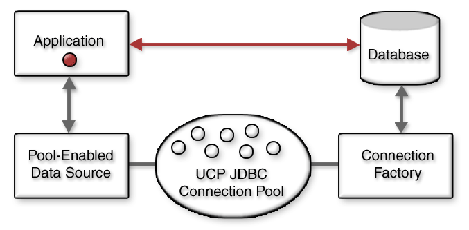

# Oracle Basics

## Connections and Connection Pools

A connection pool is a cache of database connection objects. The objects represent physical database connections that can be used by an application to connect to a database. At run time, the application requests a connection from the pool. If the pool contains a connection that can satisfy the request, it returns the connection to the application. If no connections are found, a new connection is created and returned to the application. The application uses the connection to perform some work on the database and then returns the object back to the pool. The connection is then available for the next connection request.

Connection pools promote the reuse of connection objects and reduce the number of times that connection objects are created. Connection pools significantly improve performance for database-intensive applications because creating connection objects is costly both in terms of time and resources. Tasks such as network communication, reading connection strings, authentication, transaction enlistment, and memory allocation all contribute to the amount of time and resources it takes to create a connection object. In addition, because the connections are already created, the application waits less time to get the connection.

Connection pools often provide properties that are used to optimize a pool's performance. The properties control behaviors such as the minimum and maximum number of connections allowed in the pool or the amount of time a connection can remain idle before it is returned to the pool. The best configured connection pools balance quick response times with the memory spent maintaining connections in the pool. It is often necessary to try different settings until the best balance is achieved for a specific application.

### Benefits of Using Connection Pools

Applications that are database-intensive generally benefit the most from connection pools. As a policy, applications should use a connection pool whenever database usage is known to affect application performance.

Connection pools provide the following benefits:

* Reduces the number of times new connection objects are created.
* Promotes connection object reuse.
* Quickens the process of getting a connection.
* Reduces the amount of effort required to manually manage connection objects.
* Minimizes the number of stale connections.
* Controls the amount of resources spent on maintaining connections.
  


## Problem you might face if connection pool is not used properly

If there are less connections and application needs more connection then we might have to create more connections on demand. On the other had if we have too many connections it will consume more memory on PGA which might lead to reduce the servers overall performace.

If connection pool reaches it's MAX size then the incoming request has to wait till the connection becomes free. It is good practice to use the MAX time out on the database call so that it dosen't wait infinitly for the connection.

## SQL bind variables

A bind variable consists of a variable indicated by a placeholder character such as a question mark (?), :name, or @name. The placeholder character depends on the SQL database server that you use. You provide the actual value of the placeholder at runtime, just before the SQL statement is executed.

### How bind variables improve application performance

1. Parsing the SQL statement: Verifies the SQL statement syntax and access rights and builds the best (optimized) execution plan for the SQL statement. Placeholder variables are not known at this point.
2. Binding variables: Where the API provides the actual values for placeholders.
3. Execution: Done with the selected execution plan and actual value of the placeholder variables.

Each time an SQL statement is sent to a database, an exact text match is performed to see if the statement is already present in the shared pool. If no matching statement is found, the database performs a hard parse of that statement. If a matching statement is found, then the database initiates a soft parse.

In a **hard parse**, the SQL statement needs to be parsed, checked for syntax errors, checked for correctness of table names and column names, and optimized to find the best execution plan.
In a **soft parse**, the SQL statement already exists in a shared pool, so very little processing is required for access rights and session verification.

Using bind variables enables soft parsing, which means that less processing time is spent on choosing an optimized execution plan. Information about how to process the SQL statement has been saved, along with the SQL statement itself, in a shared pool.

### Comparing SQL statements

There are distinct performance advantages to using bind variables. For one, holding many similar but unique SQL statements in a shared pool is a waste of memory; writing one statement with interchangeable variables is more efficient. It is also time-consuming to parse SQL statements. Reducing the number of hard parses minimizes CPU usage.

Literals

```sql
SQL> SELECT * FROM dual WHERE dummy = 'dummy_literal1';
no rows selected
 
SQL> SELECT * FROM dual WHERE dummy = 'dummy_literal2';
no rows selected
```

shows the queries in a shared pool using below query:

```sql
SQL> SELECT sql_text,
  2         executions
  3  FROM   v$sql
  4  WHERE  INSTR(sql_text, 'SELECT * FROM dual WHERE dummy') > 0
  5  AND    INSTR(sql_text, 'sql_text') = 0
  6  ORDER BY sql_text;
```

```sql
SQL_TEXT                                                     EXECUTIONS
------------------------------------------------------------ ----------
SELECT * FROM dual WHERE dummy = 'dummy_literal1'                1
SELECT * FROM dual WHERE dummy = 'dummy_literal2'                1
2 rows selected.
```

## SQL parsing and performance

CPU usage varies based on the type of SQL parsing required. Literals and substitution variables require hard parsing, which consumes more CPU cycles than the soft parsing required for bind variables.

### SQL injection attacks

In the first type of attack, a hacker puts text that includes escape characters and embedded SQL statements into a web application form field or query attribute. If the web application doesn't filter out the escape characters, the text, with the malicious SQL statements, is passed into the database for execution.

40
```sql
statement := "SELECT * FROM emp WHERE emp_name = '" + empName + "';"
```

If empName is set from a web application's form field, the attacker could enter the following in the empName field:

```sql
' or '1'='1
```

injection attacks can be prevented by using bind variables.

Ref: <https://www.ibm.com/developerworks/library/se-bindvariables/index.html>
