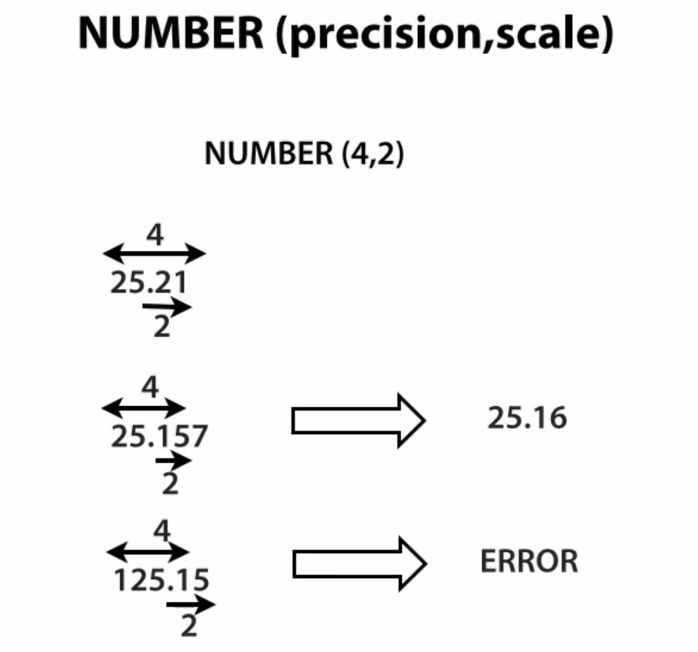
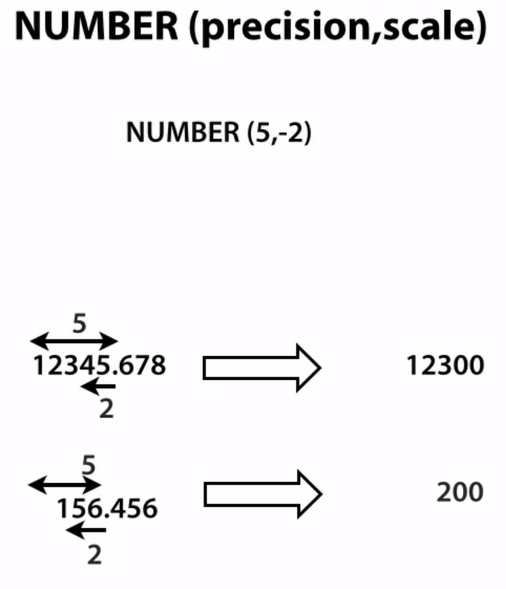

# Oracle Fundamentals

## What is precision and scale?
Precision is the number of significant digits. Oracle guarantees the portability of numbers with precision ranging from 1 to 38.

Scale is the number of digits to the right (positive) or left (negative) of the decimal point. The scale can range from -84 to 127.
```
NUMBER(Precision,Scale)

Precision 5, scale 3 : 54.321

Precision 5, scale 1 : 5432.1

Precision 5, scale 0 : 54321

Precision 5, scale -1: 54320

Precision 5, scale -3: 54000
```


## Negative scale



## % Type
% type is a anchored type. i.e the variable declared as anchored type takes the data type of it's anchored.
Below is the example
```sql
Declare 
    l_num NUMBER (5,2) NOT NULL DEFAULT 2.21;
    l_num_varType l_num%TYPE := 1.123;   -- This inherite the type and not null from l_num with precision and scale (5,2)
    l_num_col_type departments.dept_id%TYPE; -- This will inherite the type of dept_id column of departments table.    
BEGIN
    l_num_varType := 3.15;
END;
```

## Simple Loop
Simple loop starts with 'Loop' keyword and ends with 'End Loop;'. We have to explicitly write the exit condition.
Below are different ways to exit the loop.

Exit with If and Exit
```sql
DECLARE
  x NUMBER := 0;
BEGIN
  LOOP
    DBMS_OUTPUT.PUT_LINE ('Inside loop:  x = ' || TO_CHAR(x));
    x := x + 1;
    IF x > 3 THEN
      EXIT;
    END IF;
  END LOOP;
  -- After EXIT, control resumes here
  DBMS_OUTPUT.PUT_LINE(' After loop:  x = ' || TO_CHAR(x));
END;
```

Exit with EXIT WHEN
```sql
DECLARE
  x NUMBER := 0;
BEGIN
  LOOP
    DBMS_OUTPUT.PUT_LINE ('Inside loop:  x = ' || TO_CHAR(x));
    x := x + 1;
    EXIT WHEN x > 3;
      
  END LOOP;
  -- After EXIT, control resumes here
  DBMS_OUTPUT.PUT_LINE(' After loop:  x = ' || TO_CHAR(x));
END;
```

Return with If and Exit
```sql
DECLARE
  x NUMBER := 0;
BEGIN
  LOOP
    DBMS_OUTPUT.PUT_LINE ('Inside loop:  x = ' || TO_CHAR(x));
    x := x + 1;
    IF x > 3 THEN
      Return;
    END IF;
  END LOOP;
  -- After EXIT, control resumes here
  DBMS_OUTPUT.PUT_LINE(' After loop:  x = ' || TO_CHAR(x));
END;
```

## For Loop
[label] FOR loop_counter IN [REVERSE] lower_bound..upper_bound LOOP
    -- group of statements
END LOOP [label];
- [] is options values
Example:
```sql
DECLARE
    x number := 0;
    count number :=0;
BEGIN
    FOR I IN 0..5 LOOP
        count := count + 1; -- Increment the count by 1
    END LOOP;
END;
```

## Cursors

### Implicit cursors
using queries like 'select .. into ..' are conidered as implicit cursors.

* SQL%FOUND - found some value to put in vaiable
* SQL%ROWCOUNT - prints the number of rows selected.
* SQL%NOTFOUND - Use when you want to check if nothing was updated/deleted.


```sql
declare
    dept_id departments.deptno%type;
    dept_name departments.name%type;
begin
    select dept.deptno, dept.name into dept_id, dept_name 
    from departments dept where dept.deptno = 2;
    
    if SQL%FOUND then
        DBMS_OUTPUT.PUT_LINE(SQL%ROWCOUNT);
    end if;
end;
```

```sql
SET SERVEROUTPUT ON
DECLARE
    L_EMP_ID EMPLOYEES.EMPLOYEE_ID%TYPE;
    L_EMP_SAL EMPLOYEES.SALARY%TYPE;
BEGIN
    DELETE FROM EMPLOYEES WHERE EMPLOYEE_ID = 1;
    
    IF SQL%NOTFOUND THEN
        DBMS_OUTPUT.PUT_LINE('NOT FOUND');
    ELSE
        DBMS_OUTPUT.PUT_LINE('FOUND');
    END IF;
END;
```

#### Limititations
Implicit cursors can be used for select, delete and update where only one row is going to fetch. If more then one row are fetch fetch returning more number of rows and if no rows are fetch then no data found error is raised.

### Explicit cursors
We define explicit cursors in declaration section below is the basic syntax. In case we don't get data with cursor query it does not rasie an error. Oracle also gives us the keyword to handle this kind of situations.
> CURSOR cursor_name IS SELECT_statement;

> OPEN cursor_name

> OPEN cursor_name (number of records to fetch (Optional)>)

> CLOSE cursor_name

Attributes which can be used with cursor
> <CURSOR>%ROWTYPE - The %ROWTYPE attribute provides a record type that represents a row in a database table. The record can store an entire row of data selected from the table or fetched from a cursor or cursor variable. Fields in a record and corresponding columns in a row have the same names and datatypes.

> <CURSOR>%NOTFOUND  - used to check if cursor has any values in it. returns false when nothing is there.

> <CURSOR>%ROWCOUNT - A cursor attribute that can be appended to the name of a cursor or cursor variable. When a cursor is opened, %ROWCOUNT is zeroed. Before the first fetch, cursor_name%ROWCOUNT returns 0. Thereafter, it returns the number of rows fetched so far. The number is incremented if the latest fetch returned a row. (It will not show total number of records in cursor) It can be used to exit the cursor loop by checking how many records are fetched till now.

> <CURSOR>%ISOPEN - A cursor attribute that can be appended to the name of a cursor or cursor variable. If a cursor is open, cursor_name%ISOPEN returns TRUE; otherwise, it returns FALSE.


Simple cursor with only one record
```sql
SET SERVEROUT ON
DECLARE
    L_DEPT_ID DEPARTMENTS.DEPARTMENT_ID%TYPE; -- DEFINE THE TYPE
    L_DEPT_NAME DEPARTMENTS.DEPARTMENT_NAME%TYPE; -- DEFINE THE TYPE
    
    CURSOR CUR_DEPT IS SELECT DEPARTMENT_ID,DEPARTMENT_NAME FROM DEPARTMENTS WHERE DEPARTMENT_ID=10; -- DEFINE CURSOR WITH ONLY ONE RECORD
BEGIN
    OPEN CUR_DEPT; -- OPEN CURSOR
    
    FETCH CUR_DEPT INTO L_DEPT_ID, L_DEPT_NAME;    -- GETCH THE DATA INTO VARIABLE
        DBMS_OUTPUT.PUT_LINE('L_DEPT_ID:' || L_DEPT_ID || ', L_DEPT_NAME:' || L_DEPT_NAME);
    
    CLOSE CUR_DEPT; -- CLOSE THE CURSOR
END;
```

Simple cursor with %ROWTYPE
```sql
SET SERVEROUT ON
DECLARE 
    CURSOR CUR_DEPT IS SELECT DEPARTMENT_ID,DEPARTMENT_NAME FROM DEPARTMENTS WHERE DEPARTMENT_ID=10;
    dept_row CUR_DEPT%ROWTYPE;
BEGIN
    OPEN CUR_DEPT; -- OPEN CURSOR
    
    FETCH CUR_DEPT INTO dept_row;    -- GETCH THE DATA INTO VARIABLE
        DBMS_OUTPUT.PUT_LINE('L_DEPT_ID:' || dept_row.DEPARTMENT_ID || ', L_DEPT_NAME:' || dept_row.DEPARTMENT_NAME);    
    CLOSE CUR_DEPT; -- CLOSE THE CURSOR
END;
```

### Cursor with For loop
The FOR LOOP statement opens the specified cursor. With each iteration of the loop, the FOR LOOP statement fetches a row from the result set and stores it in the record. When there are no more rows to fetch, the cursor FOR LOOP statement closes the cursor. The cursor also closes if a statement inside the loop transfers control outside the loop or if PL/SQL raises an exception.

> We can use bulk fetch instead of for loop if the data is huge and we want fast performace.

```sql
SET SERVEROUT ON
DECLARE 
    CURSOR CUR_DEPT IS SELECT DEPARTMENT_ID,DEPARTMENT_NAME FROM DEPARTMENTS;
    dept_row CUR_DEPT%ROWTYPE; -- We can omit this as it is being declared in for loop
BEGIN
   
    FOR dept_row in CUR_DEPT LOOP
        DBMS_OUTPUT.PUT_LINE('L_DEPT_ID:' || dept_row.DEPARTMENT_ID || ', L_DEPT_NAME:' || dept_row.DEPARTMENT_NAME);
    END LOOP;
END;
```

```sql
IF NOT (emp_cur%ISOPEN) THEN
   OPEN emp_cur;
END IF;
FETCH emp_cur INTO emp_rec;
```

Cursor with %ROWCOUNT
```sql
SET SERVEROUT ON
DECLARE 
    CURSOR CUR_DEPT IS SELECT DEPARTMENT_ID,DEPARTMENT_NAME FROM DEPARTMENTS;
    dept_row CUR_DEPT%ROWTYPE;
BEGIN
   OPEN CUR_DEPT;
   LOOP
        FETCH CUR_DEPT into dept_row;
        EXIT WHEN CUR_DEPT%ROWCOUNT = 5 OR CUR_DEPT%NOTFOUND; -- once 5 rows are fetch or no rows found then exit loop
        DBMS_OUTPUT.PUT_LINE('L_DEPT_ID:' || dept_row.DEPARTMENT_ID || ', L_DEPT_NAME:' || dept_row.DEPARTMENT_NAME);         
    END LOOP;    
    CLOSE CUR_DEPT;
END;
```

### Cursor parameters
We can send parameters to cursor. these parameters can be used in the select statement of cursor. Below is the syntax
```
CURSOR cursor_name (
    parameter_name datatype := default_value, 
    parameter_name datatype := default_value, 
    ...
) IS 
    cursor_query;
```

```sql
SET SERVEROUT ON
DECLARE 
    CURSOR CUR_DEPT(p_rows number default 5) IS SELECT DEPARTMENT_ID,DEPARTMENT_NAME FROM DEPARTMENTS where rownum <= 5;
    dept_row CUR_DEPT%ROWTYPE;
BEGIN
   OPEN CUR_DEPT;
   LOOP
        FETCH CUR_DEPT into dept_row;
        EXIT WHEN CUR_DEPT%NOTFOUND;
        DBMS_OUTPUT.PUT_LINE('L_DEPT_ID:' || dept_row.DEPARTMENT_ID || ', L_DEPT_NAME:' || dept_row.DEPARTMENT_NAME);
        
    END LOOP;
    
    CLOSE CUR_DEPT;
END;
```

### Cursor for update
The SELECT FOR UPDATE statement allows you to lock the records in the cursor result set. You are not required to make changes to the records in order to use this statement. The record locks are released when the next commit or rollback statement is issued.

This can be used to ensure that you have the latest data and another sessions has not changed the record after your cursor is open.
This will also slow down the udate as other sessions will wait till your cursor is either commited or rollback

```
CURSOR cursor_name
IS
   select_statement
   FOR UPDATE [OF column_list] [NOWAIT];
-----------------------
cursor_name
    The name of the cursor.
select_statement
    A SELECT statement that will populate your cursor result set.
column_list
    Optional. The columns in the cursor result set that you wish to update.
NOWAIT
    Optional. The cursor does not wait for resources.
```

EXAMPLE
```SQL
SET SERVEROUT ON
DECLARE 
    CURSOR CUR_DEPT(p_rows number default 5) IS SELECT DEPARTMENT_ID,DEPARTMENT_NAME 
    FROM DEPARTMENTS 
    FOR UPDATE 
    OF DEPARTMENT_NAME -- Optional column name. Will lock this column until the cursor is closed.
    NOWAIT            --  Will not wait for resource if it locked.
    ;
    dept_row CUR_DEPT%ROWTYPE;
BEGIN
   OPEN CUR_DEPT;
   LOOP
        FETCH CUR_DEPT into dept_row;
        EXIT WHEN CUR_DEPT%NOTFOUND;        
            DBMS_OUTPUT.PUT_LINE('L_DEPT_ID:' || dept_row.DEPARTMENT_ID || ', L_DEPT_NAME:' || dept_row.DEPARTMENT_NAME);
        UPDATE DEPARTMENTS SET DEPARTMENT_NAME = DEPARTMENT_NAME || '_UPDATED' WHERE CURRENT OF CUR_DEPT;
    END LOOP;
   
    --COMMIT;
    ROLLBACK; -- ROLLBACK THE CHANGES
    CLOSE CUR_DEPT;
END;
```

### Ref Cursors or Cursors Variables
* These are the reference/pointer to cursors and can be assigned to another cursor query. i.e you can open it for one query and later can be used for different query.
* This can be used for multiple queries.
* It can be used for subprogram / function or procedure parameters can be used to pass the query result.
* We cannot pass parameters to ref cursors like normal cursors.
* we can use all cursor attributes with ref cursor (%FOUDN, %NOTFOUND, %ISOPEN, %ROWCOUNT)
* This cannot ve used in for loop.

Using REF CURSORs is one of the most powerful, flexible, and scalable ways to return query results from an Oracle Database to a client application.

A REF CURSOR is a PL/SQL data type whose value is the memory address of a query work area on the database. In essence, a REF CURSOR is a pointer or a handle to a result set on the database. REF CURSORs are represented through the OracleRefCursor ODP.NET class.

REF CURSORs have the following characteristics:

* A REF CURSOR refers to a memory address on the database. Therefore, the client must be connected to the database during the lifetime of the REF CURSOR in order to access it.
* A REF CURSOR involves an additional database round-trip. While the REF CURSOR is returned to the client, the actual data is not returned until the client opens the REF CURSOR and requests the data. Note that data is not be retrieved until the user attempts to read it.
* A REF CURSOR is not updatable. The result set represented by the REF CURSOR is read-only. You cannot update the database by using a REF CURSOR.
* A REF CURSOR is not backward scrollable. The data represented by the REF CURSOR is accessed in a forward-only, serial manner. You cannot position a record pointer inside the REF CURSOR to point to random records in the result set.
* A REF CURSOR is a PL/SQL data type. You create and return a REF CURSOR inside a PL/SQL code block.

<https://docs.huihoo.com/enterprisedb/8.1/spl-ref-cursors.html>

```sql
SET SERVEROUT ON
DECLARE 
    TYPE RCUR_DEPT IS REF CURSOR RETURN DEPARTMENTS%ROWTYPE; -- DECLARE NEW REF CURSOR TYPE
    CUR_RCUR_DEPT RCUR_DEPT; -- DECLARE A VAIRABLE FOR CURSOR TYPE
    RCUR_DEPT_ROW DEPARTMENTS%ROWTYPE;  
BEGIN
   OPEN CUR_RCUR_DEPT FOR SELECT * FROM departments;
   LOOP
        FETCH CUR_RCUR_DEPT into RCUR_DEPT_ROW;
        EXIT WHEN CUR_RCUR_DEPT%NOTFOUND;        
            DBMS_OUTPUT.PUT_LINE('L_DEPT_ID:' || RCUR_DEPT_ROW.DEPARTMENT_ID || ', L_DEPT_NAME:' || RCUR_DEPT_ROW.DEPARTMENT_NAME);
    END LOOP;
    
    CLOSE CUR_RCUR_DEPT;
    
    OPEN CUR_RCUR_DEPT FOR SELECT * FROM departments where department_id > 4;
    LOOP
        FETCH CUR_RCUR_DEPT into RCUR_DEPT_ROW;
        EXIT WHEN CUR_RCUR_DEPT%NOTFOUND;        
            DBMS_OUTPUT.PUT_LINE('L_DEPT_ID:' || RCUR_DEPT_ROW.DEPARTMENT_ID || ', L_DEPT_NAME:' || RCUR_DEPT_ROW.DEPARTMENT_NAME);
    END LOOP;
    
    CLOSE CUR_RCUR_DEPT;
END;
```

### Weakly typed cursor vaiables
In weakly typed cursor we do not define the return type. this is flexiable as it can be used with differen table and not just one table as shown in previous examples. But there is no compile time checks and it can lead to run time errors.

```sql
SET SERVEROUT ON
DECLARE 
    TYPE RCUR_WEAK IS REF CURSOR; -- DECLARE NEW REF CURSOR TYPE
    CUR_RCUR_WEAK RCUR_WEAK; -- DECLARE A VAIRABLE FOR CURSOR TYPE
    RCUR_DEPT_ROW DEPARTMENTS%ROWTYPE;
    RCUR_EMP_ROW EMPLOYEES%ROWTYPE; 
BEGIN
   OPEN CUR_RCUR_WEAK FOR SELECT * FROM departments;
   LOOP
        FETCH CUR_RCUR_WEAK into RCUR_DEPT_ROW;
        EXIT WHEN CUR_RCUR_WEAK%NOTFOUND;        
            DBMS_OUTPUT.PUT_LINE('L_DEPT_ID:' || RCUR_DEPT_ROW.DEPARTMENT_ID || ', L_DEPT_NAME:' || RCUR_DEPT_ROW.DEPARTMENT_NAME);
    END LOOP;
    
    CLOSE CUR_RCUR_WEAK;
    
    OPEN CUR_RCUR_WEAK FOR SELECT * FROM employees where employee_id > 4;
    LOOP
        FETCH CUR_RCUR_WEAK into RCUR_EMP_ROW;
        EXIT WHEN CUR_RCUR_WEAK%NOTFOUND;        
            DBMS_OUTPUT.PUT_LINE('employee_id:' || RCUR_EMP_ROW.employee_id || ', EMAIL:' || RCUR_EMP_ROW.EMAIL);
    END LOOP;
    
    CLOSE CUR_RCUR_WEAK;
END;
```

## Exceptions
In PL/SQL, a warning or error condition is called an exception. Exceptions can be internally defined (by the run-time system) or user defined. Examples of internally defined exceptions include division by zero and out of memory. Some common internal exceptions have predefined names, such as ZERO_DIVIDE and STORAGE_ERROR. The other internal exceptions can be given names.

Exception | Oracle Error | SQLCODE Value
----------|--------------|--------------
ACCESS_INTO_NULL | ORA-06530 | -6530
CASE_NOT_FOUND | ORA-06592 | -6592
COLLECTION_IS_NULL | ORA-06531 | -6531
CURSOR_ALREADY_OPEN | ORA-06511 | -6511
DUP_VAL_ON_INDEX | ORA-00001 | -1
INVALID_CURSOR | ORA-01001 | -1001
INVALID_NUMBER | ORA-01722 | -1722
LOGIN_DENIED | ORA-01017 | -1017
NO_DATA_FOUND | ORA-01403 | 100
NOT_LOGGED_ON | ORA-01012 | -1012
PROGRAM_ERROR | ORA-06501 | -6501
ROWTYPE_MISMATCH | ORA-06504 | -6504
SELF_IS_NULL | ORA-30625 | -30625
STORAGE_ERROR | ORA-06500 | -6500
SUBSCRIPT_BEYOND_COUNT | ORA-06533 | -6533
SUBSCRIPT_OUTSIDE_LIMIT | ORA-06532 | -6532
SYS_INVALID_ROWID | ORA-01410 | -1410
TIMEOUT_ON_RESOURCE | ORA-00051 | -51
TOO_MANY_ROWS | ORA-01422 | -1422
VALUE_ERROR | ORA-06502 | -6502
ZERO_DIVIDE | ORA-01476 | -1476

Examples
```sql
SET SERVEROUT ON
DECLARE 
    l_num PLS_INTEGER;
BEGIN
   l_num := 1233344455555;
   
   Exception
    When OTHERS then 
        DBMS_OUTPUT.PUT_LINE('ERROR');   
END;
```

Below the example of user define exception with pragma. In PL/SQL, the pragma EXCEPTION_INIT tells the compiler to associate an exception name with an Oracle error number. That lets you refer to any internal exception by name and to write a specific handler for it. When you see an error stack, or sequence of error messages, the one on top is the one that you can trap and handle.

You code the pragma EXCEPTION_INIT in the declarative part of a PL/SQL block, subprogram, or package using the syntax

PRAGMA EXCEPTION_INIT(exception_name, -Oracle_error_number);
```sql
SET SERVEROUT ON
DECLARE 
    l_num PLS_INTEGER;
    too_big Exception;
    PRAGMA exception_init(too_big,-1426);
BEGIN
   l_num := 1233344455555;
   
   Exception
    When too_big then
        DBMS_OUTPUT.PUT_LINE('My Exception');   
    When OTHERS then 
        DBMS_OUTPUT.PUT_LINE('ERROR');   
END;
```

## Stored Procedure
A procedure is a group of PL/SQL statements that you can call by name. A call specification (sometimes called call spec) declares a Java method or a third-generation language (3GL) routine so that it can be called from SQL and PL/SQL. The call spec tells Oracle Database which Java method to invoke when a call is made. It also tells the database what type conversions to make for the arguments and return value.

```
CREATE [OR REPLACE] PROCEDURE procedure_name
    [ (parameter [,parameter]) ]

IS | AS
    [declaration_section]

BEGIN
    executable_section

[EXCEPTION
    exception_section]

END [procedure_name];

IS | AS Clause - Can use any as there is no difference
```

```sql
create or replace PROCEDURE TEST_PROC IS
    l_id employees.employee_id%type;
BEGIN
    select employee_id into l_id FROM employees where employee_id = 5;
    DBMS_OUTPUT.put_line(l_id);
END;
```

### Set PL/SQL optimiser level
> PLSQL_OPTIMIZE_LEVEL

PLSQL_OPTIMIZE_LEVEL specifies the optimization level that will be used to compile PL/SQL library units. The higher the setting of this parameter, the more effort the compiler makes to optimize PL/SQL library units.

Values:

0

Maintains the evaluation order and hence the pattern of side effects, exceptions, and package initializations of Oracle9i and earlier releases. Also removes the new semantic identity of BINARY_INTEGER and PLS_INTEGER and restores the earlier rules for the evaluation of integer expressions. Although code will run somewhat faster than it did in Oracle9i, use of level 0 will forfeit most of the performance gains of PL/SQL in Oracle Database 10g.

1

Applies a wide range of optimizations to PL/SQL programs including the elimination of unnecessary computations and exceptions, but generally does not move source code out of its original source order.

2

Applies a wide range of modern optimization techniques beyond those of level 1 including changes which may move source code relatively far from its original location.

3

Applies a wide range of optimization techniques beyond those of level 2, automatically including techniques not specifically requested.

## Functions
A stored function (also called a user function or user-defined function) is a set of PL/SQL statements you can call by name. Stored functions are very similar to procedures, except that a function returns a value to the environment in which it is called. User functions can be used as part of a SQL expression.

Below is the syntax
```
CREATE [OR REPLACE] FUNCTION function_name
   [ (parameter [,parameter]) ]

   RETURN return_datatype

IS | AS

   [declaration_section]

BEGIN
   executable_section

[EXCEPTION
   exception_section]

END [function_name];
```


## Difference between Procedure and Functions
1. Procedure can return zero or n values whereas function can return one value which is mandatory.
2. Procedures can have input/output parameters for it whereas functions can have only input parameters.
3. Procedure allows select as well as DML statement in it whereas function allows only select statement in it.
4. Functions can be called from procedure whereas procedures cannot be called from function.
5. Exception can be handled by try-catch block in a procedure whereas try-catch block cannot be used in a function.
6. We can go for transaction management in procedure whereas we can't go in function.
7. Procedures can not be utilized in a select statement whereas function can be embedded in a select statement.
8. UDF can be used in the SQL statements anywhere in the WHERE/HAVING/SELECT section where as Stored procedures cannot be.
9. UDFs that return tables can be treated as another rowset. This can be used in JOINs with other tables.
10. Inline UDF's can be though of as views that take parameters and can be used in JOINs and other Rowset operations.

## Packages

A package is a schema object that groups logically related PL/SQL types, variables, constants, subprograms, cursors, and exceptions. A package is compiled and stored in the database, where many applications can share its contents.

A package will have two mandatory parts −

* Package specification
* Package body or definition

```
CREATE PACKAGE cust_sal AS 
   PROCEDURE find_sal(c_id customers.id%type); 
END cust_sal; 
```

```
CREATE OR REPLACE PACKAGE BODY cust_sal AS  
   
   PROCEDURE find_sal(c_id customers.id%TYPE) IS 
   c_sal customers.salary%TYPE; 
   BEGIN 
      SELECT salary INTO c_sal 
      FROM customers 
      WHERE id = c_id; 
      dbms_output.put_line('Salary: '|| c_sal); 
   END find_sal; 
END cust_sal; 
/
```

## Important Functions
String/Char Functions

ASCII ASCIISTR CHR COMPOSE CONCAT Concat with || CONVERT DECOMPOSE DUMP INITCAP INSTR INSTR2
INSTR4 INSTRB INSTRC LENGTH LENGTH2 LENGTH4 LENGTHB LENGTHC LOWER LPAD LTRIM NCHR
REGEXP_INSTR REGEXP_REPLACE REGEXP_SUBSTR REPLACE RPAD RTRIM SOUNDEX SUBSTR TRANSLATE TRIM UPPER VSIZE

Numeric/Math Functions

ABS ACOS ASIN ATAN ATAN2 AVG BITAND CEIL COS COSH COUNT EXP
FLOOR GREATEST LEAST LN LOG MAX MEDIAN MIN MOD POWER REGEXP_COUNT REMAINDER
ROUND (numbers) ROWNUM SIGN SIN SINH SQRT SUM TAN TANH TRUNC (numbers)

Date/Time Functions

ADD_MONTHS CURRENT_DATE CURRENT_TIMESTAMP DBTIMEZONE EXTRACT LAST_DAY
LOCALTIMESTAMP MONTHS_BETWEEN NEW_TIME NEXT_DAY ROUND (dates) SESSIONTIMEZONE
SYSDATE SYSTIMESTAMP TRUNC (dates) TZ_OFFSET

Conversion Functions

BIN_TO_NUM CAST CHARTOROWID FROM_TZ HEXTORAW NUMTODSINTERVAL NUMTOYMINTERVAL
RAWTOHEX TO_CHAR TO_CLOB TO_DATE TO_DSINTERVAL TO_LOB TO_MULTI_BYTE
TO_NCLOB TO_NUMBER TO_SINGLE_BYTE TO_TIMESTAMP TO_TIMESTAMP_TZ TO_YMINTERVAL

Analytic Functions

CORR COVAR_POP COVAR_SAMP CUME_DIST DENSE_RANK FIRST_VALUE
LAG LAST_VALUE LEAD LISTAGG NTH_VALUE RANK
STDDEV VAR_POP VAR_SAMP VARIANCE

### Advanced Functions

> NVL( string1, replace_with )
The NVL function returns a substitute value. 
```sql
SELECT NVL(supplier_city, 'n/a')
FROM suppliers;
```
The SQL statement above would return 'n/a' if the supplier_city field contained a null value. Otherwise, it would return the supplier_city value.

> COALESCE( expr1, expr2, ... expr_n )
The Oracle/PLSQL COALESCE function returns the first non-null expression in the list. If all expressions evaluate to null, then the COALESCE function will return null.

```sql
SELECT COALESCE( address1, address2, address3 ) result
FROM suppliers;
```

> DECODE( expression , search , result [, search , result]... [, default] ) - case in sql
The Oracle/PLSQL DECODE function has the functionality of an IF-THEN-ELSE statement.

Parameters or Arguments

expression

    The value to compare. It is automatically converted to the data type of the first search value before comparing.

search

    The value that is compared against expression. All search values are automatically converted to the data type of the first search value before comparing.

result

    The value returned, if expression is equal to search.

default

    Optional. If no matches are found, the DECODE function will return default. If default is omitted, then the DECODE function will return NULL (if no matches are found).

```
SELECT supplier_name,
DECODE(supplier_id, 10000, 'IBM',
                    10001, 'Microsoft',
                    10002, 'Hewlett Packard',
                    'Gateway') result
FROM suppliers;
```
The above DECODE statement is equivalent to the following IF-THEN-ELSE statement:
```
IF supplier_id = 10000 THEN
   result := 'IBM';

ELSIF supplier_id = 10001 THEN
   result := 'Microsoft';

ELSIF supplier_id = 10002 THEN
   result := 'Hewlett Packard';

ELSE
   result := 'Gateway';

END IF;
```

> COALESCE( expr1, expr2, ... expr_n ) 
The COALESCE function accepts a number of arguments and returns the first non-NULL argument. The following illustrates the syntax of the COALESCE function.

Parameters or Arguments
expr1, expr2, ... expr_n
The expressions to test for non-null values. The expressions must all be the same datatype.

```
SELECT COALESCE( address1, address2, address3 ) result
FROM suppliers;
```
The above COALESCE function is equivalent to the following IF-THEN-ELSE statement:

```
IF address1 is not null THEN
   result := address1;

ELSIF address2 is not null THEN
   result := address2;

ELSIF address3 is not null THEN
   result := address3;

ELSE
   result := null;

END IF;
```