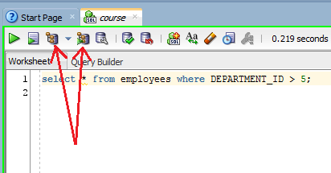
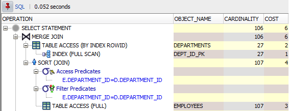
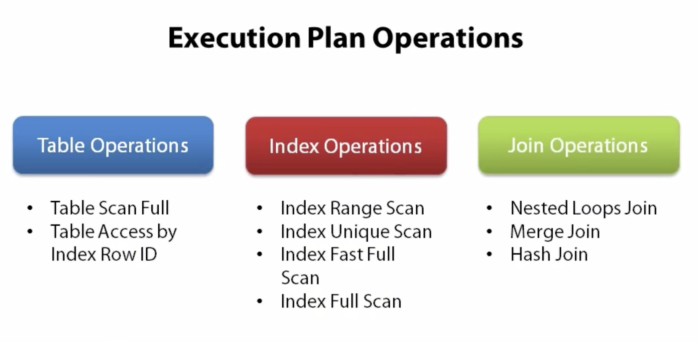
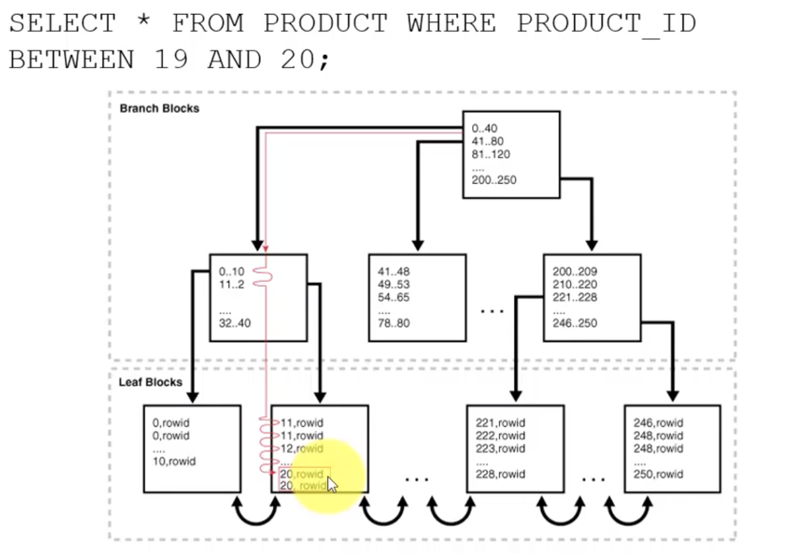
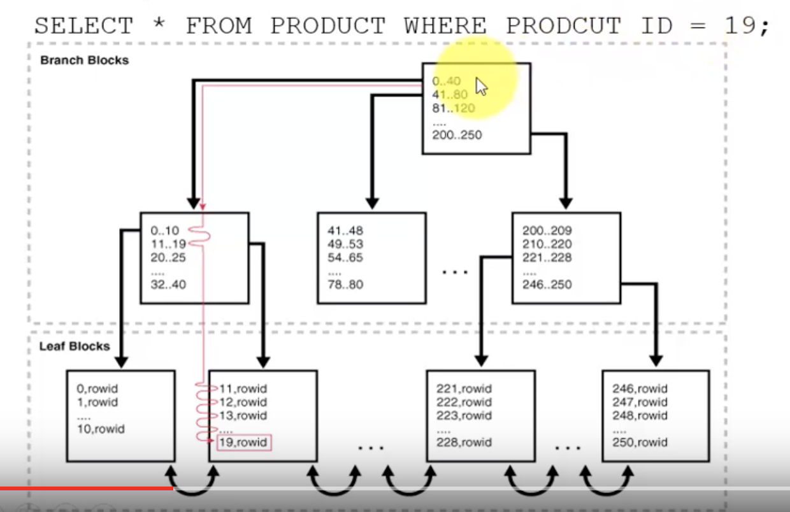
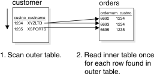
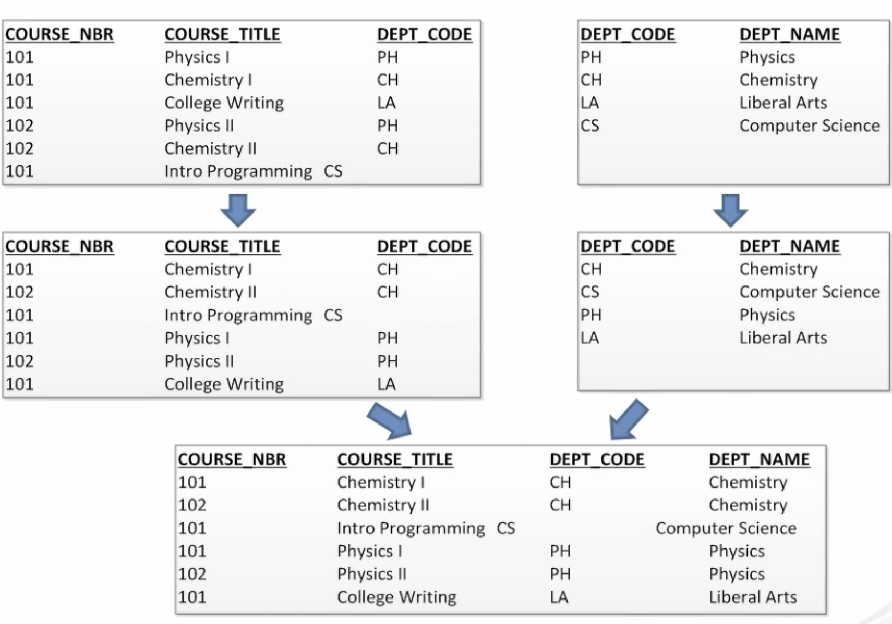
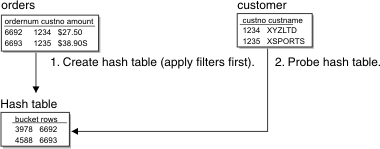

# Execution Plan & Auto Trace

REf: http://sql.standout-dev.com/2016/01/understanding-querys-execution-plan/

## What is an Execution Plan

You can think of an execution plan as the combination of steps used by the database to execute an SQL statement. In an execution plan, you can see the list of steps the database will have to perform to execute the statement, along with the cost associated with each step, which is very useful because you can see which of the steps are using more resources, and thus, probably taking more time to complete.

## How do I Display an Execution Plan

The method used to display an execution plan and the way it will be displayed may vary depending on the tool you are using.

If you are using SQL*Plus, you can set the AUTOTRACE system variable to ON or TRACEONLY, like this:

SET AUTOTRACE TRACEONLY;

This will make SQL*Plus display the execution plan for the query you are running.

You can also do something like this:
```sql
EXPLAIN PLAN FOR 
[your query];
```

Then

```sql
SELECT *
FROM TABLE(DBMS_XPLAN.DISPLAY());
```

If you are using SQL Developer, which is the tool I currently use, you can simply press the F10 key (for explain plan) or F6 (for autotrace), or simply click the appropriate button in the worksheet toolbar:



## Explain Plan vs. Autotrace

Explain plan and autotrace produce similar results (both of them display an execution plan), but there are two key differences:

The plan displayed by explain plan is the one that the database “thinks” or predicts it will use to run the query, whereas the plan displayed by autotrace is the plan that was actually used to run the query (at least that is the case when using autotrace in SQL Developer), and that is why in some cases you can get different plans for the same query depending on how you generate it.
Besides the execution plan, autotrace displays some statistics or metrics about each of the steps performed to execute the query, which can be very useful in investigating performance issues.
That is why I prefer to use autotrace over explain plan in most situations. The only disadvantage of autotrace could be that it actually executes the statement, so if you want to see the execution plan for a query that takes a very long time to run, you would get it much faster by using explain plan.

The documentation says that to use the autotrace utility you need the SELECT_CATALOG_ROLE and SELECT ANY DICTIONARY privileges, but as far as I can tell, you actually only need SELECT_CATALOG_ROLE.

## Example 



### Full Table Scan

A full table scan reads all rows from a table, and then filters out those rows that do not meet the selection criteria (if there is one). Contrary to what one could think, full table scans are not necessarily a bad thing. There are situations where a full table scan would be more efficient than retrieving the data using an index.

### Table Access by Rowid

A rowid is an internal representation of the storage location of data. The rowid of a row specifies the data file and data block containing the row and the location of the row in that block. Locating a row by specifying its rowid is the fastest way to retrieve a single row because it specifies the exact location of the row in the database.

In most cases, the database accesses a table by rowid after a scan of one or more indexes.

### Index Unique Scan

An index range scan is an ordered scan of values, and it is typically used when a query predicate references some of the leading columns of an index, or when for any reason more than one value can be retrieved by using an index key. These predicates can include equality and non-equality operators (=, <. >, etc).

### Index Full Scan

An index full scan reads the entire index in order, and can be used in several situations, including cases in which there is no predicate, but certain conditions would allow the index to be used to avoid a separate sorting operation.

### Index Fast Full Scan

An index fast full scan reads the index blocks in unsorted order, as they exist on disk. This method is used when all of the columns the query needs to retrieve are in the index, so the optimizer uses the index instead of the table.

### Index Join Scan

An index join scan is a hash join of multiple indexes that together return all columns requested by a query. The database does not need to access the table because all data is retrieved from the indexes.

### Sorts

A sort operation is performed when the rows coming out of the step need to be returned in some specific order. This can be necessary to comply with the order requested by the query, or to return the rows in the order in which the next operation needs them to work as expected, for example, when the next operation is a sort merge join.

### Joins

When you run a query that includes more than one table in the FROM clause the database needs to perform a join operation, and the job of the optimizer is to determine the order in which the data sources should be joined, and the best join method to use in order to produce the desired results in the most efficient way possible.

Both of these decisions are made based on the available statistics.

Here is a small explanation for the different join methods the optimizer can decide to use:

### Nested Loops Joins

When this method is used, for each row in the first data set that matches the single-table predicates, the database retrieves all rows in the second data set that satisfy the join predicate. As the name implies, this method works as if you had 2 nested for loops in a procedural programming language, in which for each iteration of the outer loop the inner loop is traversed to find the rows that satisfy the join condition.

As you can imagine, this join method is not very efficient on large data sets, unless the rows in the inner data set can be accessed efficiently (through an index).

In general, nested loops joins work best on small tables with indexes on the join conditions.

### Hash Joins

The database uses a hash join to join larger data sets. In summary, the optimizer creates a hash table (what is a hash table?) from one of the data sets (usually the smallest one) using the columns used in the join condition as the key, and then scans the other data set applying the same hash function to the columns in the join condition to see if it can find a matching row in the hash table built from the first data set.

You don’t really need to understand how a hash table works. In general, what you need to know is that this join method can be used when you have an equi-join, and that it can be very efficient when the smaller of the data sets can be put completely in memory.

On larger data sets, this join method can be much more efficient than a nested loop.

### Sort Merge Joins

A sort merge join is a variation of a nested loops join. The main difference is that this method requires the 2 data sources to be ordered first, but the algorithm to find the matching rows is more efficient.

This method is usually selected when joining large amounts of data when the join uses an inequality condition, or when a hash join would not be able to put the hash table for one of the data sets completely in memory.

## Why is there difference between Explain Plan Vs Autotrace

_________________________________
|      Method        |   Cost   | 
|--------------------|----------|
| Query A Explain    |  306,188 |
| Query A Autotrace  |  399,131 |
| Query B Explain    |   99,226 |
| Query B Autotrace  |  137,661 |
|____________________|__________|

There are a number of things that can cause the actual plan to differ from the estimated plan (and if you want to get really deep in the weeds, there are lots of things that can cause different methods of producing the actual plan to produce different results but I'll ignore that).

The simplest (and most common) revolve around bind variables. If I do an EXPLAIN PLAN on a simple query like

```sql
SELECT COUNT(*)
  FROM my_table
 WHERE col1 = :1
```

Oracle has no information about what value I might pass in for col1 so it does a very generic estimate. If there are 20 distinct values, for example, it will probably guess that the query would need to access 5% of the rows in the table. If you actually execute this statement and pass in a value, on the other hand, Oracle has a lot more information-- it may know from a histogram that the value you passed in will actually require it to access 7% of the rows in the table. If the actual query plan remains unchanged, it's entirely plausible that the cost would increase by 40% since the expected amount of work grew by 40%.

## Reading Execution Plans

Execution plans can look very confusing, but reading them is reasonably simple provided you follow three simple rules:

The first operation, or starting point, is the first leaf node, when reading from the top to the bottom. That is, the first element without an indented entry below it. You read from that point backwards.
Join operations always require two sets. The order you read the sets is top down, so the first set is the driving set and the second is the probed set. In the case of a nested loop, the first set is the outer loop. In the case of a hash join, the first set is used to build the hash table.
One join is performed at a time, so you only need to consider two sets and their join operation at any one time.
Looking at the following execution plan, the order of the operations is 4, 5, 3, 6, 2, 9, 10, 8, 7, 1, 0.

```
---------------------------------------------------------------------------------------------------
| Id  | Operation                     | Name              | Rows  | Bytes | Cost (%CPU)| Time     |
---------------------------------------------------------------------------------------------------
|   0 | SELECT STATEMENT              |                   |    10 |   570 |     7  (15)| 00:00:01 |
|*  1 |  HASH JOIN                    |                   |    10 |   570 |     7  (15)| 00:00:01 |
|   2 |   NESTED LOOPS                |                   |       |       |            |          |
|   3 |    NESTED LOOPS               |                   |    10 |   380 |     4   (0)| 00:00:01 |
|*  4 |     TABLE ACCESS FULL         | DEPARTMENTS       |     1 |    16 |     3   (0)| 00:00:01 |
|*  5 |     INDEX RANGE SCAN          | EMP_DEPARTMENT_IX |    10 |       |     0   (0)| 00:00:01 |
|   6 |    TABLE ACCESS BY INDEX ROWID| EMPLOYEES         |    10 |   220 |     1   (0)| 00:00:01 |
|   7 |   VIEW                        | index$_join$_004  |   107 |  2033 |     3  (34)| 00:00:01 |
|*  8 |    HASH JOIN                  |                   |       |       |            |          |
|   9 |     INDEX FAST FULL SCAN      | EMP_NAME_IX       |   107 |  2033 |     1   (0)| 00:00:01 |
|  10 |     INDEX FAST FULL SCAN      | EMP_EMP_ID_PK     |   107 |  2033 |     1   (0)| 00:00:01 |
---------------------------------------------------------------------------------------------------
```


## So, what do I do with all this Information

Now that you have a basic understanding of what you see in an execution plan, let’s talk about the things you should pay attention to when investigating a performance issue.

One of the main reasons why you would want to look at the execution plan for a query is to try to figure out if the optimizer in fact chose the most efficient plan. This could not be the case if the query is not written correctly or if the statistics are not up-to-date, among other things.

For example, you might see that a full table scan is being performed on a large table when you know that accessing it through an existing index would be more efficient, or that 2 big tables are being joined by using a nested loop, when you think that a hash join would be more efficient.

One of the first things you could do to identify potential performance problems would be looking at the cost of each operation, and focusing your attention on the steps with the highest costs (but remember that the cost displayed for each step is the accumulated cost, or in other words, it includes the cost of its “child” operations).

Once you have identified the steps with the highest cost, you can review the access paths or joining methods used in those steps, to see if there is something you think should have done in a different way.

Also, since the metrics autotrace reports include the time used to complete each operation, you might want to identify the steps that took longer to complete as well, and review the methods used to execute them.

And, because autotrace also reports the number of rows actually returned or accessed by each step, you can compare that number to the number of rows the optimizer “predicted” for each step (the value in the cardinality column) to see how accurate the estimation was.

Why? Because if the decision to use a certain plan was based on incorrect estimations, then there is a good probability that the plan chosen is not really the most efficient one. For example, if the optimizer estimated that a table had only a few hundred rows, it might have decided to fully scan it, but if in reality it had several thousand rows, it could have been more efficient to access it through an index.

However, looking for the steps that took longer to complete and comparing estimates with actual rows returned by hand might not be an easy task when the explain plan you are analyzing is big.

Fortunately, recent versions of SQL Developer include a “HotSpot” utility, which performs these tasks for you. It will identify steps with significant differences between the cardinality and last_output_rows columns, and will also identify the steps where the most time was spent.

## Execution Plan Operations



### Table Operations

#### Table Scan Full

Full Table Scan (also known as Sequential Scan) is a scan made on a database where each row of the table under scan is read in a sequential (serial) order and the columns encountered are checked for the validity of a condition. Full table scans are usually the slowest method of scanning a table due to the heavy amount of I/O reads required from the disk which consists of multiple seeks as well as costly disk to memory transfers.

In a database, a query that is not indexed results in a full table scan, where the database processes each record of the table to find all records meeting the given requirements. Even if the query selects just a few rows from the table, all rows in the entire table will be examined. This usually results in suboptimal performance but may be acceptable with very small tables or when the overhead of keeping indexes up to date is high.

**When the Optimizer Considers a Full Table Scan**

**No index**
The optimizer must use a full table scan since no index exists.

**Small number of rows**
The cost of full table scan is less than index range scan due to small table.

When query processed SELECT COUNT(*), nulls existed in the column
The query is counting the number of null columns in a typical index. However, SELECT COUNT(*) can't count the number of null columns.

**The query is unselective**
The number of return rows is too large and takes nearly 100% in the whole table. These rows are unselective.

**The table statistics does not update**
The number of rows in the table is higher than before, but table statistics haven't been updated yet. The optimizer can't correctly estimate that using the index is faster.

**The table has a high degree of parallelism**
The high degree of parallelism table distorts the optimizer from a true way, because optimizer would use full table scan.

**A full table scan hint**
The hint lets optimizer to use full table scan.

#### Table Access by Index Row ID

TABLE ACCESS BY INDEX ROWID means that the Oracle kernel is going through your index and knows that not all needed information is contained in the index (columns needed are not in this index). Therefore it takes the pointer to the actual table data (rowid) and looks it up.

Popular trick to make things run faster is in this case including missing columns in the (non unique) index. It avoids one lookup in the table at the expense of larger indexes.

The rowid of a row specifies the data file and data block containing the row and the location of the row in that block. Locating a row by specifying its rowid is the fastest way to retrieve a single row because it specifies the exact location of the row in the database.

Searching the index is a fast and an efficient operation for Oracle and when Oracle finds the desired value it is looking for, it can also find out the rowid of the record in some other table. Oracle can then use this rowid to fetch further information if requested in query

#### Index Range Scan

Index Range Scan is used when there is NON Unique Index or you are searching for range values. A Range Scan is any scan on an index that is not guaranteed to return zero or one row. ie. A SQL that uses a Unique index and supplies every column in the unique index in an equals clause will result in a Unique Scan, anything else is a Range Scan.



#### Index Unique Scan

Index Unique Scan is used when there is a unique index on column. The database obtains the rowid from the index entry and retrives the row specified by the rowId.



#### Index Fast Full Scan

This execution plan is invoked when a index contains all of the values required to satisfy the query and table access is not required. The fast full-index scan execution plan will read the entire index with multi-block reads (using db_file_multiblock_read_count) and return the rows in unsorted.

An index fast full scan reads the ENTIRE index, unsorted, as it exists on disk. It is basically using the index as a "skinny" version of the table. The query in question would only be accessing attributes in the index (we are not using the index as a way to get to the table, we are using the index INSTEAD of the table) We use multiblock IO and read all of the leaf, branch and the root block. We ignore the branch and root blocks and just process the (unordered) data on the leaf blocks.

This is basically used when all the required columns are present in index and table access is not required.

#### Index Full Scan

Index full scan is a mechanism where Oracle does not read all the required entries from the index by traversing the tree from top to leaf for the rows. Instead, it traverses the tree from top to bottom on "the left side" of the index. When the left-most leaf level is found, it continues to read the index horizontally in the order defined by the index keys, block-by-block.

Here index is scanned fulley.

An index full scan is when we read the index a block at a time - from start to finish. We'll read the root block, navigate down the left hand side of the index (or right if we are doing a descending full scan) and then when we hit the leaf block - we'll read across the entire bottom of the index - a block at a time - in sorted order. We use single block IO, not multiblock IO for this operation. 

Good Ref - https://www.youtube.com/watch?v=0X9bbtwTnuE&list=PLUWdEQb_2yqVXnx-P1881VVtec8moW1sk&index=1

#### Nested Loop Joins

In a nested-loop join, the database server scans the first, or outer table, and then joins each of the rows that pass table filters to the rows found in the second, or inner table.

```sql
SELECT * FROM customer, orders 
WHERE customer.customer_num=orders.customer_num 
AND order_date>"01/01/2007";
```
The database server accesses an outer table by an index or by a table scan. The database server applies any table filters first. For each row that satisfies the filters on the outer table, the database server reads the inner table to find a match.

The database server reads the inner table once for every row in the outer table that fulfills the table filters. Because of the potentially large number of times that the inner table can be read, the database server usually accesses the inner table by an index.



If the inner table does not have an index, the database server might construct an autoindex at the time of query execution. The optimizer might determine that the cost to construct an autoindex at the time of query execution is less than the cost to scan the inner table for each qualifying row in the outer table.

If the optimizer changes a subquery to a nested-loop join, it might use a variation of the nested-loop join, called a semi join. In a semi join, the database server reads the inner table only until it finds a match. In other words, for each row in the outer table, the inner table contributes at most one row.

#### Merge Joins

A sort merge join is used when each of the row sources that Oracle is trying to join is in sorted order and that sorted order matches the join condition that is applied. In some cases, the rows in the row sources are already in sorted order because they have been read from an index. In other cases, Oracle will perform a sort against the rows in one or both of the row sources. Then once the rows have been sorted, Oracle can perform a merge operation between the two data sets. And this merge is very efficient because the rows are already sorted.



#### Hash Joins

The optimizer usually uses a hash join when at least one of the two join tables does not have an index on the join column or when the database server must read a large number of rows from both tables. No index and no sorting is required when the database server performs a hash join.

A hash join consists of two activities: first building the hash table (build phase) and then probing the hash table (probe phase).

In the build phase, the database server reads one table and, after it applies any filters, creates a hash table. Think of a hash table conceptually as a series of buckets, each with an address that is derived from the key value by applying a hash function. The database server does not sort keys in a particular hash bucket.

In the probe phase, the database server reads the other table in the join and applies any filters. For each row that satisfies the filters on the table, the database server applies the hash function on the key and probes the hash table to find a match.



A hash join is the most common type of join used when you're joining two large data sets. What Oracle is going to do is take one of the row sources that needs to be joined, usually the smaller one, and build a hash table from this row source. The key for this hash table will be a value calculated from the columns in the join condition. Then, Oracle is going to iterate through the other rows and probe the hash table it just built for matching values. When a match is found, this row will be included in the result set. Oracle will look to perform a hash join when there is no suitable index that can be used in a nested loops join. Since no suitable index exists in order to probe one of the data sources, what Oracle is doing is building its own data structure in memory, the hash table, that can be used to perform the join operation. And this is one of the keys for hash join performance. First, Oracle has to build the hashtable, so Oracle's expending processing resources to do this. Second, if a hashtable Oracle needs to build is large enough it may not fit into memory on the Oracle server, meaning that Oracle have to cache part of the hashtable to its temp table space. Consequently, Oracle will incur cost for physical IO during the joint process when it needs to read and write parts of the hashtable to disk. That being said, hash joins are often the most efficient join operation when large data sets are involved.

