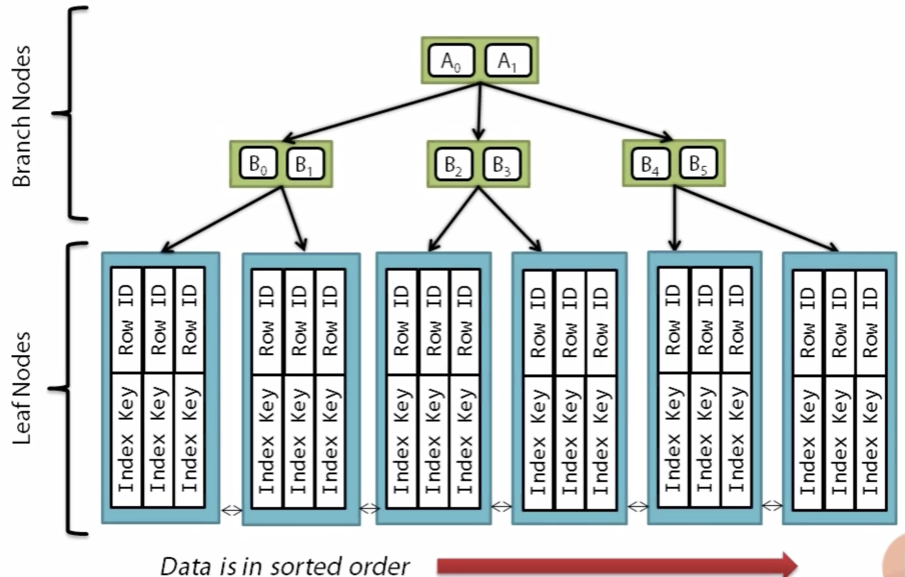
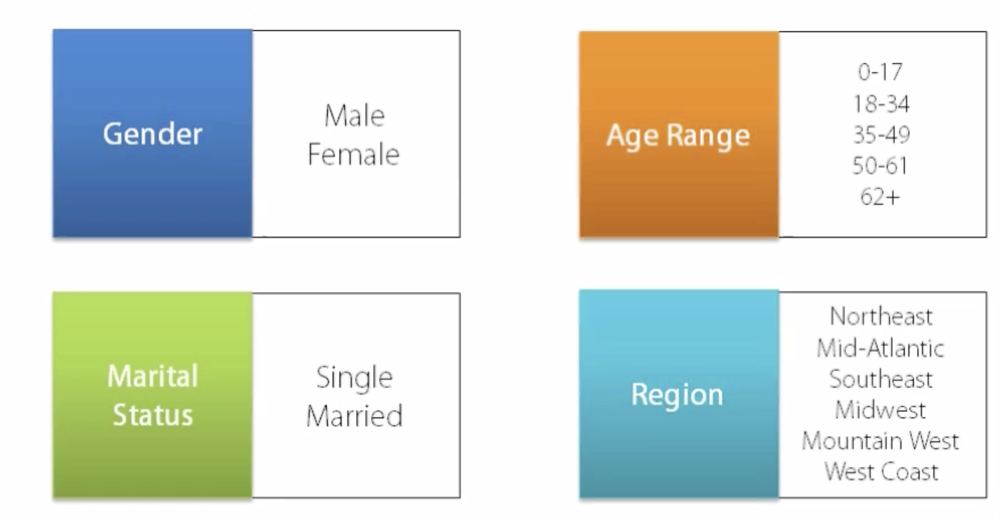
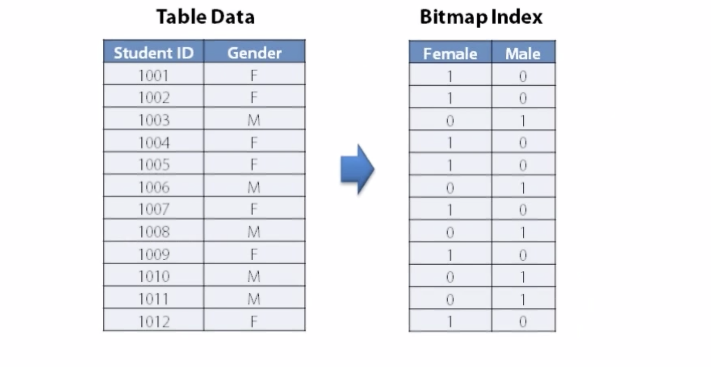
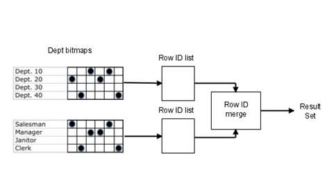

# Indexing Essentials

An index is an optional structure, associated with a table or table cluster, that can sometimes speed data access. By creating an index on one or more columns of a table, you gain the ability in some cases to retrieve a small set of randomly distributed rows from the table. Indexes are one of many means of reducing disk I/O.

By default, Oracle creates B-tree indexes.

## Keys and Columns

A key is a set of columns or expressions on which you can build an index. Although the terms are often used interchangeably, indexes and keys are different. Indexes are structures stored in the database that users manage using SQL statements. Keys are strictly a logical concept.

The following statement creates an index on the customer_id column of the sample table orders:

```sql
CREATE INDEX ord_customer_ix ON orders (customer_id);
```

## Composite Indexes

A composite index, also called a concatenated index, is an index on multiple columns in a table. Columns in a composite index should appear in the order that makes the most sense for the queries that will retrieve data and need not be adjacent in the table.

For example, suppose an application frequently queries the last_name, job_id, and salary columns in the employees table. Also assume that last_name has high cardinality, which means that the number of distinct values is large compared to the number of table rows. You create an index with the following column order:

```sql
CREATE INDEX employees_ix
   ON employees (last_name, job_id, salary);
```

Queries that access all three columns, only the last_name column, or only the last_name and job_id columns use this index. In this example, queries that do not access the last_name column do not use the index.

## Unique and Nonunique Indexes

Indexes can be unique or nonunique. Unique indexes guarantee that no two rows of a table have duplicate values in the key column or columns. For example, no two employees can have the same employee ID. Thus, in a unique index, one rowid exists for each data value. The data in the leaf blocks is sorted only by key.

Nonunique indexes permit duplicates values in the indexed column or columns. For example, the first_name column of the employees table may contain multiple Mike values. For a nonunique index, the rowid is included in the key in sorted order, so nonunique indexes are sorted by the index key and rowid (ascending).

## Types of Indexes

### B-tree indexes

These indexes are the standard index type. They are excellent for primary key and highly-selective indexes. Used as concatenated indexes, B-tree indexes can retrieve data sorted by the indexed columns. B-tree indexes have the following subtypes:



**Index-organized tables**

An index-organized table differs from a heap-organized because the data is itself the index. See "Overview of Index-Organized Tables".

**Reverse key indexes**

In this type of index, the bytes of the index key are reversed, for example, 103 is stored as 301. The reversal of bytes spreads out inserts into the index over many blocks. See "Reverse Key Indexes".

**Descending indexes**

This type of index stores data on a particular column or columns in descending order. See "Ascending and Descending Indexes".

**B-tree cluster indexes**

This type of index is used to index a table cluster key. Instead of pointing to a row, the key points to the block that contains rows related to the cluster key. See "Overview of Indexed Clusters".

### Bitmap and bitmap join indexes

Bitmap index are designed to index the columns which have low number of distinct values. These can be:



Oracle bitmap indexes are very different from standard b-tree indexes. In bitmap structures, a two-dimensional array is created with one column for every row in the table being indexed. Each column represents a distinct value within the bitmapped index. This two-dimensional array represents each value within the index multiplied by the number of rows in the table.



The real benefit of bitmapped indexing occurs when one table includes multiple bitmapped indexes. Each individual column may have low cardinality. The creation of multiple bitmapped indexes provides a very powerful method for rapidly answering difficult SQL queries.



Also, remember that bitmap indexes are only suitable for static tables and materialized views which are updated at nigh and rebuilt after batch row loading.  If your tables experience multiple DML's per second, BE CAREFUL when implementing bitmap indexes!

**1 - 7 distinct key values** - Queries against bitmap indexes with a low cardinality are very fast.

**8-100 distinct key values** - As the number if distinct values increases, performance decreases proportionally.

**100 - 10,000 distinct key values** - Over 100 distinct values, the bitmap indexes become huge and SQL performance drops off rapidly.

**Over 10,000 distinct key values** - At this point, performance is ten times slower than an index with only 100 distinct values.

## What is the difference between a btree and a bitmap index

Internally, a bitmap and a btree indexes are very different, but functionally they are identical in that they serve to assist Oracle in retrieving rows faster than a full-table scan.  The basic differences between b-tree and bitmap indexes include:

1:  Syntax differences:  The bitmap index includes the "bitmap" keyword.  The btree index does not say "bitmap".

2: Cardinality differences:  The bitmap index is generally for columns with lots of duplicate values (low cardinality), while b-tree indexes are best for high cardinality columns.

3: Internal structure differences:  The internal structures are quite different.  A b-tree index has index nodes (based on data block size), it a tree form:


A bitmap index looks like this, a two-dimensional array with zero and one (bit) values:


Ref:- http://www.dba-oracle.com/t_difference_between_btree_and_bitmap_index.htm

## Selecting an Index Strategy

Use the following guidelines for determining when to create an index:

* Create an index if you frequently want to retrieve less than 15% of the rows in a large table. The percentage varies greatly according to the relative speed of a table scan and how clustered the row data is about the index key. The faster the table scan, the lower the percentage; the more clustered the row data, the higher the percentage.
* Index columns used for joins to improve performance on joins of multiple tables.
* Primary and unique keys automatically have indexes, but you might want to create an index on a foreign key;
* Small tables do not require indexes; if a query is taking too long, then the table might have grown from small to large.

Some columns are strong candidates for indexing. Columns with one or more of the following characteristics are candidates for indexing:

* Values are relatively unique in the column.
* There is a wide range of values (good for regular indexes).
* There is a small range of values (good for bitmap indexes).
* The column contains many nulls, but queries often select all rows having a value. In this case, a comparison that matches all the non-null values, such as:
  WHERE COL_X > -9.99 *power(10,125)

  is preferable to

  WHERE COL_X IS NOT NULL

  This is because the first uses an index on COL_X (assuming that COL_X is a numeric column).

Columns with the following characteristics are less suitable for indexing:

* There are many nulls in the column and you do not search on the non-null values.

## Limit the Number of Indexes for EachTable

The more indexes, the more overhead is incurred as the table is altered. When rows are inserted or deleted, all indexes on the table must be updated. When a column is updated, all indexes on the column must be updated.

You must weigh the performance benefit of indexes for queries against the performance overhead of updates. For example, if a table is primarily read-only, you might use more indexes; but, if a table is heavily updated, you might use fewer indexes.

## Choose the Order of Columns in Composite Indexes

Although you can specify columns in any order in the CREATE INDEX command, the order of columns in the CREATE INDEX statement can affect query performance. In general, you should put the column expected to be used most often first in the index. You can create a composite index (using several columns), and the same index can be used for queries that reference all of these columns, or just some of them.


Assume that there are five vendors, and each vendor has about 1000 parts.

Suppose that the VENDOR_PARTS table is commonly queried by SQL statements such as the following:

SELECT * FROM vendor_parts
    WHERE part_no = 457 AND vendor_id = 1012;

To increase the performance of such queries, you might create a composite index putting the most selective column first; that is, the column with the most values:

CREATE INDEX ind_vendor_id
    ON vendor_parts (part_no, vendor_id);

Composite indexes speed up queries that use the leading portion of the index. So in the above example, queries with WHERE clauses using only the PART_NO column also note a performance gain. Because there are only five distinct values, placing a separate index on VENDOR_ID would serve no purpose.

## Function-Based Indexes

A function-based index is an index built on an expression. It extends your indexing capabilities beyond indexing on a column. A function-based index increases the variety of ways in which you can access data.

### Advantages of Function-Based Indexes

```sql
CREATE INDEX Idx ON Example_tab(Column_a + Column_b);
SELECT * FROM Example_tab WHERE Column_a + Column_b < 10;
```

The optimizer can use a range scan for this query because the index is built on (column_a + column_b). Range scans typically produce fast response times if the predicate selects less than 15% of the rows of a large table. The optimizer can estimate how many rows are selected by expressions more accurately if the expressions are materialized in a function-based index. (Expressions of function-based indexes are represented as virtual columns and ANALYZE can build histograms on such columns.)

## Covring Indexes

If oracle can find all it's data for query within the index and doesn't need to do a full table scan then it's called covering index. It's dependent on the query.

## Function Based Indexes

When you create an index in Oracle the index is created over the actual values in the table. There are times though when it is useful to create an index not over the actual values in the table but a derived value. This is where function based indexes come in. With a function based index, you specify a function in your create index statement, then Oracle will run this function against each row of the table to create a derived value, and the index will be built over this derived value.

Example:

```sql
  CREATE INDEX ix_student_lats_name ON students (UPPER(last_name));
```

Index is created on the value which is returned by the *UPPER(last_name)* function.

```sql
  SELECT * 
  FROM students
  WHERE UPPER(last_name) = UPPER('<user_input>')
```

Now the above query will be able to use the function based index *ix_student_lats_name* to get the records from above query. It's important to recognize though, that the function used in the index and the function used in the where clause must match exactly. Otherwise, the Oracle optimizer won't be able to match up the functions between the SQL statement and the index, and Oracle wouldn't be able to use the function-based index to perform this query.

When choosing the function for a function based index, there are some criteria that you want to be aware of. First of all, you can use both built-in Oracle functions as well as user-defined functions. In our example, we're using the upper function, but you could use the lower function.

You cannot use any aggregate functions to build a function-based index. These operate over multiple rows, not just one row. So they aren't allowed.

## Index Compression

Index Compression is another technique that can help you not just to save storage space on your database server. But can also in many cases provide a performance boost to your SQL statements. In a compressed index, what Oracle does is take repeated values at the front of the index key, and compress them into a single prefix value, so if you were to look at the leaf box of a compressed index, you wouldn't see the repeated value over and over again. But a prefix value that mapped to the repeated value that Oracle could look up when it was needed. How this helps from a performance standpoint is that now the index can take up significantly less space on disk. This means the amount of IO needed to read the index is reduced, and usually when we reduce the amount of IO we have a corresponding performance improvement.

## Invisible Indexes

One of the capabilities that Oracle provides is the ability to mark an index invisible. What this means is that the index will exist, but the Oracle Optimizer will not use the index in the execution of any SQL statements unless you set a session parameter to tell the Optimizer to consider invisible indexes.

Let's say we have a new index. But before we make it generally available, we want to do some additional testing ourselves, and we don't want to impact the execution plans that anyone else is getting, or how their statements are running at this point. So what you can do is create the new index as invisible. Then you can log into Oracle, set the session parameter to allow your session to use individual indexes. And test the index out, while not impacting anyone else.

## Indexing Costs and Overhead

Something that you need to be mindful of is overindexing your database. Sometimes in technology, when we learn about a new feature or capability, we have a tendency to apply this capability to every problem we see whether it's a fit or not. There's an old interview question that I'll sometimes ask along these lines of, if indexing columns improves performance, why don't we index every column in a table? The answer is, because indexes are a separate data structure. They take up additional space on disk and they create 
overhead in that the index has to be maintained for any DML operations against the table.

## Why isn't Oracle Using My Index?

* One of the first things you want to check when Oracle is not using an index is if you've included the leading edge. That is the first column of the index in your where of clause.
* Any column that is always included with the where clause should be the first column in the index. Because if this first column is not present in our statement, Oracle won't use the index.
* Another of the major reasons that an index does not get used is because of a lack of selectivity. If over 10% of the rows from the table with query. And when Oracle does the math, it will actually be more expensive to use the index than to just read the table directly in a full-table scan. So to solve this problem, we need to improve the selectivity. If our index has only one column in it and this column is not very selective on its own, then we need to add additional columns to the index so we have more distinct keys in our index and improve the selectivity of the index. This isn't enough, though. You also need to make sure to include those columns in the where clause of our SQL statement.
* Using a Like Clause and a Leading Wildcard. the trailing wildcard is not a problem. The issue is the leading wildcard character. Whenever we have a leading wildcard carrier, like we see here, Oracle will not use an index on that column.
* Data Type Conversion in the Where Clause. Now Oracle will not error, it will run the statement for you just fine. But it will not use any indexes that have been built over the course number of column due to this implicit data conversion that's going on. The solution to this problem is very easy. You want to make sure that the data types you use in your SQL statements always match up with the data types defined in the table.

